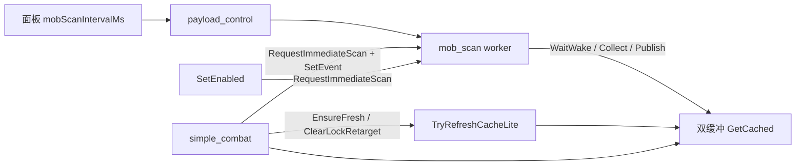

# mob_scan Feature 模块设计（Classic TWMS）

> **状态**：✅ 已落地（面板周期 + 事件唤醒 + 按需 Lite + MobCtrl + 同图降频 + 弃锁写回）  
> **产品**：新枫之谷：经典版（TW · `Maplestory_Classic.exe`）· **不是**枫星  
> **源码**：`x/features/mob_scan/` · `x/features/ports/mob_pool_port.*` · `x/features/simple_combat/simple_combat.cpp`（消费端）  
> **契约**：`common/xcat_payload_control.*` · `[core] mobScanIntervalMs` · GUI：`xcat_app/workspace_tabs.cpp`「怪物读取速度」  
> **日志**：`bin/XCat_data/logs/mobscan.log` · 换怪龄：`combat.log` 的 `mob_cache refresh`  
> **相关**：[`../mob_pool/活怪n与刷怪槽M.md`](../mob_pool/活怪n与刷怪槽M.md)（n/M 语义）· [`../simple_combat/模块设计.md`](../simple_combat/模块设计.md) · [`../mob_pool/P0a_OnLocalMob与Init包体.md`](../mob_pool/P0a_OnLocalMob与Init包体.md)（进场观察 · **未**产品化 Hook）

---

## 0. 一句话

`mob_scan` = 进图后的 **MobPool 后台采集线程**：打怪开时用面板周期扫活怪字典并双缓冲 Publish；战斗侧 **禁止** 完整 `Collect`，靠缓存 + `TryRefreshCacheLite` + **事件唤醒** 压换怪延迟。

相对旧实现：**定时扫 + 盲 Sleep** → **可调周期 + SetEvent 唤醒 + 按需 Lite + MobCtrl 软优先**。

---

## 1. 相对旧实现的优势

| 维度 | 以前 | 现在 |
|------|------|------|
| 换怪延迟 | `Sleep` 中最多再拖约 1–15ms 才看到 force | `SetEvent` 立刻醒 → 扫 |
| 开 F5 | 可能卡在 idle **360ms** 节奏 | `SetEnabled` → `RequestImmediateScan` |
| 弃锁同 tick | 清锁后可能抱旧 snap | `ClearLockRetarget` + `thread_local` tick 写回 |
| 表更新 | 基本靠周期扫 | 周期 + 按需（换怪 / 龄 >16ms） |
| 战斗线程 | 不宜完整 Collect | `TryRefreshCacheLite`（字典只读，禁 FindAll） |
| 默认周期 | 50ms | **20ms**（旧 50 读盘自动迁）；面板 1–500 |
| 多人选怪 | 仅距离/群怪 | `MobCtrl`：我方控 > 中性 > 他人（全员 Passive ≡ 旧行为） |
| 稳态成本 | `interval=1` 易热空转；每帧 foothold/M | `WaitWake(remain)`；同图 foothold/M ≈500ms；龄门跳过多余 Lite |
| Collect 失败 | 仍推进 lastScan，空转占满 interval | 不推进 lastScan，`WaitWake(15)` 重试 |

**未改变的边界**：抢怪体感大头仍在瞬移 CD / 攻速 / 脆皮早切；本模块只保证「怪表够新 + 唤醒快 + 优先可选靶」。  
**明确不做**：游戏 `EnterField`/`LeaveField` INLINE HOOK；方案 ⑥ methodPointer 观察见 P0a，**未**产品化。

---

## 2. 目标与非目标

| 要 | 不要 |
|----|------|
| 打怪开时可控扫描周期（1–500ms，默认 20） | 把 `interval=1` 当「极致抢怪」银弹 |
| 杀怪/换怪立刻扫一帧（事件唤醒） | 游戏进池/出池 E9 / `.text` Hook |
| Acquire 缓存过旧时战斗线程安全刷新 | 战斗线程 `FindAll` / `RuntimeClassInit` / 完整 Collect |
| 选怪软优先我方 `MobCtrl` | 硬过滤他人控怪 |
| 同图 foothold / LifeList(M) 降频 | 改 `.text` / SendInput |

---

## 3. 配置与面板

| 项 | 值 |
|----|-----|
| ini | `[core] mobScanIntervalMs`（v51 引入；v56 默认 50→20） |
| 默认 | `kMobScanIntervalDefaultMs = 20` |
| 旧默认迁移 | 读盘为 `50`（`kMobScanIntervalLegacyDefaultMs`）→ 迁为 `20` |
| 范围 | `ClampMobScanIntervalMs` → **1–500** |
| UI | 首页独立一行「怪物读取速度」`DragInt` |
| 下发 | `payload_control` → `mob_scan::SetCombatIntervalMs` |

| 模式 | 周期 |
|------|------|
| 打怪开（`simple_combat::IsEnabled`） | `mobScanIntervalMs` |
| 闲置 | 固定 **360ms**（`kScanIntervalIdleMs`） |

---

## 4. Worker 节奏（`mob_scan.cpp`）

```text
play-ready?
  ├─ no  → WaitWake(15ms)（可被 Stop / force 打断）
  └─ yes → interval = combat ? panel : 360
           force / 改间隔 / 切 combat↔idle → 立刻扫
           未到 interval → WaitWake(remain)   // 全额 remain，可 SetEvent 打断
           到点 → foothold? / Collect(fillSlots?) / Publish
           Collect 失败 → 不推进 lastScan，WaitWake(15) 重试
```

### 4.1 事件唤醒（`gWakeEvt`）

| API | 行为 |
|-----|------|
| `CreateEventW` auto-reset | `EnsureWakeEvent`；`atomic<HANDLE>` + CAS，避免双建泄漏；失败打日志并回退 Sleep |
| `WaitWake(ms)` | `WaitForSingleObject`；无事件则 `Sleep` |
| `RequestImmediateScan` | `gForceScan=true` + `SetEvent` |
| `SetCombatIntervalMs` 变化 | `SetEvent`（按新间隔重算） |
| `simple_combat::SetEnabled` 开/关 | `RequestImmediateScan`（开打不卡 idle 360；关打立刻切 pace） |
| `StopWorker` | `stop` + `SetEvent`；**不 join** |
| `Shutdown` | **不** `CloseHandle(gWakeEvt)`（防 Wait UAF；句柄随进程回收） |

语义：

- **事件** = 别再睡了  
- **`gForceScan`** = 醒了必须立刻扫一帧  

### 4.2 记时（采集完成后）

成功后均用当时 `GetTickCount()`，避免长采集把间隔算偏紧：

| 变量 | 何时更新 |
|------|----------|
| `lastScan` | `Collect` 成功后 |
| `lastSlotsRefresh` | 本次填了 M 时，与 `lastScan` 同值 |
| `lastFhRefresh` | `foothold::CollectToCache` 成功后 |

### 4.3 同图降频

| 工作 | 周期 |
|------|------|
| 活怪字典 `Collect` | 按 interval |
| foothold `CollectToCache` | 同图约 **500ms**（换图立刻） |
| LifeList 填 M | 同图约 **500ms**；`Collect(snap, fillSpawnSlots=false)` 沿用上一帧 M |

---

## 5. 战斗侧按需刷新（`simple_combat.cpp`）

战斗 worker **禁止**完整 `Collect`。

| 入口 | 行为 |
|------|------|
| `NoteNeedFreshMobs(snap*, forceLite)` | 总是 `RequestImmediateScan`；`forceLite` 或龄 >16ms → `TryRefreshCacheLite`；否则只 `GetCached` |
| `EnsureFreshMobSnap` | 龄 ≤ **16ms** 直接用；否则 `NoteNeedFreshMobs`（不 force）；`combat.log` 限频 `mob_cache refresh` |
| `ClearLockRetarget(forceLite)` | `ClearLock` + `NoteNeedFreshMobs(gTickMobSnap, forceLite)` |
| `TickMobSnapScope` | `thread_local` 指针指向本 tick 栈上 `snap`；弃锁写回，防同 tick 抱旧表 |

### 5.1 `forceLite` 何时为 true

| 场景 | `forceLite` |
|------|-------------|
| 死怪 / 早切（dealt/oneshot/abshp/hitlag/wounded）/ whiff | **true**（防尸体行） |
| sticky / no_land / hop 失败 / land_unsafe / 跨层禁止 softBan | **false**（怪仍活，走龄门） |

### 5.2 `TryRefreshCacheLite`

- 仅 mob_scan 已热身（字段 resolved + MobPool 可信）  
- **只读字典** + `Publish`  
- **不** FindAll / RuntimeClassInit / LifeList  
- M/map/life 沿用上一帧  

---

## 6. MobCtrl 选怪软优先

真源：`Mob.MobCtrlState@0xE8` → `MobLite.ctrl`。

| `ctrl` | `CtrlPreferRank` | 含义 |
|--------|------------------|------|
| `>0` | 2 | 我方控 |
| `==0` | 1 | 中性 |
| `<0` | 0 | 他人驱动 |

`PickNearestTarget`：先比 ctrl 秩，再群怪/距离。全员 Passive → 与旧版一致。

---

## 7. 数据流



---

## 8. 文件职责

| 路径 | 职责 |
|------|------|
| `mob_scan.cpp` | worker、间隔、force、事件唤醒、foothold/M 降频、失败重试、日志 |
| `mob_pool_port.*` | Collect / 双缓冲 / TryRefreshCacheLite / CtrlPreferRank / GetCachedAgeMs |
| `simple_combat.cpp` | EnsureFresh、NoteNeedFreshMobs、ClearLockRetarget、TickMobSnapScope、MobCtrl 选怪、SetEnabled 唤醒 |
| `xcat_payload_control.*` | 字段、clamp、ini、旧默认迁移 |
| `workspace_tabs.cpp` | 「怪物读取速度」 |
| `payload_control.cpp` | ApplyControl → `SetCombatIntervalMs` |

---

## 9. 验收与日志

| 证据 | 期望 |
|------|------|
| 开 F5 | `mobscan.log` 很快出现 `force` / `pace combat`（勿干等 ~360ms） |
| 杀怪换靶 | `mobscan force` 贴时间戳 |
| 改面板间隔 | `SetCombatIntervalMs …` + `pace combat interval=…` |
| 缓存过旧 | `combat.log`：`mob_cache refresh age=…` |
| 选怪 | `acquire` 可选 `ctrl=` / `rank=` |
| 池 miss | 约 15ms 一拍重试，CPU 不打满 |

**NOT**：扫怪延迟下降单独证明「抢怪变快」。

---

## 10. 风险与约束

| 点 | 决策 |
|----|------|
| DllMain | Stop 只 signal，不 join；事件进程内不关 |
| CreateEvent 失败 | 日志 + Sleep 回退 |
| `interval=1` | 有 Wait 不热空转；仍有调度/Collect 成本 |
| GC / 未知线程 | 战斗侧只用 Lite；完整 Collect 留在 mob_scan |
| Hook | 禁止 INLINE；P0a 方案 ⑥ 未开工 |

---

## 11. 变更摘要（实现史）

1. 面板 `mobScanIntervalMs`（1–500，默认 20，旧 50 迁）  
2. Sleep → `WaitWake` + auto-reset 事件；CAS 建事件；Shutdown 不关事件  
3. `RequestImmediateScan` + `TryRefreshCacheLite` + 龄 16ms  
4. MobCtrl 软优先  
5. 同图 foothold / FillSpawnSlots ≈500ms  
6. Collect 失败不推进 `lastScan`；F5 `SetEnabled` 唤醒  
7. `ClearLockRetarget` + `TickMobSnapScope`（`thread_local`）  
8. 死怪路径 `forceLite`；落点/跨层不强制；记时用采集后 `GetTickCount()`  
