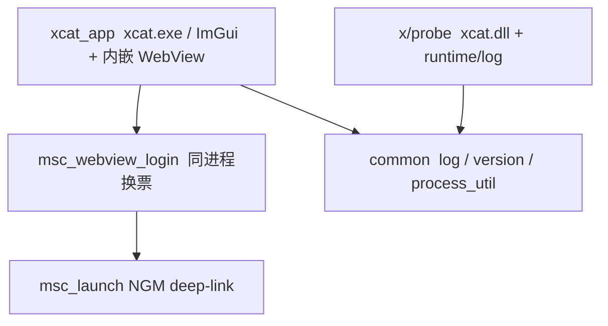

# 架构总览与防腐约定（TWMS / 经典版）

本文定义本仓分层边界。对照枫星：[`xcat_for_fengxing/docs/features/ops/架构总览.md`](../../../xcat_for_fengxing/docs/features/ops/架构总览.md)。

## 1. 分层依赖（目标 DAG）

| ↓依赖 \ 被依赖→ | common | launcher/msc_launch | xcat_app | x |
|---|---|---|---|---|
| common | — | | | |
| msc_launch (+ weblogin) | | — | | |
| xcat_app | ✓ | ✓ | — | |
| x | ✓ | | | — |

**铁律**

1. `common` 是 leaf，不依赖业务模块。
2. `x`（载荷）禁止依赖 `xcat_app`；跨进程契约以后再落 `common`。
3. 本里程碑注入默认只走 Classic `LoadLibraryW`（`injector/`）；**禁止**把 manual-map / stealth 当默认。
4. 换票走 **同进程** `msc_webview_login`；独立 `MscLauncher.exe` 默认不编（`XCAT_BUILD_MSC_LAUNCHER_EXE`）。

## 2. 本里程碑边界（相对早期 V0 壳）

| 有 | 说明 / 文档 |
|---|---|
| ImGui 壳：无边框 + DPI + CJK + 主题 + 工作区 Tab | — |
| 启动：账号 → WebView 换票 → NGM → Classic `LoadLibrary` 注入 | — |
| 探针 `bin/XCat_data/xcat.dll` + 多 feature（fly / 站桩 / 测谎等） | 各 `docs/features/*/模块设计.md` |
| **自动测谎** `auto_lie` + `LieAiPump` + 离线基建（BIN 已过；实机开题待服端） | [`auto_lie/模块设计.md`](../auto_lie/模块设计.md)、[`基建与离线验收.md`](../auto_lie/基建与离线验收.md) |
| 通知 / OTA / LED 等 | 以各模块文档为准 |

**仍禁止默认**：manual-map / Blackbone / stealth 注入。

## 3. 与枫星差异

| | 枫星 | TWMS 经典版 |
|---|---|---|
| 游戏进程 | `msw.exe` | `Maplestory_Classic.exe` |
| 启动 | launcher_core 编排 NGM + 注入 | xcat 内嵌 WebView 换票 → NGM |
| GUI | 全功能面板 | 启动壳 + 功能 Tab + 底部 WebView |
| 单实例 mutex | `XCatFengxing...` | `XCatTwms...` |
| 测谎 | Artale/枫星对照仓另线 | Classic UIAntiMacro + 文件泵 LLM（本仓） |

## 4. 目录职责

| 目录 | 写什么 |
|------|--------|
| `xcat_app/` | 用户可见 ImGui + WebView 宿主；含 `lie_ai_pump` / `anti_bot_ai` |
| `launcher/` | `msc_launch` + `msc_webview_login`（可选独立 exe） |
| `common/` | 日志 / 版本 / 路径 / `PayloadControl` 契约 |
| `x/runtime/` | 载荷运行时：`log` / `managed_main` / `main_thread_pump` / **`il2cpp_bind`** |
| `x/features/` | feature 源码（含 `auto_lie/`：TextCaptcha+LLM / NonFinite 物理跟随） |
| `x/features/ports/` | 游戏读口：`world_port`（WM SSOT + 场景门控）等 |
| `docs/features/` | 长期设计 |
| `bin/` | 构建产物（主入口 `xcat.exe`；载荷 `XCat_data/xcat.dll`） |
