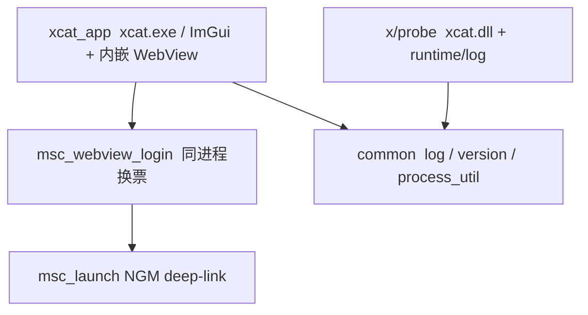

# 架构总览与防腐约定（TWMS / 经典版）

本文定义本仓分层边界。对照枫星：[`xcat_for_fengxing/docs/features/ops/架构总览.md`](../../../xcat_for_fengxing/docs/features/ops/架构总览.md)。

## 1. 分层依赖（目标 DAG）

| ↓依赖 \ 被依赖→ | common | launcher/msc_launch | xcat_app | x |
|---|---|---|---|---|
| common | — | | | |
| msc_launch (+ weblogin) | | — | | |
| xcat_app | ✓ | ✓ | — | |
| x | ✓ | | | — |

**铁律**

1. `common` 是 leaf，不依赖业务模块。
2. `x`（载荷）禁止依赖 `xcat_app`；跨进程契约以后再落 `common`。
3. 本里程碑注入默认只走 Classic `LoadLibraryW`（`injector/`）；**禁止**把 manual-map / stealth 当默认。
4. 换票走 **同进程** `msc_webview_login`；独立 `MscLauncher.exe` 默认不编（`XCAT_BUILD_MSC_LAUNCHER_EXE`）。

## 2. 本里程碑（V0 / ImGui 基础壳）边界

| 有 | 无 |
|---|---|
| 枫星对齐：`app_window` 无边框 + DPI + CJK 字体 + 暗夜/白天主题 | LED / 测谎 / 通知 / OTA |
| 标题栏拖动 / 最小化 / 关闭；双行工作区 Tab（对齐枫星） | LED / 测谎实装 |
| 启动 Tab：账号串 → 静默 WebView 换票 → NGM → **Classic LoadLibrary 注入探针** | 完整 FEATURE payload / IPC |
| 探针 `bin/XCat_data/xcat.dll`（`x/probe`） | manual-map / Blackbone / stealth |
| `common_ui` 主题 + CardGuard + `user.ini [ui]` | |

## 3. 与枫星差异

| | 枫星 | TWMS 经典版 |
|---|---|---|
| 游戏进程 | `msw.exe` | `Maplestory_Classic.exe` |
| 启动 | launcher_core 编排 NGM + 注入 | xcat 内嵌 WebView 换票 → NGM |
| GUI | 全功能面板 | V0 启动壳 + 底部 WebView |
| 单实例 mutex | `XCatFengxing...` | `XCatTwms...` |

## 4. 目录职责

| 目录 | 写什么 |
|------|--------|
| `xcat_app/` | 用户可见 ImGui + WebView 宿主 HWND |
| `launcher/` | `msc_launch` + `msc_webview_login`（可选独立 exe） |
| `common/` | 日志 / 版本 / 路径工具 |
| `x/features/` | feature 源码（fly 已链入 `xcat_probe` → `bin/XCat_data/xcat.dll`） |
| `docs/features/` | 长期设计 |
| `bin/` | 构建产物（主入口 `xcat.exe`） |
