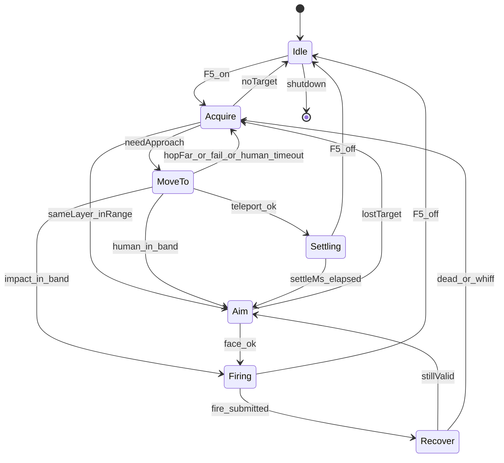

# simple_combat Feature 模块设计（Classic TWMS）

> **状态**：✅ 状态机重设计 · Impact 贴怪（默认）· 拟人 / fill+Doing 瞬移互斥回退  
> **产品**：新枫之谷：经典版（TW · `Maplestory_Classic.exe`）· **不是**枫星  
> **对照来源**：`xcat_for_fengxing` 的状态机/IPC 模式（**不复用偏移/Lua**）  
> **源码**：`x/features/simple_combat/`（含 `heli_rotor.*` 旋翼环）· `ports/attack_input_port` · `ports/mob_pool_port` · `ports/teleport_port` · `ports/player_combat_port`  
> **Impact 飞天（F6）**：[`../fly/模块设计.md`](../fly/模块设计.md)（同 Impact 端口；**F5 交战期同样开 fh-ban**，多源 OR）  
> **瞬移锚点**：[`../teleport/模块设计.md`](../teleport/模块设计.md) · fill+Doing 仅当 Impact/拟人都关  
> **掉图结案**：[`../teleport/P0d_fill_slim软重载结案.md`](../teleport/P0d_fill_slim软重载结案.md)（Doing 后勿抢收态）  
> **契约**：`common/xcat_payload_control.*` · GUI：`xcat_app/workspace_tabs.cpp`  
> **安全**：禁止 `SendInput` / GA `.text` hook；Settling 禁止 SyncRel / 手写 Attr=4 抢收态；Impact 贴怪只走 `teleport_port` 的 `ImpactSetVelocity`（旋翼）/ `ImpactImpulseToward`（F6 跟飞）

---

## 0. 一句话

自动打怪 = **显式状态机**：选怪 → **位移贴近** → 朝向 → **出刀 `OnFuncKey(A 键绑定优先，空则 BasicActionAttack=5/52)`** → Recover。  
位移优先级（互斥）：**Impact 贴怪（默认）** → 拟人走路 → fill+Doing 贴怪瞬移。  
Impact 贴怪 = **近战直升机**：旋翼环以 ~11Hz 持续托举悬停在怪旁，空中出刀；打死换下一只再飞过去。  
**旋翼与打怪状态机解耦**——出刀、丢锁、技能前置、池未热身期间照转；停一拍就掉一段（fh-ban 下没有地板托）。  
交战期开 `fly_fh_ban`（`CombatImpact` 源，与 F6 多源 OR）；无怪超 1500ms 则卸掉、正常落地站着。

---

## 1. 设计原则（硬约束）

1. **单一职责分层**：选怪 / 出刀 / Impact / 瞬移 / 拟人走路不塞进同一分支森林。
2. **显式状态机**：状态切换带最短驻留；日志写 `state A→B why`。
3. **出刀真源唯一**：`UserLocal.OnFuncKey(Down/Up, FuncKey)`；**优先 A 键 keymap**（`GetDataByKeyCode(Key.A=15)`，可为 Skill/BasicAction）；A 空才回退 `5/52`。**不用** `KeyDownTouch`（CFF SEH）；硬编 `OnKey(Ctrl)` 易假成功。
4. **位移策略互斥**：`impactOn` 时 `humanOn=tpOn=false`；仅 Impact 关且拟人开才 `HoldWalk`；两者都关才 `TeleportNativeSkillCall`。
5. **位移与出刀互斥（仅瞬移/拟人）**：`MoveTo`/`Settling` 禁止 Fire；`Firing`/`Recover` 禁止 Teleport / 走路。
   **Impact 不受此约束**：旋翼是飞行控制而非「贴怪位移」，出刀期间必须继续托举，停转即掉落。
6. **BIN 门禁**：声称「能打」须 `combat.log` 有序流转 + `SecAttack pktSum` 上升或 mob HP 下降。
7. **安全**：无 `SendInput`；无 GA `.text`；Impact 只走 `teleport_port::ImpactSetVelocity`；瞬移只走 fill+Doing；拟人走 KeyPad `SetFields`。

---

## 2. 状态机



| 状态 | 允许 | 禁止 |
|------|------|------|
| Idle | `RestoreWalkable`（关/换图） | 一切战斗副作用 |
| Acquire | 读 mob 快照（`EnsureFreshMobSnap` ≤16ms）、MobCtrl 软优先选怪、上锁、softBan | TP、Fire；禁止完整 Collect |
| MoveTo | **Impact**：只发布 setpoint 等进带（冲量在 A 层）；瞬移：一次 fill+Doing；拟人：`HoldWalk` | Fire、Rescue；Impact **不进 Settling** |
| Settling | 等待满窗（仅瞬移） | Fire、再次 TP |
| Aim | 朝向；校验命中带 | 带内再贴 |
| Firing | 一次出刀（普攻或可选多发） | TP / Rescue |
| Recover | 最短 ≥480ms + MotionBusy | TP、再次 Fire |

> **Impact 是例外**：旋翼层（`heli_rotor`）不在这张表的管辖范围内——它在**每个**状态下都可能发冲量，包括
> `Firing`。「位移与出刀互斥」只约束 fill+Doing 与拟人走路两条路径。

### 几何常量

| 项 | 值 | 说明 |
|----|-----|------|
| 同层 | 同 `zMass`（失败退 `|dy|≤45`） | 优先同连通域；无则跨 zMass（仅瞬移策略） |
| 命中带 | `12 ≤ \|dx\| ≤ standOff×1.35` | 带内禁止再 TP；默认 standOff=40 |
| 落点 | 怪台 ± standOff | FH 为 Prev/Next **线段链**；仅链条端点内缩 36，接合处不缩 |
| 最大 hop | 160px | 超距 softBan + Acquire（瞬移） |
| 拟人超时 | 8000ms | 同层走路追不到 → softBan 换怪 |
| settle | 700ms | Settling 满窗（仅瞬移） |
| 普攻 hold / recover | 220ms / 480ms | `attack_input_port` |
| 过滤 | `tpl=9999999` | 特殊怪 |

---

## 3. 出刀端口（唯一真源）

`ports/attack_input_port`：

- `FaceToward(dx)` 只记相对位移；**暂不**发左右键（L/R SEH）。
- `TryFirePrimary` → 间隔门控 + `OnFuncKey(Down)` → 异步 `Up`（hold≈180ms，不堵主线程）。
- FuncKey：优先 `GetDataByKeyCode(Key.A=15)`（技能/动作均可）；A 空再 `GetKeyByFunc(5,52)` / 合成 `5/52`。
- `MotionBusy`：距上次成功出刀 &lt; recover(480ms) 或 Up 未到。
- 智能间隔默认 **关**；开时随机 480–560ms（不低于 recover）。
- **拟人走路**：`HoldWalk(±1)` → 每帧 `KeyPad` A/B/C（右 A=0 / 左 A=64）+ AuxFrameTick；`StopWalk` / 出刀前 / 关 F5 清锁存。OnKey L/R **不**驱动物理（已 BIN）。

**不做**：主线程 Sleep、改 face 位叠床架屋、SendInput、伪造攻包。

---

## 4. 位移策略

优先级（SM 内互斥）：

| 优先级 | 字段 | 面板 | 行为 |
|--------|------|------|------|
| 1（默认） | `simpleCombatImpactApproach=1` | 「Impact贴怪」 | 旋翼环悬停在怪旁 → 进带 `Firing`（空中出刀） |
| 2 | Impact 关 ∧ `simpleCombatHumanWalk=1` | 「拟人模式」 | `HoldWalk` 同层 |
| 3 | 两者都关 ∧ `simpleCombatTeleport=1` | （强制开） | fill+Doing → Settling |

### 4.0 Impact 贴怪 = 近战直升机（默认 · 给后续 Agent）

**三层解耦。改这块之前先看懂为什么必须分层，否则一定会把「掉出地图」改回来。**

```
C 武器层  Firing/出刀        进命中带就砍。出刀期间旋翼照转 —— 不再停冲量
B 飞控层  simple_combat FSM  只发布 setpoint + 模式，不发冲量
A 旋翼层  heli_rotor         每 tick：读 Ap 位置+速度 → 横向 P 控 / 纵向 P 控+抗重力配平 → 小冲量
```

#### 竖直物理模型（实测 · 每一条都曾搞反并直接导致掉图 / 空刀）

**① `+Y` 是向上。** 别套 MapleStory「y 向下」的常识。

- 铁证：`foothold_path.cpp:37` 实机记录——Doing 挂不上台，「掉到**下层** `fh60@(786,-1463)`」，下层 y 更负。
- ⚠️ 同文件第 24 行注释「MS +Y 向下」是**错的**，曾被引用并导致整轮方向反掉，别再拿它当依据。
- 交叉验证：BIN 4ad1b2 `y` 从 `55` 掉到 `-1318` = 玩家实见「掉出地图」；BIN 79947e 角色 `y=-276`、怪 `y=-95` = 玩家实见「悬停在怪物底下空刀」。

**② 竖直冲量是叠加语义，写 `0` 无效。** BIN 4ad1b2：`cmdVy=0, pre=-670, post=-670`。
所以悬停不可能靠「写一次 0」实现。横向相反——X 是**设速度**：`cmd=-560 → vx=-560` 精确复现，叠加会是两倍。

**③ 合速被引擎钳在约 `[-670, +110]`，上下极不对称。**

| 方向 | 权限 | 含义 |
|---|---|---|
| 向上 | 合速上界 `+110`，实测净爬升 ~106px/s | 弱但可持续，**必须每拍给** |
| 向下 | 重力免费提供，终端 `-670` | 不需要发指令 |

⇒ **`kHoverVy` 这个常驻上偏就是悬停机制本身，不是缺陷。** 拆掉它 = 自由落体。

#### 历史病灶（两轮反向翻车，都记在这里）

**BIN 79947e「悬停在怪物底下空刀」**——方向搞反 + 配平被当成缺陷：

1. `ty = my - kHeliLiftPx` 在 `+Y 向上` 下把悬停点压到怪**下方**；
2. 那 `-90` 上偏其实是抗重力配平，却被当成「无条件偏置」；
3. 越过图边后 `Rtb` 目标取 FH AABB **图心** `y=355`，而怪在 `y=-95` → 把角色往怪下方拖了 450px；
4. 1247 条采样里 1186 条 `emg=1`，战斗意图长期被包线接管。

**BIN 4ad1b2「一直掉下地图 + 205」**——错误地信了「有自然下沉」：

1. 上一轮把 79947e 的 `+110` 误读成「引擎自带下沉封顶」，据此改成单边律「高于 setpoint 就不发指令」；
2. 但真相是②③：不发 = 叠加语义下什么都没发生 = 保持终端落速 `-670`；
3. 且把图底救援推力改成 `cmdVy=0`，**亲手拆掉唯一兜底** → `y` 一路掉到 `-1318`，连吃 205。

**教训**：这两轮都是「凭一份日志里的饱和值反推物理模型」翻的车。改竖直律前先用 `drift` 字段确认重力增量，
并拿 `foothold_path.cpp:37` 复核方向，别再从单份日志的数值猜语义。

#### 为什么要 A 层（历史病灶 · BIN 0bf954 / ac21f9）

旧实现把冲量写在 `State::MoveTo` 里点射，于是：

| 病灶 | 后果 |
|---|---|
| 冲量只在 MoveTo 发 | 一进 `Firing` 整个出刀窗口零冲量，fh-ban 下 = 自由落体 |
| 无锁期间完全不发 | `Acquire`/池未热身/`skill_prepare` 全是提前 `return` → 一路掉出图底 |
| 只按位置误差算 v，不读 `Ap.Vy` | 没有阻尼项，重力累积的落速无从抵消 |
| `ClampImpactSpeed` 每轴 80 地板 | 近距做不了小修正，只能大踹 → 限幅震荡越踹越偏 |
| 瞄点取 `EstimateLandPrefer` | 那是怪脚下的**地面台**，空中朝它推 = 往地板下钻 |

**硬约束**：旋翼 `heli::Tick()` 必须在 `TickImpl` **所有提前 `return` 之前**调用。往那之后挪一行，掉图立刻复现。

#### A 层控制律（`heli_rotor.cpp`）

- 端口：`teleport_port::QueryFlightState()` 读 `Ap` 位置 + 速度；`ImpactSetVelocity()` 直给速度（**不套 80 地板**）。
- 发射节奏 `kIssueMs=90`（~11Hz）；emergency 收紧到 45ms。
- 横向：`cmdVx = KpX·errX`（4.0），死区 12px。X 是**设速度**语义，每发抹掉旧速度，单 P 项在离散意义上自带阻尼。
- 纵向：`!onFh` 时先由 P 控算**期望均速** `desiredVy = (|errY|>12 ? KpY·errY : 0)`（`KpY=3.0`），
  再换算成本拍要发的**增量** `cmdVy = (desiredVy − vy) + trim/2 + 30`。
  - `+Y 向上` ⇒ `errY>0` = setpoint 在上方 = 正向指令。
  - **重力配平每拍都要付**（叠加语义下写 0 是空操作），但它是按**距上次发射的真实耗时**
    算出来的 `trim = 2·sinceMs`，**不是**写死常数——主线程一卡顿发射变稀，需要的配平同比变大。
    历史上写死 `kHoverVy=90` 正是净下沉的根源（90ms 周期只给了半油门，盈亏线是 180）。
  - 末项 `+kGravityPerStep/2 = +30` 是「冲量落地那一帧也吃一步重力」，漏掉它稳态稳定下沉
    30px/s，十秒 300px —— 正是过去「看着在悬停却越飘越低」的量级。
  - **死区 = 稳态位置残差的上界**（纵横都取 12px）。死区内不产生位移意图、只维持速度 0，
    所以角色停在**进入死区的那一点**；而进近总是从上方降下来，残差会一边倒地偏高。
    BIN 14a58c：死区 30 时中位残差 `+18px`，叠加当时 `kHeliLiftPx=14` = 稳定悬在怪上方 32px 砍空气。
    ⚠️ 曾经取 30 是怕「同台时把站定的角色踹飞」（BIN 79947e），该隐患现由 `onFh` 分支兜住
    （挂台强制 `cmdVy=0`），不必再靠宽死区代偿；fh-ban 悬空时更没有台可踹。
  - 挂台（`onFh`）时高度由引擎免费维持，**一发竖直冲量就变成连续小跳**，绝不能碰。
- 只读观测 `drift`（未发冲量的相邻两拍 `|Δvy|` 峰值 = 重力每拍增量）：它明显超过 `kHoverVy`
  说明配平不足、角色会稳定下沉——该抬配平，**不是**加大 `Kp`。
- 档位**意图**上限 `{vx, 上升, 下降}`：`Cruise {560,420,240}` · `Rtb {480,460,200}` ·
  `Station {340,300,200}` · `Hold {260,260,160}`。这是**意图**限幅、不是作动器限幅：
  下降速度必须低于「一个发射周期内能抵消掉的量」，否则一进下降就再也拉不平
  （bea1c3 的 `-300` 俯冲指令就是这么把人送出图的）。作动器侧只留 `kMaxCmdVy=900` 防呆。
- **判定框是「AABB 外扩 `kEnvSlackPx=48`」，不是内缩**（`heli_rotor.h`）。FH AABB 就是可站区域，
  怪站在最外沿那条台上是常态。三处（A 层包线 / B 层 `NeedsHeliRtb` / 站位点 `ClampAimInPlayBounds`）
  必须用同一口径，否则一层想下去、另一层判紧急往上拉，互相打架。详见下方「边界内缩事故」。
- **安全包线**（注意 `Rect.top/bottom` 是**数值**含义，`top=min y`；`+Y 向上` ⇒ `top` 才是图底）：
  - `vy < -460`（高速下坠）→ 弃战全力上拉 `kRescueClimbVy=300`
  - `y < top+72`（跌破最低台）→ 全力上拉。**这是唯一会掉出地图的方向，绝不可改成 `cmdVy=0`**（BIN 4ad1b2 就是这么改出来的）。
    上拉量必须**高于盈亏线 `2·sinceMs`**，否则越"救"越掉——bea1c3 给 `+120`（周期 90ms、盈亏线 180）从 `y=-270` 一路掉到 `-1188` 被服务端断线
  - `y > bottom-72`（飞太高）→ 只撤掉配平（`cmdVy=0`），重力会带回来，不算 emergency
  - x 越 FH AABB 内缩 72px 则向内推
  - emergency 可越过拥堵闸与技能前置闸，**不可**越过无敌闸

#### B 层：setpoint 与档位（`simple_combat.cpp`）

| 模式 | 触发 | setpoint |
|---|---|---|
| `Station` | 有锁 ∧ 距站位点 ≤260px | `ty = my + kHeliLiftPx`，`kHeliLiftPx = 0` 即**与怪同高**（写成 `my - lift` 会压到怪下方，BIN 79947e）。历史上给 `+14` 是补重力锯齿，A 层改成重力前馈闭环后锯齿只剩约 4px，那 14px 就纯变成上偏 → 砍空气，**别再往这里加"保险余量"** |
| `Cruise` | 有锁 ∧ >260px | 同上，放宽水平速度 |
| `Hold` | 丢锁但在 1500ms 宽限内 | **进入 Hold 那一刻**的位置（不可每拍跟当前位置，等于放任下坠） |
| `Rtb` | 出 FH AABB 安全框任一侧 | **就近拉回安全线**：x/y 各自钳进安全区。**不可取图心**——怪都在图上部时那等于把角色往下拖几百 px（79947e） |
| `Off` | 宽限到点 / F5 关 / 硬暂停 | 同时卸 fh-ban → 正常落地 |

#### C 层：出刀带 —— 悬停带 ≠ 出刀带

「还要不要再飞」和「这一刀够不够得到」是两个问题，阈值差一倍多，**必须分开**：

| 带 | 常量 | dy 容差 | 用途 |
|---|---|---|---|
| 悬停带 `InHeliHoverBand` | `kHeliHoverMaxDy` | 80 | 只回答横向站位是否到位 |
| **出刀带 `InHeliFireBand`** | **`kHeliFireMaxDy`** | **35** | 出刀硬门；`NeedsHeliStationKeep` 也跟这个口径 |

BIN 14a58c + b8c7f6 合并 483 次出刀实测（`dy = 角色y − 怪y`，`+` = 角色在上方）：

| | dy 中位 | 四分位 | \|dy\|>40 |
|---|---|---|---|
| 命中（`whiff wounded`） | `+13` | `[0, +19]` | **1.6%** |
| 空刀（`whiff tick`） | `−3` | `[−57, +21]` | **47.2%** |

- **dy 是命中/空刀的唯一显著区分量。** 同一批数据里 `|dx|` 两组中位 `44` vs `43`，毫无区分力——
  别再往横向站距 / `standOff` 上找空刀的原因（我找过，是死路）。
- 阈值 35 取自权衡曲线拐点：保住 **98.4%** 命中、拦掉 **50.9%** 空刀。收到 30 只多拦 5 个点却
  白丢 6 个点命中；放到 40 命中一点不涨、反而少拦 4 个点。
**⚠️ 这个 dy 必须在全部五处门禁上同步生效，少一处就两头对推：**

| # | 位置 | 说明 |
|---|---|---|
| ① | `MoveTo` 的 `heli_in_band` | 到位判定 |
| ② | `Aim` 的 `heli_hover` | |
| ③ | `Aim` 的 `InHitBand / InMeleeHoldBand` 旁路 | 纵向容差 `SameLayer 45` / `同台 100` 是**地面站桩**口径 |
| ④ | `Recover` 的 `heli_hold` / `heli_near` | `heli_near` 原本无条件出刀 |
| ⑤ | `Firing` 的 P0 硬门 | `FireGateOk` 同为地面口径，会把 `dy=60` 判成可打，故 dy 超限**一票否决** |

外加 `NeedsHeliStationKeep`（「够不到就得继续飞」，口径同上）。

> **BIN 1394b0 事故**：首版只改了 ②③⑤，漏了 ①④。dy 落在 `(35, 80]` 时 `MoveTo` 说「到了」
> → `Firing`，`Firing` 说「够不到」→ `MoveTo`，70s 内对推 **4495 次（≈64/s）**，而收紧前同一
> 路径只有约 1.9 次/秒。更糟的是 `gStateEnterMs` 被每次迁移重置，`kHeliApproachTimeoutMs`
> **永远触发不了**，连换靶自救都做不到——现象就是「头顶台上的怪一直打不到、角色在下方死转」。
> 教训：**收紧任一出刀判据时，必须同时收紧所有『到位/续砍』判据**，否则 FSM 会在两个不
> 一致的阈值之间自激。

#### FSM 抖动为什么会冻死 IMGUI（放大器已断，但要知道它存在）

`EnterState` 在离开 `MoveTo` 时会调 `ports::attack::StopWalk()`，而它：

1. `InvokeAndWait` **阻塞抢占游戏主线程**（`JobPrio::High`）；
2. 给 `VK_LEFT` / `VK_RIGHT` 各注入一次抬起事件；
3. **没有「没在走路就早退」的短路**——不管走没走都跑完整流程；
4. 自身日志被 `sStop < 32` 限流，所以 `combat.log` 里**看不见**，只能从
   `key_macro_bin.log` 的 `osSend vk=* UP` 反推。

BIN 1394b0 实测：自激 64 次/秒 → `osSend` **4528 次**（69/s，峰值 112/s）+ 同量主线程抢占
→ IMGUI 覆盖层点不动。`vk=0x25 × 2264`、`vk=0x27 × 2264` 与 `MoveTo→Firing × 2261` 一一对应。

**现已在 `EnterState` 里加闸：`impactOn` 时跳过 `StopWalk`**——直升机全靠冲量位移、从不走路，
这一步本就是空转。切档时的锁存清理由 `SetImpactApproachEnabled` / `SetHumanWalkEnabled` 兜底。

> 排查同类「UI 卡死 / 游戏发飘」时的固定手法：先比 `key_macro_bin.log` 的体积与 `osSend`
> 条数，再回 `combat.log` 找对应频次的状态迁移。体积从 35KB 跳到 224KB 就是强信号。

#### 边界内缩事故：为什么「只有地图中段的怪能打中」

**症状**（BIN 4a79e4）：头顶和脚下的怪都打不中，只有中段飞行途中能命中；连续四个目标全部
2600ms 进近超时换靶，出刀率掉到 0.5 次/秒。

**根因**：A 层包线、B 层 `NeedsHeliRtb`、站位点 `ClampAimInPlayBounds` 三处都用
`kLandMarginPx(24) + 48 = 72` **向内缩**，等于把 FH AABB 最外一圈判成禁区。而站在最低/
最高台上的怪恰好全在那一圈里：

```
MoveTo heli id=756348 d=(40,-57)                        <- 怪在下方 57px
heli mode=station pos=(764,-550) sp=(788,-558)          <- setpoint 只在下方 8px，被钳住了
```

怪在 `y≈-607`，站位点被钳在 `-558`（AABB 下沿 + 72），永远差约 50px 进不了 ±35 的出刀带。
更糟的是三层口径一致地互相加强：飞控想往下、A 层包线判「跌破最低台」直接用
`kRescueClimbVy=+300` 覆盖掉下降意图（日志里满屏 `emg=1` 配 `des=-50`）。

**修法**：统一为「**AABB 之内一律合法，外扩 `kEnvSlackPx=48` 才算真出界**」。

| 位置 | 旧 | 新 |
|---|---|---|
| A 层包线（`heli_rotor.cpp`） | `AABB 内缩 72` | `AABB 外扩 kEnvSlackPx` |
| B 层 `NeedsHeliRtb` | `AABB 内缩 72`；拉回到内缩线 | `AABB 外扩 kEnvSlackPx`；拉回到内缩 `kEnvReturnInsetPx` |
| 站位点 `ClampAimInPlayBounds` | `AABB 内缩 72` | `AABB` 原始边界 |

> 那个 72 是从**瞬移落点**的安全内缩借来的，语义不通用：落点要避开边界，悬停点不用——
> **怪的坐标本身就是该处合法的证据**。夹取仍然保留（ac21f9 的 Y 过冲出图必须拦），
> 只是不再向内缩。真·坠落另有 `vy < -kMaxFallVy` 的**速度**闸兜底，不依赖位置阈值。
- 收紧不会卡死：`PublishHeliSetpoint` 在 pass 循环顶部**无条件每拍调用**，旋翼照常把 dy 压下去，
  角色只是「先不砍、边飞边等」。

#### 出界掉线：靠预刹，不靠放大缓冲（BIN c9b8dc）

上面那次放宽把命中救回来了（出刀 3.0 次/秒、进近超时归零），但暴露了另一个**一直存在、之前被
72px 内缩挡住**的缺陷：**横向进近根本不刹车**。

怪在最左台，角色带 `vx=-448` 扑过去，AABB 左沿 `-585`，实际冲到 `-658`（**出界 73px**），
在界外滞留约 130ms 且 `fired=1`——**界外还在出刀**。两段界外攻击的时间戳
（`05:12:46`、`05:13:05`）与用户报的两次掉线一一对应：服务端在校验坐标合法性。

事后靠 RTB 拉回是**追不上的**：`kEnvPushVx=300` 反不过 448 的入射速度，要好几拍才反向。

正解是从源头消灭过冲。**X 是设速度语义**——这一拍发多少，接下来整个发射周期就以多少速度平移，
所以只要让「本周期位移」落在 AABB 内，就不可能冲出去：

```
roomR = (rawR - x) / horizon      // 允许的最大 +vx
roomL = (rawL - x) / horizon      // 允许的最小 vx（界内为负）
cmdVx = clamp(cmdVx, roomL, roomR)
```

`horizon` 取 **150ms** 而非标称的 90ms：主线程一卡顿发射就变稀（实测 `since` 到过 106ms），
按标称算会刹不住。放在包线**之后**，这样紧急内推也按这条重算——已在界外时 `roomL/roomR` 同号，
两句钳位会把指令顶成内推且力度比 `kEnvPushVx` 更足，一个周期回到界内。

配套三条：

- `kEnvSlackPx` **48 → 8**。它只留抖动余量，不当缓冲区用：界外没有台也没有怪，多待一拍都是在赌
  服务端校验。真正防过冲的是预刹，不是把这个数放大。
- 新增 `kEnvReturnInsetPx = 24`：RTB 拉回到 AABB **内缩 24px**，纯迟滞——拉到边沿上会立刻又落进
  出界判定，模式在 `rtb`/`station` 之间抖。24 远小于 ±35 的出刀带，不影响够边沿台上的怪。
- **界外一律不出手**：`PlayerOutOfPlayBounds()` 硬闸插在 Firing 的 P0 门**之前**。必须在前面，
  因为 `heliFireOk` 会绕过 `FireGateOk`，指望后者兜底兜不住。命中则回 `Aim`（日志 `oob_hold`），
  让旋翼按 RTB 把人拽回来再打。读不到边界时放行——不能因为拿不到图信息就哑火。

> 教训：`kEnvSlackPx` 这类「安全余量」不是越大越安全。放大它只是把**控制律缺陷**（不刹车）
> 藏起来，代价是边沿的怪够不到；缩小它缺陷就原形毕露。余量该做的是吸收抖动，防过冲得靠控制律本身。

**后续（c72cff）**：上面这套预刹只把过冲从 73px 压到 43px，没消灭——因为它建立在
**错误的横向作动器模型**上（详见下面的语义证据汇总）。`+300` 的紧急内推遇上 `v=-556`
只能把速度推到 `-256`，人还在往外飞。同一份日志里 `oob_hold=24`：界外禁刀的硬闸有效，
全程没有界外攻击，也没再掉线。模型订正后预刹才真正成立——`desiredVx` 是意图、`cmdVx` 是增量，
反向一发到位。

> 已知未修：`Cruise/Station` 判档用的是**各向同性**的 `d>260`。怪在正下方 247px 时 `d<260`，
> 会判成「已到位」的 Station 档。b8c7f6 有 38% 的 station 样本 `|errY|>40`（上一版仅 3.7%）。
> 出刀带收紧后这只影响收敛快慢、不再直接产生空刀，**先观察再决定要不要给 dy 单独设闸**。

#### 其它

- setpoint 在 pass 循环**顶部每拍刷新**：怪会动，出刀期间也要跟着悬停。
- **fh-ban 只在交战期挂**：`gHeliAirborneUntilMs` 由有锁时续期；无怪超 1500ms 就卸掉落地站着，不悬在空中赌旋翼。
- 进近超时 `kHeliApproachTimeoutMs=2600` → softBan 换靶，不无限盘旋。
- 硬依赖 `invuln::IsEnabled()`；关无敌旋翼停转（日志 `heli … guard=invuln_off`）。

#### 禁止

- 在 FSM 里直接调 `ImpactImpulseToward` 做贴怪（那是 F6 光标跟飞的 API，位置误差开环）。
- 给旋翼加瞬移冷却（`simpleCombatTeleportCooldownMs` 与 Impact 路径**无关**）。
- 朝 `EstimateLandPrefer` 的地面落点推冲量。
- 把 `heli::Tick` 挪到任何提前 `return` 之后。

#### 日志（combat.log）

`heli mode=… pos=… v=… sp=… cmd=… fired=… emg=… fh=… guard=…`（~2Hz，emergency/失败即时打）  
`MoveTo heli … (rotor inbound)` / `heli_in_band` / `MoveTo heli timeout` / `FlyFhBan BAN ON`

`guard` 取值：`off` / `no_state` / `invuln_off` / `congested` / `skill_prep` / `cadence` / `deadband` / `impact_fail` / `stale` / `bailout`。

排查出界掉线看两处：`mode=rtb` 行里 `pos.x` 与 `sp.x` 的差 = 实际出界深度（`sp` 就是拉回目标，
可反推 AABB 边沿）；状态迁移里的 `oob_hold` = 界外拦下了几次出刀。正常应为 0。

#### 语义证据汇总（曾用一次性 `heli_probe` 采证，结论已落地，探针已移除）

| 事实 | 证据 |
|---|---|
| X 轴 = **叠加 + 钳位**：`v_new = clamp(v_old + cmd, ±max(\|v_old\|, \|cmd\|))` | c72cff + 1ce9a0 共 11 组全中；对比设速度模型平均误差 228px |
| Y 轴 = **叠加**，写 0 无效 | BIN 4ad1b2：`cmdVy=0, pre=-670, post=-670` |
| **`+Y 向上`** | `foothold_path.cpp:37` 实机「掉到下层 `fh60@(786,-1463)`」；⚠️ 同文件 24 行注释「MS +Y 向下」是错的 |
| 重力 = 每物理步固定 `-60 px/s`、步长 30ms（g=2000 px/s²，与当前速度无关） | BIN bea1c3 逐帧采样 1128 个样本里 `dvy=-60` 出现 315 次，无第二众数 |
| **上升没有引擎封顶** | 已实测 `cmd=300` 整值落地（`dvy=+240`）。300 以上未测，别反向臆断成"无限" |

~~合速钳在约 `[-670, +110]`~~ —— **该结论已被 `keypad_walk_bin.log` 推翻，勿再引用**：那是把本模块
自己的 `caps.vy` 当成了引擎特性（`+110` 恰好 = 当时 `cmd 210` 减一帧重力）。

~~`X 轴 = 设速度`~~ —— **同样已被 c72cff 推翻，勿再引用**。那条取自**静止起步**的样本，
而 `0 + cmd` 与 `set(cmd)` 在静止态完全同形，**根本区分不了两个模型**。这是本模块踩过的
最贵的一次坑，教训单列一条：

> **只在静止态标定作动器，等于没标定。** 想区分「叠加」和「设速度」，样本必须取在
> `v_before ≠ 0` 且最好与 cmd 反向的时刻——那是两个模型预测差距最大的地方。
> c72cff 的六组样本里，反向的四组把 `before + cmd = after` 打得分毫不差（误差 ≤1px）。

式子里那个 `max` 是全部麻烦的根源：**引擎不允许一发冲量把你降到比原速更慢**。
于是「同向发个小值来减速」是彻底的空操作：

| 工况 | 发的值 | 实际落地 |
|---|---|---|
| `v=-557` 想减速到 `-208` | `-208` | `-765` 钳回 `max(557,208)=557` → **仍是 -557，指令被无视** |
| `v=-556` 想反向到 `+300` | `+300` | `-256`，**人继续往外飞** |

这两条合起来解释了历轮出界：**预刹从头到尾就没生效过**（刹车指令全被 `max` 吃掉），
唯一能救回来的只有紧急反向那一发——反向时钳位不咬，所以它偶尔管用，更加掩盖了问题。
c72cff 出界 43px、1ce9a0 出界 22px，都是这么来的。

正解见 `VxCommandFor()`：**除同向加速外一律发 `vt - v`**。
`vt=0` 时它自然退化成 `-v`，即一发刹停，不需要额外特例。

配套两处：`caps.vx` 从「命令上限」改成「**意图速度**上限」，命令上限另设 `kMaxCmdVx=1200`
（按 `caps.vx` 钳命令等于把反向所需的 `|vt|+|v|` 削掉）；`kIssueEmergencyMs` 45→20，
让紧急档按 tick 率发——1ce9a0 里已出界还在外飞时被节奏闸连拦两拍 40ms、多滑 22px，
那正是当轮剩余的**全部**出界深度。

日志新增 `desx` 字段（意图速度）。**校验横向作动器只需一条：下一拍的 `v.x` 应精确等于本拍的 `desx`。**
配对时不能只按时间就近取样——日志是 2Hz，两个样本之间夹着未记录的发射。要用 `since` 字段筛：
只有 `since_j == t_j - t_i` 的 `(i, j)` 才保证中间没有别的发射。

由「重力每步 -60」直接推出**唯一要记住的算术**：两次发射间隔 `T` ms，重力吃掉 `2T` px/s。
**单次发射量低于 `2T` 就是净下沉**，与 Kp、死区、模式全都无关。历史事故全部栽在这条上。

### 4.1 拟人位移（Impact 关时）

- 字段：`simpleCombatHumanWalk`（默认 **1**）；首页「拟人模式」。
- 开：同层 `HoldWalk` 贴近 → Aim → A 出刀；跨层 softBan 换怪；日志 `human_approach` / `MoveTo human walk`。
- **非目标**：爬绳 / 下楼 / 跨台跳跃 / 寻路图。

### 4.2 fill+Doing 贴怪瞬移（Impact+拟人都关）

- 面板 `simpleCombatTeleport` 仍强制 **1**（能力保留）。
- Acquire **优先同层**可落点；同层没有才跨层 → `MoveTo` → `TeleportNativeSkillCall` → `Settling` → `Aim`。
- **进 MoveTo 前查原生 CD**（`NativeCooldownRemainingMs`）；未好则 defer。
- settle / 互斥在 SM 内；**禁止** Settling 再调 SyncRel / 手写 ImpactNext / HealVisual 抢收态（见 teleport P0d）。
- Aim/Recover：**仅出带 / 怪心 / 跨层**才 `MoveTo`；**带内禁止 hug_follow**。

### 4.3 LiveStep 贴怪（实验 TAB · 默认关）

- 字段：`simpleCombatLiveStep`（仅 fill+Doing 路径有效；Impact 开时走 Impact）。
- **UI**：仅「实验」TAB。
- **开**：出带后同层、且 **hop < 80** → `hug_follow` 微瞬移；**hop≥80** 仍远距 `tp_ok`。

---

## 5. 多发（Phase3 · 可选）

仅当 `multiSkill` 开 **且** 有勾选技能：在 `Firing` 走 `multi_skill::TryCast`，与普攻互斥。  
默认关；失败不回退同 tick 普攻（下 tick 再判）。

---

## 6. IPC / 面板

| 字段 | 默认 | 说明 |
|------|------|------|
| `simpleCombat` | 0 | 总开关；F5 边沿切换 |
| `simpleCombatSmartInterval` | **0** | 智能间隔（本轮默认关） |
| `simpleCombatAttackIntervalMs` | 350 | 固定间隔（≥recover 才有效） |
| `simpleCombatTeleport` | **1** | 贴怪瞬移能力（面板强制开；Impact/拟人都关时才用） |
| `simpleCombatImpactApproach` | **1** | **Impact 滑翔贴怪（默认）**；优先于拟人/瞬移 |
| `simpleCombatHumanWalk` | **1** | 拟人位移；仅 Impact 关时生效 |
| `simpleCombatLiveStep` | **0** | **实验 TAB**：同层短 hop 跟位（fill+Doing） |
| `simpleCombatTeleportStandOff` | 40 | 落点偏移 20–200 |
| `simpleCombatTeleportCooldownMs` | 200 | 瞬移 + LiveStep 内置节流；**与 Impact 无关**（旋翼用自己的 `kIssueMs=90`）；无面板入口 |
| `simpleCombatTeleportMinDx` | 220 | 落盘保留；选靶以命中带为准 |
| `multiSkill` | 0 | 多发总开关（独立模块） |

F6 飞行与 F5 打怪可并存：fh-ban 是**多源 OR**（`Fly` / `CombatImpact` 各自独立位），
F5 交战期武装 `CombatImpact`、无怪超宽限自动卸；关 F5 不会拆掉 F6 的 `Fly` 源。

---

## 7. 分阶段验收（BIN）

### Phase1 — 站桩（贴怪关）

- `combat.log`：`state=Acquire→Aim→Firing→Recover` 有序，**无** `MoveTo`/`teleport` 行
- `SecAttack pktSum` 上升，或 `hp%` 下降 / `dead_or_gone`
- F5 关后可走

### Phase Impact — 近战直升机（默认）

- **先看 `drift`**：这是重力每拍增量。若明显大于 `kHoverVy=90`，配平不足、角色会稳定下沉，
  其余观测都在错误前提上跑——先抬配平
- 无敌开 + Impact 开：`MoveTo heli … (rotor inbound)` → `heli_in_band` → fire
- `heli mode=…` 行连续出现且 `mode` 在 `cruise → station` 间收敛；**无** Settling 贴怪行
- **高度判据**（两轮翻车各有一条）：
  - `pos.y − sp.y` 应在 `[-30, 0]` 附近小幅锯齿。**持续为负且越来越负 = 在下沉**（配平不足或
    又被人改回「不发指令」）；持续为正 = 配平过头在爬升
  - `vy` 不应长期停在 `-670`（下坠饱和）或 `+110`（上升饱和）——任一饱和都说明控制律没在闭环
- **不掉图判据**（这是本阶段唯一硬指标）：
  - 出刀期间仍有 `heli mode=station fired=1` —— 证明旋翼没随 `Firing` 停转
  - 无 `bad_player_pos` / 205 软断；`kick.log` 无 `pendingError=205` 连发
  - `emg=1` 应罕见。若持续 `emg=1`，先看是哪一侧：`y<top+72` 说明真在往下掉（查配平），
    `x` 越界说明横向 P 控没收敛
- 丢锁：`mode=hold` 钉住原地 ≤1500ms → 无怪则 `FlyFhBan` OFF、人落地站着（不该继续悬空）
- 关无敌：`heli … guard=invuln_off` + `MoveTo heli defer`，不硬崩
- 仍有 pktSum / 掉血

### Phase2 — fill+Doing 贴怪（Impact+拟人都关）

- 日志：`MoveTo → Settling(wait) → Settling(done) → … → fire`
- Settling / Recover 期间零 fire / 零 teleport 交错

### Phase Human — 拟人（Impact 关）

- `human_approach` / `MoveTo human walk`；**无** `TeleportNative` / Settling
- 同层走路贴近后 A 出刀；异层 softBan 换怪
- 关 F5 后 InputX 清零

### Phase3 — 多发

- 多发开且有选：`multi fire` 行；与普攻不同 tick 并存

---

## 8. 明确非目标

- 风筝悬停 / IsOnGround 伪装
- foothold 爬绳自动下楼追跨层（拟人 MVP 亦禁）
- 伪造攻击包
- ClearAllTargetBans 刷屏（改用 per-id softBan + throttle 日志）
- F5 自动武装 F6 鼠标跟飞（仅共用 fh-ban，不抢光标飞）

---

## 9. 文件职责

| 路径 | 职责 |
|------|------|
| `simple_combat.cpp` | 状态机 Tick / F5 / 选靶 / 拟人·瞬移互斥 / **发布旋翼 setpoint（B 层）** |
| `heli_rotor.{h,cpp}` | **旋翼环（A 层）**：横向 P 控 + 纵向意图速度与重力前馈 + 安全包线 + 缴械判定；不含选怪与出刀 |
| `attack_input_port.cpp` | OnFuncKey(A 槽优先) 出刀 + HoldWalk/StopWalk + 异步 Up + recover |
| `teleport_port.cpp` | `QueryFlightState` / `ImpactSetVelocity` / `ImpactImpulseToward` / `TeleportNativeSkillCall`（无战斗业务） |
| `mob_pool_port` / `mob_scan` | 活怪快照（只读）；节奏/唤醒/Lite 刷新见 [`../mob_scan/模块设计.md`](../mob_scan/模块设计.md) |
| `player_combat_port` | 玩家坐标/上下文 |
| `multi_skill` | 可选 Firing 旁路 |

---

## 10. 读怪与选怪（与 mob_scan 协作）

详情以 [`../mob_scan/模块设计.md`](../mob_scan/模块设计.md) 为准；战斗侧要点：

| 项 | 行为 |
|----|------|
| 缓存新鲜度 | `EnsureFreshMobSnap`：龄 >16ms → `RequestImmediateScan` + Lite（龄门可跳过） |
| 换怪 | `ClearLockRetarget`：死怪/早切/whiff 强制 Lite；落点/跨层 softBan 走龄门；写回 `thread_local` tick snap |
| 选怪 | `CtrlPreferRank`：我方控 > 中性 > 他人；再比距离；全员 Neutral ≡ 旧行为 |
| 面板 | `[core] mobScanIntervalMs`（首页「怪物读取速度」，默认 20ms） |
| 启停 | F5 `SetEnabled` → `RequestImmediateScan`（避免卡 idle 360ms） |

详表与相对旧实现优势见 [`../mob_scan/模块设计.md`](../mob_scan/模块设计.md) §1。

---

## 11. 风险

| 点 | 决策 |
|----|------|
| OnKey(Ctrl) vs OnFuncKey | **OnFuncKey(A 绑定优先，空则 5/52)**（BIN：OnKey 假成功） |
| 位移优先级 | Impact（默认）→ 拟人 → fill+Doing；三者 SM 互斥 |
| 拟人 InputX 粘住 | 出刀前 / 离 MoveTo / 关 F5 / 切策略 → `StopWalk` |
| Impact vs F6 | 同底层 Impact 写入；F5 走 `ImpactSetVelocity` 闭环旋翼 + `BanSource::CombatImpact`，F6 走 `ImpactImpulseToward` 光标开环 |
| **掉出地图** | 根因是「旋翼停转 + 无速度反馈 + 每轴 80 地板」，不是瞄点没夹。修法见 §4.0；`heli::Tick` 必须在所有提前 `return` 之前 |
| 攻速检测 | interval/recover ≥480ms；智能间隔不低于此（引擎真源见 [`../attack_speed/模块设计.md`](../attack_speed/模块设计.md)） |
| **GC unknown thread** | worker **禁止** `GetGoName` / `RuntimeClassInit` / FindAll 直调；玩家解析与 IM bind 走主线程泵；combat 只读 `GetCached` / `TryRefreshCacheLite`（禁完整 Collect） |
