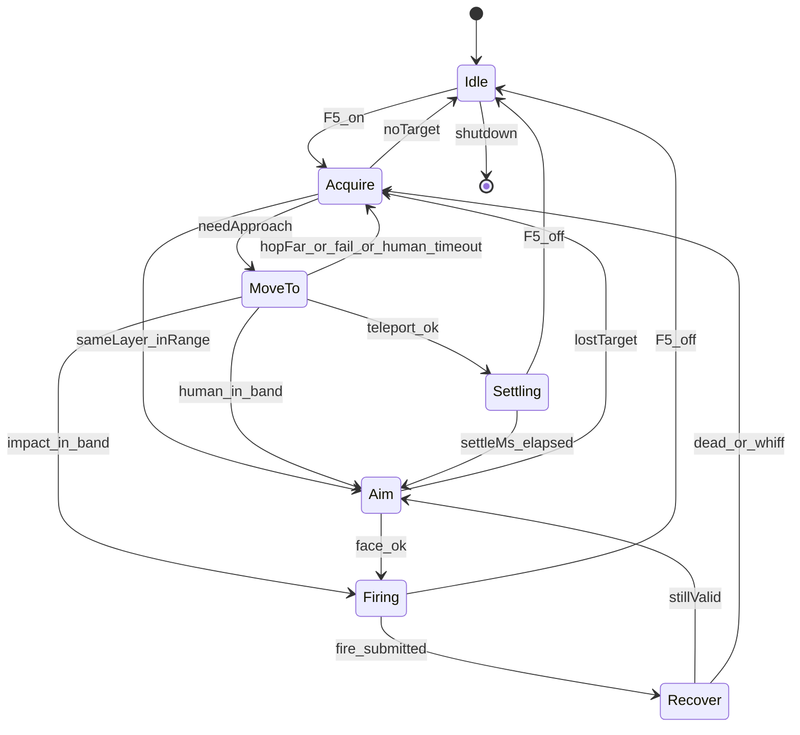

# simple_combat Feature 模块设计（Classic TWMS）

> **状态**：✅ 状态机重设计 · Impact 贴怪（默认）· 拟人 / fill+Doing 瞬移互斥回退  
> **产品**：新枫之谷：经典版（TW · `Maplestory_Classic.exe`）· **不是**枫星  
> **对照来源**：`xcat_for_fengxing` 的状态机/IPC 模式（**不复用偏移/Lua**）  
> **源码**：`x/features/simple_combat/`（含 `heli_rotor.*` 旋翼环）· `ports/attack_input_port` · `ports/mob_pool_port` · `ports/teleport_port` · `ports/player_combat_port`  
> **Impact 飞天（F6）**：[`../fly/模块设计.md`](../fly/模块设计.md)（同 Impact 端口；**F5 交战期同样开 fh-ban**，多源 OR）  
> **空中贴怪防抖**：[`防抖.md`](防抖.md)（钉 Y + X 跟 ideal + 两轴软悬停；面板「防抖」）  
> **瞬移锚点**：[`../teleport/模块设计.md`](../teleport/模块设计.md) · fill+Doing 仅当 Impact/拟人都关  
> **掉图结案**：[`../teleport/P0d_fill_slim软重载结案.md`](../teleport/P0d_fill_slim软重载结案.md)（Doing 后勿抢收态）  
> **契约**：`common/xcat_payload_control.*` · GUI：`xcat_app/workspace_tabs.cpp`  
> **安全**：禁止 `SendInput` / GA `.text` hook；Settling 禁止 SyncRel / 手写 Attr=4 抢收态；Impact 贴怪只走 `teleport_port` 的 `ImpactSetVelocity`（旋翼）/ `ImpactImpulseToward`（F6 跟飞）

---

## 0. 一句话

自动打怪 = **显式状态机**：选怪 → **位移贴近** → 朝向 → **出刀 `OnFuncKey(A 键绑定优先，空则 BasicActionAttack=5/52)`** → Recover。  
位移优先级（互斥）：**Impact 贴怪（默认）** → 拟人走路 → fill+Doing 贴怪瞬移。  
Impact 贴怪 = **近战直升机**：旋翼环以 ~11Hz 持续托举悬停在怪旁，空中出刀；打死换下一只再飞过去。  
**旋翼与打怪状态机解耦**——出刀、丢锁、技能前置、池未热身期间照转；停一拍就掉一段（fh-ban 下没有地板托）。  
交战期开 `fly_fh_ban`（`CombatImpact` 源，与 F6 多源 OR）；无怪超 1500ms 则卸掉、正常落地站着。

---

## 1. 设计原则（硬约束）

1. **单一职责分层**：选怪 / 出刀 / Impact / 瞬移 / 拟人走路不塞进同一分支森林。
2. **显式状态机**：状态切换带最短驻留；日志写 `state A→B why`。
3. **出刀真源唯一**：`UserLocal.OnFuncKey(Down/Up, FuncKey)`；**优先 A 键 keymap**（`GetDataByKeyCode(Key.A=15)`，可为 Skill/BasicAction）；A 空才回退 `5/52`。**不用** `KeyDownTouch`（CFF SEH）；硬编 `OnKey(Ctrl)` 易假成功。
4. **位移策略互斥**：`impactOn` 时 `humanOn=tpOn=false`；仅 Impact 关且拟人开才 `HoldWalk`；两者都关才 `TeleportNativeSkillCall`。
5. **位移与出刀互斥（仅瞬移/拟人）**：`MoveTo`/`Settling` 禁止 Fire；`Firing`/`Recover` 禁止 Teleport / 走路。
   **Impact 不受此约束**：旋翼是飞行控制而非「贴怪位移」，出刀期间必须继续托举，停转即掉落。
6. **BIN 门禁**：声称「能打」须 `combat.log` 有序流转 + `SecAttack pktSum` 上升或 mob HP 下降。
7. **安全**：无 `SendInput`；无 GA `.text`；Impact 只走 `teleport_port::ImpactSetVelocity`；瞬移只走 fill+Doing；拟人走 KeyPad `SetFields`。

---

## 2. 状态机



| 状态 | 允许 | 禁止 |
|------|------|------|
| Idle | `RestoreWalkable`（关/换图） | 一切战斗副作用 |
| Acquire | 读 mob 快照（`EnsureFreshMobSnap` ≤16ms）、MobCtrl 软优先选怪、上锁、softBan | TP、Fire；禁止完整 Collect |
| MoveTo | **Impact**：只发布 setpoint 等进带（冲量在 A 层）；瞬移：一次 fill+Doing；拟人：`HoldWalk` | Fire、Rescue；Impact **不进 Settling** |
| Settling | 等待满窗（仅瞬移） | Fire、再次 TP |
| Aim | 朝向；校验命中带 | 带内再贴 |
| Firing | 一次出刀（普攻或可选多发） | TP / Rescue |
| Recover | 最短 ≥480ms + MotionBusy | TP、再次 Fire |

> **Impact 是例外**：旋翼层（`heli_rotor`）不在这张表的管辖范围内——它在**每个**状态下都可能发冲量，包括
> `Firing`。「位移与出刀互斥」只约束 fill+Doing 与拟人走路两条路径。

### 几何常量

| 项 | 值 | 说明 |
|----|-----|------|
| 同层 | 同 `zMass`（失败退 `|dy|≤45`） | 优先同连通域；无则跨 zMass（仅瞬移策略） |
| 命中带 | `12 ≤ \|dx\| ≤ standOff×1.35` | 带内禁止再 TP；默认 standOff=40 |
| 落点 | 怪台 ± standOff | FH 为 Prev/Next **线段链**；仅链条端点内缩 36，接合处不缩 |
| 最大 hop | 160px | 超距 softBan + Acquire（瞬移） |
| 拟人超时 | 8000ms | 同层走路追不到 → softBan 换怪 |
| settle | 700ms | Settling 满窗（仅瞬移） |
| 普攻 hold / recover | 220ms / 480ms | `attack_input_port` |
| 过滤 | `tpl=9999999` | 特殊怪 |

---

## 3. 出刀端口（唯一真源）

`ports/attack_input_port`：

- `FaceToward(dx)` 只记相对位移；**暂不**发左右键（L/R SEH）。
- `TryFirePrimary` → 间隔门控 + `OnFuncKey(Down)` → 异步 `Up`（hold≈180ms，不堵主线程）。
- FuncKey：优先 `GetDataByKeyCode(Key.A=15)`（技能/动作均可）；A 空再 `GetKeyByFunc(5,52)` / 合成 `5/52`。
- `MotionBusy`：距上次成功出刀 &lt; `EffectiveAnimBusyMs`(220ms) 或 Up 未到。**当前无调用点**——它是"按秒表猜动画有没有放完"的估计值，已被下面读引擎真实忙位的硬闸取代；留着仅作回退备用。
- 智能间隔默认 **关**；开时随机 480–560ms（不低于 recover）。
- **拟人走路**：`HoldWalk(±1)` → 每帧 `KeyPad` A/B/C（右 A=0 / 左 A=64）+ AuxFrameTick；`StopWalk` / 出刀前 / 关 F5 清锁存。OnKey L/R **不**驱动物理（已 BIN）。

**不做**：主线程 Sleep、改 face 位叠床架屋、SendInput、伪造攻包。

### ★★★ 引擎动作忙锁闸：没挥出去的刀，不许记成空刀

**背景（攻击加速停用后才暴露）。** `attack_accel` 的"清忙锁"（周期写 `LocalUser+ActionBusy = -1`）在 v65 被停用后，引擎的出刀周期整整慢了一个数量级：

| 口径 | 我们刷键的节奏 | **引擎真正接受出刀的节奏** |
|---|---|---|
| b105 加速运转中 | — | 中位 **82ms** |
| b106 无加速（kras） | 137ms | 中位 **801ms**（p25 656 / p90 826） |
| b106 无加速（E226） | 138ms | 中位 **214ms**（p75 634） |

我们却仍按 `gConfigIntervalMs`(123ms) 刷键 —— 每命中一次要刷 **5.8 次**，4.8 次被引擎当场吞掉（`Dumps/runtime/_cadence.py`）。

**真正的代价不是废键，是假空刀丢靶。** 被吞的刀照样走 `ArmWhiffObserve`，窗内没掉血就 `+whiff`，连续 `kWhiffFireN`(3) 次即 `softBan` 换怪。于是 b106 出现这个荒唐比值：

> **丢靶 424 次 > 击杀 214 次** —— 每杀 1 只怪，先扔掉 2 只**已经贴好位**的怪，而那些"没打中"的刀根本没挥出去过。

同图同角色的总账：**60.3 → 27.9 kills/min（-54%）**（`Dumps/runtime/_ceiling.py`）。

**闸门。** `attack_accel::QueryActionBusy(localUser, out)` —— **只读、不写、不 hook、不调引擎函数**。与被停用的清忙锁是两条路：那条写 `-1`，这条只读。

语义（428 份历史 `attack_accel.log` 实测：`-1` 占 99.2%，其余为 `0/5/6/7/16/17` 等小整数动作序号）：

| 读到 | 含义 | 我们的动作 |
|---|---|---|
| `busy < 0` | 空闲 | 正常出刀 |
| `busy >= 0` | 正在放动作，按键会被吞 | 回 `Recover`（`engine_busy`），**不出刀、不 `ArmWhiffObserve`** |
| 返回 `false` | 偏移未就绪 / 读越界 | **按"不拦"处理**，退回旧行为 |

**三条设计约束，别改掉：**

1. **闸放在转身块之后。** 忙的那 800ms 里转身是免费的，忙位一开就能立刻挥，不用再赔一拍 `face_settle`（见 §换向分拍的收益账）。
2. **`break` 必须赶在 `ArmWhiffObserve` 之前。** 这是整个闸门的意义所在——没挥出去的刀不该记账。位置写反了，丢靶 424 次一分不少。
3. **失效保护 `kEngineBusyMaxWaitMs`(1200ms) 不许拿掉。** 实测动画 p90 只有 826ms，1200ms 留足冗余；万一某些职业/武器的忙位不按 `-1/≥0` 走，超时会强行放行一刀并打点，最坏退化回旧行为，**绝不让一次读反演变成机器人彻底停手**。放行后重新计时，保证退化态也只是每 1200ms 挥一刀，不会变回无节制刷键。

#### ⚠️ 血的教训：忙时必须原地 `break`，绝不许换态

第一版把忙判写成 `EnterState(Recover, "engine_busy")`。判定本身完全正确（override 0 次、`switch reason=whiff` 424→24、命中间隔 810ms 打满引擎上限），**但 kills/min 反而从 27.9 掉到 18.1**。

原因不在闸门，在换态：等待 800ms 期间面板间隔早已满足，`CanFirePrimary()` 每拍都放行，于是 FSM 按 tick(16ms) 在 `Firing↔Recover` 之间自激——**310 次真实出刀伴随 9038 次弹回，约 66 转换/秒**，正踩在本文件反复警告的红线上：

> `StopWalk` 是 `InvokeAndWait` **阻塞抢占游戏主线程**（High）…… BIN 1394b0：FSM 自激 **64/s** 会合成泵抢占冻结 ImGui

抢走的主线程时间全从移动和贴怪里出，所以"每一刀都打满节奏"却"总产出更低"。附带灾害：`state` 行占满日志的 **91%**（19441/21428），把验收数据挤出轮转；另见 §进近看门狗那处同源教训——`gStateEnterMs` 被每次迁移重置，churn 会让看门狗永远触发不了。

**正解**：忙时 `break` 留在 `Firing`，一次转换都不产生。不损失任何跟踪能力——`Firing` case 开头已做 `RefreshLock` / 越界 / `TryConsumeWhiffApproachCorrect`，与 `Recover` 等价；且 `Firing` 无滞留看门狗（`gStateEnterMs` 只被 `MoveTo` 用）。可见性改由 `engine_busy stat` 每 5s 节流播报累计被拦拍数承担。

**推广**：任何"等待型"闸门都别用换态表达。这个 FSM 的态迁移带主线程副作用，等待应当原地 `break`，只有语义真的变了才迁移。

**验收怎么看。** 日志里三个量：

- `engine_busy stat blocked=` 每 5s 一行，忙窗占比 = Δblocked × tickMs / Δt（无加速时本就该很高，不是 bug）；
- `switch reason=whiff` 应从 424 次**塌到个位数**——这是本闸成立的判据（已实测 24 次）；
- `engine_busy override` 若**密集**出现，说明该角色忙位语义不成立，应回退本闸（已实测 0 次）。

**别误读。** 本闸**不会**让命中变快：801ms 是引擎给的硬底，清忙锁没了就绕不过去。它买到的是"不再丢已贴好的怪"和"每一刀都挥在好位置上"。

**⚠️ 连带影响：出刀闸的经济账作废。** §"⚠️ 别改成收紧出刀闸来治空刀"那段的两次实证（dy24/dx60 让 kills/min 119→109），是在**一刀成本 82ms** 下算的——刀便宜，乱挥比等着划算。现在一刀要等 800ms，机会成本涨十倍，"宁可等一拍站好再挥"的性价比完全反转。**那段结论在无加速档下不适用，要重新量**，别直接引用。

---

## 4. 位移策略

优先级（SM 内互斥）：

| 优先级 | 字段 | 面板 | 行为 |
|--------|------|------|------|
| 1（默认） | `simpleCombatImpactApproach=1` | 「Impact贴怪」 | 旋翼环悬停在怪旁 → 进带 `Firing`（空中出刀） |
| 2 | Impact 关 ∧ `simpleCombatHumanWalk=1` | 「拟人模式」 | `HoldWalk` 同层 |
| 3 | 两者都关 ∧ `simpleCombatTeleport=1` | （强制开） | fill+Doing → Settling |

### 4.0 Impact 贴怪 = 近战直升机（默认 · 给后续 Agent）

**三层解耦。改这块之前先看懂为什么必须分层，否则一定会把「掉出地图」改回来。**

```
C 武器层  Firing/出刀        进命中带就砍。出刀期间旋翼照转 —— 不再停冲量
B 飞控层  simple_combat FSM  只发布 setpoint + 模式，不发冲量
A 旋翼层  heli_rotor         每 tick：读 Ap 位置+速度 → 横向 P 控 / 纵向 P 控+抗重力配平 → 小冲量
```

#### 竖直物理模型（实测 · 每一条都曾搞反并直接导致掉图 / 空刀）

**① `+Y` 是向上。** 别套 MapleStory「y 向下」的常识。

- 铁证：`foothold_path.cpp:37` 实机记录——Doing 挂不上台，「掉到**下层** `fh60@(786,-1463)`」，下层 y 更负。
- ⚠️ 同文件第 24 行注释「MS +Y 向下」是**错的**，曾被引用并导致整轮方向反掉，别再拿它当依据。
- 交叉验证：BIN 4ad1b2 `y` 从 `55` 掉到 `-1318` = 玩家实见「掉出地图」；BIN 79947e 角色 `y=-276`、怪 `y=-95` = 玩家实见「悬停在怪物底下空刀」。

**② 竖直冲量是叠加语义，写 `0` 无效。** BIN 4ad1b2：`cmdVy=0, pre=-670, post=-670`。
所以悬停不可能靠「写一次 0」实现。横向相反——X 是**设速度**：`cmd=-560 → vx=-560` 精确复现，叠加会是两倍。

**③ 合速被引擎钳在约 `[-670, +110]`，上下极不对称。**

| 方向 | 权限 | 含义 |
|---|---|---|
| 向上 | 合速上界 `+110`，实测净爬升 ~106px/s | 弱但可持续，**必须每拍给** |
| 向下 | 重力免费提供，终端 `-670` | 不需要发指令 |

⇒ **`kHoverVy` 这个常驻上偏就是悬停机制本身，不是缺陷。** 拆掉它 = 自由落体。

#### 历史病灶（两轮反向翻车，都记在这里）

**BIN 79947e「悬停在怪物底下空刀」**——方向搞反 + 配平被当成缺陷：

1. `ty = my - kHeliLiftPx` 在 `+Y 向上` 下把悬停点压到怪**下方**；
2. 那 `-90` 上偏其实是抗重力配平，却被当成「无条件偏置」；
3. 越过图边后 `Rtb` 目标取 FH AABB **图心** `y=355`，而怪在 `y=-95` → 把角色往怪下方拖了 450px；
4. 1247 条采样里 1186 条 `emg=1`，战斗意图长期被包线接管。

**BIN 4ad1b2「一直掉下地图 + 205」**——错误地信了「有自然下沉」：

1. 上一轮把 79947e 的 `+110` 误读成「引擎自带下沉封顶」，据此改成单边律「高于 setpoint 就不发指令」；
2. 但真相是②③：不发 = 叠加语义下什么都没发生 = 保持终端落速 `-670`；
3. 且把图底救援推力改成 `cmdVy=0`，**亲手拆掉唯一兜底** → `y` 一路掉到 `-1318`，连吃 205。

**教训**：这两轮都是「凭一份日志里的饱和值反推物理模型」翻的车。改竖直律前先用 `drift` 字段确认重力增量，
并拿 `foothold_path.cpp:37` 复核方向，别再从单份日志的数值猜语义。

#### 为什么要 A 层（历史病灶 · BIN 0bf954 / ac21f9）

旧实现把冲量写在 `State::MoveTo` 里点射，于是：

| 病灶 | 后果 |
|---|---|
| 冲量只在 MoveTo 发 | 一进 `Firing` 整个出刀窗口零冲量，fh-ban 下 = 自由落体 |
| 无锁期间完全不发 | `Acquire`/池未热身/`skill_prepare` 全是提前 `return` → 一路掉出图底 |
| 只按位置误差算 v，不读 `Ap.Vy` | 没有阻尼项，重力累积的落速无从抵消 |
| `ClampImpactSpeed` 每轴 80 地板 | 近距做不了小修正，只能大踹 → 限幅震荡越踹越偏 |
| 瞄点取 `EstimateLandPrefer` | 那是怪脚下的**地面台**，空中朝它推 = 往地板下钻 |

**硬约束**：旋翼 `heli::Tick()` 必须在 `TickImpl` **所有提前 `return` 之前**调用。往那之后挪一行，掉图立刻复现。

#### A 层控制律（`heli_rotor.cpp`）

- 端口：`teleport_port::QueryFlightState()` 读 `Ap` 位置 + 速度；`ImpactSetVelocity()` 直给速度（**不套 80 地板**）。
- 发射节奏 `kIssueMs=90`（~11Hz）；emergency 收紧到 45ms。
- 横向：`cmdVx = KpX·errX`（4.0），死区 12px。X 是**设速度**语义，每发抹掉旧速度，单 P 项在离散意义上自带阻尼。
- 纵向：`!onFh` 时先由 P 控算**期望均速** `desiredVy = (|errY|>12 ? KpY·errY : 0)`（`KpY=3.0`），
  再换算成本拍要发的**增量** `cmdVy = (desiredVy − vy) + trim/2 + 30`。
  - `+Y 向上` ⇒ `errY>0` = setpoint 在上方 = 正向指令。
  - **重力配平每拍都要付**（叠加语义下写 0 是空操作），但它是按**距上次发射的真实耗时**
    算出来的 `trim = 2·sinceMs`，**不是**写死常数——主线程一卡顿发射变稀，需要的配平同比变大。
    历史上写死 `kHoverVy=90` 正是净下沉的根源（90ms 周期只给了半油门，盈亏线是 180）。
  - 末项 `+kGravityPerStep/2 = +30` 是「冲量落地那一帧也吃一步重力」，漏掉它稳态稳定下沉
    30px/s，十秒 300px —— 正是过去「看着在悬停却越飘越低」的量级。
  - **死区 = 稳态位置残差的上界**（纵横都取 12px）。死区内不产生位移意图、只维持速度 0，
    所以角色停在**进入死区的那一点**；而进近总是从上方降下来，残差会一边倒地偏高。
    BIN 14a58c：死区 30 时中位残差 `+18px`，叠加当时 `kHeliLiftPx=14` = 稳定悬在怪上方 32px 砍空气。
    ⚠️ 曾经取 30 是怕「同台时把站定的角色踹飞」（BIN 79947e），该隐患现由 `onFh` 分支兜住
    （挂台强制 `cmdVy=0`），不必再靠宽死区代偿；fh-ban 悬空时更没有台可踹。
  - 挂台（`onFh`）时高度由引擎免费维持，**一发竖直冲量就变成连续小跳**，绝不能碰。
- 只读观测 `drift`（未发冲量的相邻两拍 `|Δvy|` 峰值 = 重力每拍增量）：它明显超过 `kHoverVy`
  说明配平不足、角色会稳定下沉——该抬配平，**不是**加大 `Kp`。
- 档位**意图**上限 `{vx, 上升, 下降}` —— **三轴同速**（2026-08-07 改）：
  `Cruise {560,560,560}` · `Rtb {480,480,480}` · `Station {340,340,340}` · `Hold {260,260,260}`；
  `kKpY` 也从 3.0 提到 4.0 与 `kKpX` 对齐。这是**意图**限幅、不是作动器限幅，
  作动器侧 `kMaxCmdVy=1200`（与 `kMaxCmdVx` 同级）。理由与安全论证见下方
  「竖直提速到与横向同级」。
- **判定框分流（2026-08-09）**：
  - **F5 Combat 可位移** = raw FH AABB **中心 × 0.95**（`kCombatMoveBoundsScale`）：站位点、包线、预刹、RTB、出刀 `oob_hold` 同框。贴边怪照打，人不越框。**Travel 超级赶路不套此框**（用 raw±slack，否则边门外的门会被预刹钉死）。
  - **F6 / 外扩空域** = AABB ⊕ slack（`ClampToAirspace`）：手动飞与历史紧急语义保留。
  - 禁止再把「瞬移落点内缩 72」套回战斗瞄准（BIN 4a79e4）。
- **安全包线**（注意 `Rect.top/bottom` 是**数值**含义，`top=min y`；`+Y 向上` ⇒ `top` 才是图底。
  Combat 下 `t/b/l/ri` 指 **0.95 框**；Travel 用 raw±slack；F6 非 unbounded 仍用外扩空域）：
  - `vy < -kMaxFallVy`（高速下坠）→ 弃战全力上拉 `kRescueClimbVy=300`。
    该阈值现为 **780**，必须**高于**最大下降意图 560，否则每次正常快速下降都被误判成紧急
  - `y < t`（跌破合法空域下沿）→ 全力上拉。**这是唯一会掉出地图的方向，绝不可改成 `cmdVy=0`**
    （BIN 4ad1b2 就是这么改出来的）。上拉量必须**高于盈亏线 `2·sinceMs`**，否则越"救"越掉——
    bea1c3 给 `+120`（周期 90ms、盈亏线 180）从 `y=-270` 一路掉到 `-1188` 被服务端断线。
    再深 `kBailoutPx=420` 则判不可救，缴械让引擎接管
  - `y > b`（飞过合法空域上沿）→ 受控下沉 `-caps.descend`，不是放任自由落体
  - `x < l` / `x > ri` → 以 `kEnvPushVx=300` 向内推
  - **撞墙预刹（两轴都有）**：按 `kBrakeHorizonSec=200ms` 的前视把意图速度钳到
    「这一周期不会越界」的幅值。它是**预防**式的，位置包线是**事后**式的；竖直这一道是
    提速到 560 之后的必需品（见下方专节）
  - emergency 可越过拥堵闸与技能前置闸，**不可**越过无敌闸

#### B 层：setpoint 与档位（`simple_combat.cpp`）

| 模式 | 触发 | setpoint |
|---|---|---|
| `Station` | 有锁 ∧ 距站位点 ≤260px | `ty = my + kHeliLiftPx`，`kHeliLiftPx = 0` 即**与怪同高**（写成 `my - lift` 会压到怪下方，BIN 79947e）。历史上给 `+14` 是补重力锯齿，A 层改成重力前馈闭环后锯齿只剩约 4px，那 14px 就纯变成上偏 → 砍空气，**别再往这里加"保险余量"**。**防抖开**：到位后钉 **Y**、**X 每拍跟 ideal**，旋翼进 settle 软悬停——详见 [`防抖.md`](防抖.md)。**可位移区**：站位点经 `ClampToCombatMoveBounds` 夹进 **raw FH AABB × 0.95**（中心缩放）；贴边怪照打，人不得稳出此框；Impact 出刀同框外 `oob_hold`。**左右竖边**：外侧站位越框，或人在靠缘侧且人到缘余量 `< standOff` → **强制内侧 side**（BIN 08:37 框沿空挥） |
| `Cruise` | 有锁 ∧ >260px | 同上，放宽水平速度 |
| `Hold` | 丢锁但在 1500ms 宽限内 | **进入 Hold 那一刻**的位置（不可每拍跟当前位置，等于放任下坠）。走传送门由用户关 F5/F6，不在浅区无锁时强行落地 |
| `Rtb` | **仅左右**出 Combat 可位移框（raw×0.95 的 left/right）；**上下不触发** | 水平拉回 **`kRtbAimInsetPx=48`**，**Y 保持当前高度**。**latch**：出左右置位；已回左右框内即停 RTB（可 Station）；须水平深入 **`kRtbExitInsetPx=48`** 才清 latch。竖直越界交给 A 层包线与站位 |
| `Off` | 宽限到点 / F5 关 / 硬暂停 | 同时卸 fh-ban → 正常落地 |

#### C 层：出刀带 —— 悬停带 ≠ 出刀带

「还要不要再飞」和「这一刀够不够得到」是两个问题，阈值差一倍多，**必须分开**：

| 带 | 常量 | dy 容差 | 用途 |
|---|---|---|---|
| 悬停带 `InHeliHoverBand` | `kHeliHoverMaxDy` | 80 | 只回答横向站位是否到位 |
| **出刀带 `InHeliFireBand`** | **`kHeliFireMaxDy`** | **35** | 出刀硬门；`NeedsHeliStationKeep` 也跟这个口径 |

BIN 14a58c + b8c7f6 合并 483 次出刀实测（`dy = 角色y − 怪y`，`+` = 角色在上方）：

| | dy 中位 | 四分位 | \|dy\|>40 |
|---|---|---|---|
| 命中（`whiff wounded`） | `+13` | `[0, +19]` | **1.6%** |
| 空刀（`whiff tick`） | `−3` | `[−57, +21]` | **47.2%** |

- **dy 是命中/空刀的唯一显著区分量。** 同一批数据里 `|dx|` 两组中位 `44` vs `43`，毫无区分力——
  别再往横向站距 / `standOff` 上找空刀的原因（我找过，是死路）。
- 阈值 35 取自权衡曲线拐点：保住 **98.4%** 命中、拦掉 **50.9%** 空刀。收到 30 只多拦 5 个点却
  白丢 6 个点命中；放到 40 命中一点不涨、反而少拦 4 个点。
**⚠️ 这个 dy 必须在全部五处门禁上同步生效，少一处就两头对推：**

| # | 位置 | 说明 |
|---|---|---|
| ① | `MoveTo` 的 `heli_in_band` | 到位判定 |
| ② | `Aim` 的 `heli_hover` | |
| ③ | `Aim` 的 `InHitBand / InMeleeHoldBand` 旁路 | 纵向容差 `SameLayer 45` / `同台 100` 是**地面站桩**口径 |
| ④ | `Recover` 的 `heli_hold` / `heli_near` | `heli_near` 原本无条件出刀 |
| ⑤ | `Firing` 的 P0 硬门 | `FireGateOk` 同为地面口径，会把 `dy=60` 判成可打，故 dy 超限**一票否决** |

外加 `NeedsHeliStationKeep`（「够不到就得继续飞」，口径同上）。

> **BIN 1394b0 事故**：首版只改了 ②③⑤，漏了 ①④。dy 落在 `(35, 80]` 时 `MoveTo` 说「到了」
> → `Firing`，`Firing` 说「够不到」→ `MoveTo`，70s 内对推 **4495 次（≈64/s）**，而收紧前同一
> 路径只有约 1.9 次/秒。更糟的是 `gStateEnterMs` 被每次迁移重置，`kHeliApproachTimeoutMs`
> **永远触发不了**，连换靶自救都做不到——现象就是「头顶台上的怪一直打不到、角色在下方死转」。
> 教训：**收紧任一出刀判据时，必须同时收紧所有『到位/续砍』判据**，否则 FSM 会在两个不
> 一致的阈值之间自激。

#### FSM 抖动为什么会冻死 IMGUI（放大器已断，但要知道它存在）

`EnterState` 在离开 `MoveTo` 时会调 `ports::attack::StopWalk()`，而它：

1. `InvokeAndWait` **阻塞抢占游戏主线程**（`JobPrio::High`）；
2. 给 `VK_LEFT` / `VK_RIGHT` 各注入一次抬起事件；
3. **没有「没在走路就早退」的短路**——不管走没走都跑完整流程；
4. 自身日志被 `sStop < 32` 限流，所以 `combat.log` 里**看不见**，只能从
   `key_macro_bin.log` 的 `osSend vk=* UP` 反推
   （**该 BIN 默认关**；排障设 `XCAT_KEYMACRO_BIN=1`，日志巨大、日常勿开；上传器跳过该频道）。

BIN 1394b0 实测：自激 64 次/秒 → `osSend` **4528 次**（69/s，峰值 112/s）+ 同量主线程抢占
→ IMGUI 覆盖层点不动。`vk=0x25 × 2264`、`vk=0x27 × 2264` 与 `MoveTo→Firing × 2261` 一一对应。

**现已在 `EnterState` 里加闸：`impactOn` 时跳过 `StopWalk`**——直升机全靠冲量位移、从不走路，
这一步本就是空转。切档时的锁存清理由 `SetImpactApproachEnabled` / `SetHumanWalkEnabled` 兜底。
拟人路径另有 `StopWalk(prev==0)` 早退、`HoldWalk` 同向短路与出带迟滞，减轻同类放大器。

> 排查同类「UI 卡死 / 游戏发飘」时的固定手法：先开 `XCAT_KEYMACRO_BIN=1`，再比
> `key_macro_bin.log` 的体积与 `osSend` 条数，回 `combat.log` 找对应频次的状态迁移。
> 体积从 35KB 跳到 224KB 就是强信号。验完记得关回默认（不设环境变量）。

#### 边界内缩事故：为什么「只有地图中段的怪能打中」

**症状**（BIN 4a79e4）：头顶和脚下的怪都打不中，只有中段飞行途中能命中；连续四个目标全部
2600ms 进近超时换靶，出刀率掉到 0.5 次/秒。

**根因**：A 层包线、B 层 `NeedsHeliRtb`、站位点 `ClampAimInPlayBounds` 三处都用
`kLandMarginPx(24) + 48 = 72` **向内缩**，等于把 FH AABB 最外一圈判成禁区。而站在最低/
最高台上的怪恰好全在那一圈里：

```
MoveTo heli id=756348 d=(40,-57)                        <- 怪在下方 57px
heli mode=station pos=(764,-550) sp=(788,-558)          <- setpoint 只在下方 8px，被钳住了
```

怪在 `y≈-607`，站位点被钳在 `-558`（AABB 下沿 + 72），永远差约 50px 进不了 ±35 的出刀带。
更糟的是三层口径一致地互相加强：飞控想往下、A 层包线判「跌破最低台」直接用
`kRescueClimbVy=+300` 覆盖掉下降意图（日志里满屏 `emg=1` 配 `des=-50`）。

**修法**：统一为「**AABB 之内一律合法，外扩 `kEnvSlackPx=48` 才算真出界**」。

| 位置 | 旧 | 新 |
|---|---|---|
| A 层包线（`heli_rotor.cpp`） | `AABB 内缩 72` | `AABB 外扩 kEnvSlackPx` |
| B 层 `NeedsHeliRtb` | `AABB 内缩 72`；拉回到内缩线 | `AABB 外扩 kEnvSlackPx`；拉回到内缩 `kEnvReturnInsetPx` |
| 站位点 `ClampAimInPlayBounds` | `AABB 内缩 72` | `AABB` 原始边界 |

> 那个 72 是从**瞬移落点**的安全内缩借来的，语义不通用：落点要避开边界，悬停点不用——
> **怪的坐标本身就是该处合法的证据**。夹取仍然保留（ac21f9 的 Y 过冲出图必须拦），
> 只是不再向内缩。真·坠落另有 `vy < -kMaxFallVy` 的**速度**闸兜底，不依赖位置阈值。
- 收紧不会卡死：`PublishHeliSetpoint` 在 pass 循环顶部**无条件每拍调用**，旋翼照常把 dy 压下去，
  角色只是「先不砍、边飞边等」。

#### 出界掉线：靠预刹，不靠放大缓冲（BIN c9b8dc）

上面那次放宽把命中救回来了（出刀 3.0 次/秒、进近超时归零），但暴露了另一个**一直存在、之前被
72px 内缩挡住**的缺陷：**横向进近根本不刹车**。

怪在最左台，角色带 `vx=-448` 扑过去，AABB 左沿 `-585`，实际冲到 `-658`（**出界 73px**），
在界外滞留约 130ms 且 `fired=1`——**界外还在出刀**。两段界外攻击的时间戳
（`05:12:46`、`05:13:05`）与用户报的两次掉线一一对应：服务端在校验坐标合法性。

事后靠 RTB 拉回是**追不上的**：`kEnvPushVx=300` 反不过 448 的入射速度，要好几拍才反向。

正解是从源头消灭过冲。**X 是设速度语义**——这一拍发多少，接下来整个发射周期就以多少速度平移，
所以只要让「本周期位移」落在 AABB 内，就不可能冲出去：

```
roomR = (rawR - x) / horizon      // 允许的最大 +vx
roomL = (rawL - x) / horizon      // 允许的最小 vx（界内为负）
cmdVx = clamp(cmdVx, roomL, roomR)
```

`horizon` 取 **150ms** 而非标称的 90ms：主线程一卡顿发射就变稀（实测 `since` 到过 106ms），
按标称算会刹不住。放在包线**之后**，这样紧急内推也按这条重算——已在界外时 `roomL/roomR` 同号，
两句钳位会把指令顶成内推且力度比 `kEnvPushVx` 更足，一个周期回到界内。

配套三条：

- 横向余量 **48 → 8**。它只留抖动余量，不当缓冲区用：界外没有台也没有怪，多待一拍都是在赌
  服务端校验。真正防过冲的是预刹，不是把这个数放大。
  （**竖直**后来另行放回 48，理由完全不同，见下方「可站立面 ≠ 合法空域」——别把两轴混为一谈。）
- 新增 `kEnvReturnInsetPx = 24`：RTB 拉回到 AABB **内缩 24px**，纯迟滞——拉到边沿上会立刻又落进
  出界判定，模式在 `rtb`/`station` 之间抖。24 远小于 ±35 的出刀带，不影响够边沿台上的怪。
- **界外一律不出手**：`PlayerOutOfPlayBounds()` 硬闸插在 Firing 的 P0 门**之前**。必须在前面，
  因为 `heliFireOk` 会绕过 `FireGateOk`，指望后者兜底兜不住。命中则回 `Aim`（日志 `oob_hold`），
  让旋翼按 RTB 把人拽回来再打。读不到边界时放行——不能因为拿不到图信息就哑火。

> 教训：`kEnvSlackPx` 这类「安全余量」不是越大越安全。放大它只是把**控制律缺陷**（不刹车）
> 藏起来，代价是边沿的怪够不到；缩小它缺陷就原形毕露。余量该做的是吸收抖动，防过冲得靠控制律本身。

**后续（c72cff）**：上面这套预刹只把过冲从 73px 压到 43px，没消灭——因为它建立在
**错误的横向作动器模型**上（详见下面的语义证据汇总）。`+300` 的紧急内推遇上 `v=-556`
只能把速度推到 `-256`，人还在往外飞。同一份日志里 `oob_hold=24`：界外禁刀的硬闸有效，
全程没有界外攻击，也没再掉线。模型订正后预刹才真正成立——`desiredVx` 是意图、`cmdVx` 是增量，
反向一发到位。

#### 可站立面 ≠ 合法空域：贴地面层打怪时 970 次「出界」全是误判（BIN b3d1bd · M0002）

第二台机器（`M0002`，跨 15 张图 16 分钟）跑出与本机完全不同的剖面：`oob_hold=970`、
`RTB=73`、`heli timeout=18`、`emg=90`——而同期本机全是 0。用户问的是「这张图为何一直掉线，
是否频繁出界」。**出界属实，但 95% 是我们自己判错了。**

**根因是概念错位。** `map_bounds_port.cpp` 取的是**全部 foothold 的包围盒**（`src="fh"`）：

> **AABB 是「可站立面」的范围，不是「合法空域」的范围。**
> 站在最低那块台上的角色，脚下坐标天然就**等于** `Rect.top`；怪也一样。

于是「越过 AABB = 出界」对**贴地打怪的飞行角色**是结构性误判——不是余量给少了，
是拿站立面当空域用了。近战要够到地面层的怪，就**必须**飞到 `Rect.top` 那一高度，
悬停死区 ±12px 的抖动必然反复压线。

**取证链**（每一步都可复算，脚本在 `Dumps/runtime/`）：

| 步骤 | 结果 |
|---|---|
| 反推各图边界 = `rtb` 拉回目标 − `kEnvReturnInsetPx(24)` | 与该图**怪的最小 Y** 差恒为 21~24px ⇒ AABB 下沿就压在最低那排台上 |
| 触发轴统计 | 竖直 **73** 次 vs 横向 **4** 次 |
| 越线深度（`_verify_slack.py`，1091 个旋翼采样） | **双峰**：中位 8px / p75 10px，然后直接跳到 p90 **311px** / 最大 392px |
| 怪的分布（`_mob_vs_floor.py`） | `110020000` 全图 40 只怪 **100%** 贴最低台；`110040000` 100%；`110030000` 60%；`107000000` 22% |

那个双峰是本节最硬的证据：**86% 聚在 3~10px（悬停抖动）、14% 在 300~392px（一次真坠落）**，
中间是空的。48px 落在两峰之间的空隙里——阈值不是拍脑袋定的，它把两个物理性质完全不同的
样本群分开了。

最后一行否掉了「跳过边界怪」这条路：那 40 只不是「极其边界的怪物」，就是普通地面层，
跳过等于整张图一只不打。

**修法：把合法空域按近战几何从 AABB 推出来，两轴分开给。**

```
合法空域 = FH AABB ⊕ reach
reach_y  = kHeliFireMaxDy(35) + kDeadY(12) ≈ 48     ← kEnvSlackYPx
reach_x  = 维持 8                                    ← kEnvSlackXPx
```

`reach` 全部来自本模块自己的战斗常量、**与地图数据无关**，这正是它能全类型地图适用的原因——
不需要任何逐图调参、也不需要地图白名单。

| 位置 | 旧 | 新 |
|---|---|---|
| A 层包线（`heli_rotor.cpp`） | 两轴同 8 | X 用 `kEnvSlackXPx`、Y 用 `kEnvSlackYPx` |
| B 层 `NeedsHeliRtb` | 两轴同 8 | 同上 |
| 出刀硬闸 `PlayerOutOfPlayBounds` | **零余量**原始 AABB | 同上 |
| 站位点 `ClampAimInPlayBounds` | 原始 AABB | 同上 |

**横向为什么不跟着放**：同一份日志横向只有 4 次，而横向过冲才是真正撞掉线的那条
（c9b8dc 冲出 73px 并在界外出刀）。竖直有「必须飞到怪那一高度」的几何刚需，横向没有。
防横向过冲仍然靠 A 层预刹，不靠放大余量——上一节那条教训依旧成立。

**「够不着的怪就放弃」不需要新机制**：进近看门狗的 `SoftBanFor(kBanUnreachable)` 就是它，
本轮已触发 18 次。空域定义修好后它只对真正够不着的目标生效，怪自己走回来后自然重新入选。

**安全边际未被削弱（已用实采样回放验证）**：把 1091 个旋翼采样按新旧判据各跑一遍——

| | 判为出界 |
|---|---|
| 旧（零余量 AABB） | 143 / 1091 = 13% |
| 新（`kEnvSlackYPx=48`） | **20** / 1091 = 2% |

消掉的 123 个全是 ≤48px 的抖动误判，**那次 392px 的真坠落 20 个采样一个不漏地仍被判出界**。
此外 `kBailoutPx` 的深度缴械与 `vy < -kMaxFallVy` 的速度闸是独立判据，真·掉出地图是几百 px 级
（4ad1b2 掉到 `y=-1318`），本来也不该由 48px 这道闸来拦。

**这次出界与掉线无关**：三次断线里两次发生在**根本没打怪**的时候（F5 已关 43s / 1s），
第三次才在战斗中。签名同为 `lean_local_or_soft`，与下一节记录的残留掉线同一类。

#### 残留掉线：飞行干净了仍会断，且它长得就像位移踢（BIN 683181 / 6dcc28 / c9ff6e）

预刹与作动器模型订正后，**进近超时**归零、出界与紧急大幅下降（`oob_hold`/`emg=1` 仍零星出现，
直到竖直余量修好的 BIN dbad81 才首次做到全零），但会话仍会在几分钟后被断开。
把当晚 25 个会话的 `kick.log` 全扫一遍，得到两条必须先记住的事实：

| 事实 | 证据 |
|---|---|
| 这个掉线**不是**某轮改动引入的 | 同一签名出现在 `02:38 / 02:52 / 04:23 / 05:12 / 05:19 / 05:25`（build 102，早于旋翼重构）与 `05:51 / 05:54 / 06:04`（build 103） |
| 飞行越稳，活得越久 | 掉线时长按时序 `24s → 38s → 47s → 76s → 73s → 161s → 366s → 450s`；出界/紧急归零后寿命涨了约 8 倍 |

**判读订正（重要）**：`verdict=lean_local_or_soft` 过去容易被读成「偏本地/网络波动」。
但本目录 §0 已写明 **位移踢 = 服端掐 TCP + 客户端本地拆线**，且 TW 的 `Session+0x40` 只写
哨兵 204/205、**从不**写 `HackingAutoBlock.Move/Position`。也就是说**位移踢本来就没有通知包**，
它在 `kick.log` 里的长相与网络波动**完全一致**。所以「没有 kick 提示包」只能排除*明示踢*，
**不能**用来推断「是网络问题」。

#### send.log 实包采证：候选逐一证伪（BIN 41c9f7 掉线 / e6b3dc 存活）

武装 `send_probe.on` 后拿到两场对照：`41c9f7` 飞行 289s 后断，`e6b3dc` 飞行 471s 仍在线。
**只截取飞行窗口**后两者剖面几乎完全一致——这一步很重要，41c9f7 前半场是拟人模式，
不剔除会把低速段算进来，得出「掉线场更温和」的反向错误结论。

| 指标（仅飞行窗口） | 掉线场 289s | 存活场 471s |
|---|---|---|
| UserMove 速率 | 1.96 包/s | 1.96 包/s |
| 速度突变（`el=0` 相对元素） | 2.88 次/s | 3.11 次/s |
| `\|vx\|` 中位 / p90 / 最大 | 136 / 559 / 560 | 121 / 559 / 560 |
| `\|vx\|>125` 时长加权 | 50.4% | 46.4% |
| `\|vx\|>560` | 0 | 0 |

**结论：飞行剖面不具判别力**，据此调速度或调频率都没有证据支撑。逐条证伪记录：

| 候选 | 结论 | 证据 |
|---|---|---|
| 上报横向速度过大 | **不判别** | 两场 p90 同为 559、时长占比 50.4% vs 46.4%，一死一活 |
| 速度突变频率 | **不判别** | 2.88/s（死）< 3.11/s（活） |
| 峰值超 560 | **误判** | 13 个 883/-707/vy=670 的尖峰全在 `06:31:04~06`，当时 Impact **未开启**、处于拟人模式且玩家在手动跳台；飞行窗口内 `>560` 为 0 |
| 包间位置瞬移 | **误判** | 曾算出「39/445 超容差」，是 `kDumpBodyBytes=64` 截断导致——只看得到每包前 3~4 个元素，拿中途落点比下一包起点。真实包间位移中位 62px / 最大 236px（510ms），与速度自洽 |
| 发包洪水 | 否 | 出站 20-28/s，其中 77% 是 `op=207`（引擎自发的 MobMove，非我方）；攻击 1.83/s、UserMove 1.96/s |
| 心跳超时 | 否 | `op=23 AliveAck` 间隔中位 10.1s、最大 11.2s、零异常；断线前 7.0s 刚发过 |
| **轨迹不自洽**（服端真正的契约面） | **否，且已量化** | 见下方「Δpos≈v·el 自洽性实证」 |
| 长途满速巡航 | **不判别** | 12 轮断线前 5s 的 `cruise` 占比 1/10~3/10（一次 6/140），峰值 `\|vx\|` 6 场 560 / 3 场 340，死活两侧同分布 |
| ccu / channel_hop 自伤 | 否 | 两场都只在登录时 latch 一次，全程未再触发 |
| 地图重载 | 否 | `foothold.log` 全程单一 map |
| **界外出刀** | **是（已修）** | 早期 24~76s 的短命场次伴随界外攻击；修掉后寿命进入 161/366/450/695/≥768s 区间 |

> **`op=207` = `MobMove`，本行结论已在 2026-08-12 定案**（此前 `OpName` 把它标成
> `MobDropPickUp`，是照抄 CMS `ClientPacket` 同编号所致）。三条证据：
> ① `InstallSendProbe` 记的「207 decoded 08-02: mobId, per-mob seq, start xy, 14-byte elements」
> 是 MovePath 形状，拾取请求没有元素数组；② 速率随场上怪数走，只有「作为控制端上报多只怪移动」
> 讲得通；③ 出站流量里抓到过 CMS 的枚举块哨兵（`222=BEGIN_REACTORPOOL` 3207 次、
> `217=END_NPC` 231 次），哨兵不可能被发出来，证明 `>=180` 段整体 **+2 平移**，`207` 对应 CMS 205。
> **该 +2 已于 2026-08-12 用 IDA 实读混淆种子在 5 个点钉死**（并以已知的 `UserMove=47` 作正向对照、
> 一次命中），证据表见 [`../kick_sniff/断线错误码.md`](../kick_sniff/断线错误码.md) §4.0；严格说
> `207` 本身仍属家族 +2 推论（mob 移动不走 `MovePath_Flush`，未直读到常量），代码里带 `?`。
> **我方吸物实际走 `op=222`（DropPickUp，3207）与 `op=185`（PetDropPickUp，2125）**，
> 查拾取洪泛要看这两个。命名口径见 [`../kick_sniff/断线错误码.md`](../kick_sniff/断线错误码.md)。

#### Δpos≈v·el 自洽性实证：这条最该怀疑的，是干净的（BIN dbad81）

`MoveElem字段.md` §8 写明 `Vx,Vy` 与 `Δpos≈v·el/1000` 的契约面**在服端**（客户端 Flush 不拦）。
位移踢最合理的机制就是查这个式子，但一直没验过。用 1122 个绝对段实测残差
（`Dumps/runtime/_selfconsist.py`，逐段算 `x_i − (x_{i−1} + vx_i·el_i/1000)`）：

- **X 残差**：中位 0.3px、p99 1.0px、最大 1.4px —— 只有整数量化噪声。
- **Y 残差**：中位 3.1px、最大 22px，且**恒为负**（实际落点低于推算）。

Y 那点偏差不是异常，是**重力项**。元素报的是段末速度而非段内平均速度，缺的正好是 ½gt²：

| `el` | 实测 Y 残差中位 | ½·2000·t² 预测 | 样本 |
|---|---|---|---|
| 30ms | −1.1 | −0.9 | 501 |
| 60ms | −3.8 | −3.6 | 449 |
| 90ms | −8.3 | −8.1 | 143 |
| 120ms | −14.5 | −14.4 | 27 |

跨 4 倍时长的二次律精确吻合，g 与本文档上方实测的 2000 px/s² 一致。**这个签名是任何空中段
（含真人跳跃、正常坠落）都会有的**，服端若按此式判定必须容忍它，所以它不可能是踢人依据。

> 顺带：这也是「不要拿包间落点比下一包起点」那条误判的正解。`kDumpBodyBytes=64` 截断让跨包
> 比对必然失真，而**同包内相邻绝对段**不受截断影响，才是能真正检验契约的那把尺。

#### 累积式评分假设：证伪；存活时长呈无记忆分布（12 轮全样本）

「服端维护一个随可疑移动累加的分数、到阈值掐线」是当时剩下的头号候选。它有个硬预测：
**断线时刻的累计量应跨会话收敛**，而墙钟时长不必。12 轮存活时长跨 24s~979s（40 倍），
正好是检验它的好底子。取 `[Connected, Disconnected]` 窗口逐轮算
（`Dumps/runtime/_accum_threshold.py`，旋翼遥测节流实测 511ms 恒定，可当飞行时长代理）：

| 候选累计量 | CV | 均值 | 极差 |
|---|---|---|---|
| 出刀次数 | 0.79 | 776 | 22x |
| 飞行时长 | 0.81 | 240s | 15x |
| 目标切换 | 0.82 | 153 | 400x |
| 飞行位移 | 0.86 | 58 kpx | 57x |
| （对照）墙钟时长 | 0.96 | 312s | 26x |

**没有任何一个收敛**——全部与墙钟同量级。固定累积阈值假设不成立。

反过来，墙钟时长自身的形状很干净：`CV=1.12`，自助 90%CI `0.75~1.41` 涵盖 1.0，
排序样本贴合指数分位数（`_hazard.py`）。这是**无记忆过程**（恒定风险率）的签名，
λ ≈ 1 次 / 271s。

> **别把「无记忆」读成「不是我们的锅」。** 累加式评分会给出 CV≪1，老化会给出 CV<1，
> 而**周期性/概率性抽查**同样给出恒定风险率。所以这条证据只把机制从「累加到阈值」
> 收窄到「每单位时间独立判一次」，**不能**据此判定与飞行无关。真要切开，
> 只能靠「功能全关」的对照场：同样开 send.log 挂机 15 分钟，看 λ 是否不变。

（子集分析未能成立：12 轮里只有 `dbad81` 一轮是零异常，样本不足以单独拟合。）

#### 天然对照场：直升机相对地面打法**没有**额外掉线风险（176 份归档 · 生存分析）

不必等用户手跑对照——归档里已有 176 份 `kick.log`、51 台设备、8/02~8/07。
把每个 `Connected→Disconnected` 当一个会话（无后继 Disconnected 者按**右删失**计曝露），
按行为分 `fly`（旋翼飞行）/ `fight`（打怪未飞）/ `idle` 三组比风险率
（`Dumps/runtime/_natural_control.py` → `_landmark.py`）。

**这个分析踩了两个偏倚，都得修，否则结论完全相反：**

| 偏倚 | 机制 | 修法 |
|---|---|---|
| 截断反向因果 | 分组依据取自会话自身内容，而断线会截断会话——早死的会话攒不够出刀数，被系统性归进 `idle`，伪造出「闲置最危险」 | **地标分析**：只纳入活过 L=60s 的会话，用**前 60s**行为分组，只统计 L 之后的生存 |
| 日志覆盖缺失 | `combat.log` 会滚动而 `kick.log` 保留更久；落在已滚掉时段的会话「零战斗行」是日志没了、不是真闲置，于是伪造出一个巨大的低危 `idle` 组 | 要求 `combat.log` 覆盖地标窗口，否则整段剔除（实测剔掉 **106** 个会话） |

只修第一个会得到「打怪比闲置危险 7 倍，p≤0.001」——**那是假的**，两个都修完 7 倍就消失了。

| 口径 | `fly vs fight` λ 比 | p |
|---|---|---|
| 朴素（两个偏倚都在） | 0.71x | 0.640 |
| 地标（修截断） | 0.96x | 1.000 |
| 地标 + 覆盖（两个都修） | 0.85x | 1.000 |

**唯一穿过全部三种口径、始终不动的结论：直升机飞行与地面打法的掉线风险无法区分**
（点估计一直略偏低）。此前十几轮对飞控参数的怀疑，到此可以收工——
飞行不是掉线的判别变量。

至于「打怪 vs 闲置」（修完后 2.75x / p=0.132，边缘不显著）：归档样本量不够，
必须专门跑对照场。**功效可算**：若闲置风险与打怪相同（λ≈12/h，MTBF 300s），
则闲置 T 分钟不断线的概率是 `exp(-0.2T)`——**15 分钟无断线即 p<0.05，30 分钟 p<0.002**。
这就是那一场对照需要的最短时长。

剩余可能：服端周期性/概率性抽查（其触发面已从「移动」收窄，因为飞行不判别），
或与本功能无关的环境因素。
**下一步应做「功能关闭」的对照场**（挂机或手动游玩 15 分钟、同样开着 send.log）：
若照样掉线则与飞行无关，若稳定不掉才轮到二分飞行参数。
在拿到该对照前调速度或频率都是**无证据试错**。

> 已知未修：`Cruise/Station` 判档用的是**各向同性**的 `d>260`。怪在正下方 247px 时 `d<260`，
> 会判成「已到位」的 Station 档。b8c7f6 有 38% 的 station 样本 `|errY|>40`（上一版仅 3.7%）。
> 出刀带收紧后这只影响收敛快慢、不再直接产生空刀，**先观察再决定要不要给 dy 单独设闸**。

#### ★★ 掉线的两个真变量：连接新鲜度 4×、F5 开关 3×，可乘不交互（802 连接段 · BIN 70ea32）

起因是一次现场报告：「飞行中开了个不知道什么功能，立马掉线」。逐字段 diff `launcher.jsonl`
的 core 下发，掉线前**只有 `打怪 0→1`** 一项变化；用户以为按下的「加速」实际发生在
09:42:46.816，比掉线（46.598）**晚 218ms**，根本没生效。所以没有「未知功能」。

但 F5 开启（43.739）到掉线只隔 **2.86s**，按当时已知的 1/308s 风险率，偶然概率仅 0.93%。
这值得当假设检验，于是对全归档做人时（person-time）风险率分析。

**第一版结论是错的，错法值得记：** 按「距 F5 开启的时长」分箱，前 120s 风险 1/369、
之后 1/1086，2.9× 且 z=5.6。看起来铁证如山——但 F5 通常是**登录进图后**才开的，
「刚开 F5」与「连接刚建立」几乎共线。

拆开它的抓手是一条业务事实：**掉线不会关掉 F5**（`SetEnabled` 是边沿触发，一个开启区间
可以横跨多次掉线与重连）。于是存在大量「连接刚建立、但 F5 已开很久」的人时，两个变量可分。
补上「F5 全程关闭」的连接段作空白对照，得到干净的 2×2：

| 分组 | 事件 | 暴露 s | 风险率 |
|---|---|---|---|
| F5 关 · 连接 ≥120s | 99 | 675,524 | 1/6823 |
| F5 关 · 连接 <120s | 17 | 29,197 | 1/1717 |
| F5 开 · 连接 ≥120s | 154 | 346,665 | 1/2251 |
| **F5 开 · 连接 <120s** | **54** | **29,763** | **1/551** |

两个效应各自在两行/两列里**复现且量级一致**，说明没有交互、可直接相乘：

- **连接新鲜度**：3.97×（F5 关）/ 4.09×（F5 开），z=13.0
- **F5 开关**：3.12×（连接早）/ 3.03×（连接晚），z=11.1
- 最差格相对基线约 **12×**

而在「连接早」这一列里再按 F5 龄细分，刚开 F5 的是 2/2,582s（1/1291）、已开很久的是
52/27,310s（1/525）——**F5 龄本身不判别**，第一版的 2.9× 全部由连接新鲜度贡献。
BIN 70ea32 那次正落在最差格：进程 09:42:19 启动、09:42:32 进图、连接仅 14 秒，
其间已丢过两次 `SessionTcpLayer`；断线瞬间 ring 里只有正常的 MobMove/MobLeaveField，
3s 窗口内无任何 notice/warn/kick，verdict 仍是 `lean_local_or_soft`。

这同时**结掉上一节的悬案**：那里「打怪 vs 闲置 2.75× / p=0.132」边缘不显著、要求专门跑
15 分钟对照场；现在用全归档人时口径得到 3.0~3.1× 且 z=11，对照场不必再跑。

**这两个数各自的适用边界，别外推：**

| 结论 | 成立 | 不成立 |
|---|---|---|
| 连接 <120s 风险 4× | 与 F5 无关，F5 关时同样 4× | 不能推出「重连本身有害」——也可能是同一段网络劣化连着打了两次 |
| F5 开风险 3× | 「正在猎场打怪」这段人时风险更高 | **不能**推出「外挂被判别」：F5 关的人时大量落在城镇/选人/挂机，两组的**场景**本就不同 |
| 飞控参数不判别 | 见上一节与判决轮，620/780/地面三者无差 | — |

**可落地的一条**：最大单因子是连接新鲜度，且它与 F5 相乘。重连后**延迟 30~60s 再开打**
可把最差格的人时挪出高危窗口，按现有暴露估算约能消掉全部掉线的 11%，代价是等量的挂机时间。
要不要做、grace 取多长，取决于风险是否集中在重连后最初 15~30s——**这个还没测**，
先测细分再决定，别拍脑袋设常数。

> 采证脚手架的坑：PowerShell 里 `@(a,b,$arr,c)` 会把 `$arr` **展平**，字段整体错位且不报错，
> 只在后续下标运算时才炸。存结构化行一律用 `[pscustomobject]`。

#### 帧率假说：线上无痕（BIN 5e79a1 · `_fps_probe.py`）

现场报告「把引擎目标帧率锁到 480 后就不掉线了」，机制猜想是低帧时引擎实际位移与我们
按 11Hz 下发的速度对不上，被服端的 `Δpos≈v·el` 校验判掉。直接量 `send.log` 里
`UserMove` 每段的 `el` 与残差，按分钟切：

| 时段 | el 中位 | el p90 | \|ex\| 中位 | \|ey\| 中位 | 残差>10px |
|---|---|---|---|---|---|
| 09:58~10:01（掉线 3 次） | 60 | 90 | 0.3 | 3.1 | 2~8% |
| 10:01~10:07（干净 6.3min） | 60 | 90 | 0.3 | 3.1 | 2~4% |
| 对照 BIN 4238b6（未锁帧） | 60 | 90 | 0.2 | 3.6 | 2~4% |

**锁帧前后、以及与未锁帧的对照，三者完全重合。** `el` 只取 30/60/90ms，是 30ms 物理步的整数倍，
与渲染帧率解耦；`|ey|` 中位 3.1px 恰等于段内重力积分 `0.5·g·t²`（g=2000, t=60ms → 3.6px），
即客户端上报**本来就是自洽的**，没有可供服端判别的残差。

同一份日志里**仍掉线 3 次**（09:58:52 / 09:59:26 / 10:01:10，签名均为 `lean_local_or_soft`）。
前 209s 掉 3 次（≈1/70s）相对最差格基线 1/551 属异常簇（Poisson p≈0.7%），随后 367s 干净——
而按 1/2251 的常态率，随机活过 367s 的概率本就有 85%，**这段安静不构成证据**。

> 要把「锁帧有效」立住，需要 **连续约 112 分钟无掉线**（`exp(-T/2251)<0.05`）。
> 这不用专门跑，锁着帧正常挂机累计即可。但线上数据已经说明：**即便有效，也不是通过
> 改变我们发出去的包起效的**，故不必再为此调飞控。

**补充（BIN 4ff043，同一进程续跑到 10:20）**：帧率不是外部操作，是本仓 `frame_lock`
（`Application.targetFrameRate` + 关 vSync）的下发，`launcher.jsonl` 里有确切时刻，
于是能把档位与掉线对齐：

| 档位 | 时间窗 | 至险暴露 | 掉线 | 风险率 |
|---|---|---|---|---|
| 120 | ~09:57 ~ 10:01:34 | ~191s | 3 | **1/64** |
| 480 | 10:01:34 ~ 10:13:37 | ~710s | 1 | 1/710 |
| 1000 | 10:13:37 ~ 10:20:40 | 423s | 0（删失） | — |

顺序单调，「120 差于 480/1000」Poisson p≈0.021。但 480+1000 合计 1/1133 **并不优于**
归档基线 1/2251。**正确读法是「120 档异常地差」，而不是「锁帧带来额外收益」**；
`el` 与残差在三档间完全不变，说明即便 120 档真有害，也不经由我们发出的包。

`el` 恒为 30ms 的整数倍这一点同时解释了为什么：物理步与渲染帧率解耦，抬 targetFrameRate
只抬 Unity 主循环，不改物理积分。

**吞吐不受帧率影响**（480 与 1000 两档逐分钟对比）——这条决定了收闸 A/B 可以照跑：

| 档位 | kills/min | fire/kill | 空刀率 |
|---|---|---|---|
| 480（10:02~10:13） | ~119 | 1.75 | ~17% |
| 1000（10:14~10:20） | ~119 | 1.72 | ~20% |

> 这张表就是收闸的**对照基线**：≈119 kills/min、1.7 刀/杀。收闸后若 kills/min 不升，
> 无论空刀率降得多好看都算失败（少砍刀本身就能把空刀率刷低）。A/B 期间**帧率必须固定**。

**帧率对本模块无任何作用机制（终结）**：`heli mode=` 行里的 `since=`（距上次下发的实测
间隔）在 480 / 1000 / 未锁三档下分别是中位 58 / 55 / 59 ms，p90 104 / 94 / 95，遥测节流
恒为 509ms。**旋翼跑在自己的工作线程上，控制频率与 targetFrameRate 无关**；加上线上包
（`el`、残差）也不变，帧率这条线到此彻底关闭，不要再为它做归因或调参。

#### ★★ 掉线的判别量是**出刀量**，不是空刀（`_whiff_kick2.py` · 43 台 · 42,330s 人时）

假设「空刀 = 打空的攻击包 → 服端判越界 → 踢」很合理，但要分清空刀的**率**与**绝对量**。
先按绝对量分档，看着像铁证：25+ 次/60s 是 3~8 次档的 3.8 倍。可空刀量与出刀量天然共线，
必须固定活跃度。二维人时表（行 = 近 60s 出刀数，列 = 空刀占比，格内为风险率 1/x 秒）：

| 出刀/60s | 空刀 0~8% | 空刀 8~18% | 空刀 18%+ |
|---|---|---|---|
| 0~60 | 1/2980 | — | 1/770 |
| 60~120 | 1/1078 | 1/524 | 1/400 |
| 120~200 | 1/305 | 1/316 | 1/670 |
| 200+ | **1/275**（54 事件） | 1/303 | 1/860 |

边际：

| 活跃度 | 风险率 | | 空刀率 | 风险率 |
|---|---|---|---|---|
| 0~60 | 1/2410 | | 0~8% | 1/364 |
| 60~120 | 1/733 | | 8~18% | 1/369 |
| 120~200 | 1/327 | | 18%+ | 1/712 |
| 200+ | 1/297 | | | |

**活跃度单调、8 倍跨度、z=-4.2（p<1e-4）；空刀率毫无趋势，高空刀反而略安全。**
两个事件最多的行（120~200 与 200+）行内都是「空刀率越高越安全」，方向与假设相反。
所以：**空刀只偷吞吐，不偷命**。绝对量那 3.8 倍是共线假象，与「距 F5 开启 2.9×」是同一类错误。

**这条结论直接否掉「降攻击间隔提速」**：间隔 123→70ms 会把出刀量从 ~207/min 推到 ~330/min，
正是风险曲线最陡的方向。要不要做得算挂钟账。

> **两个测量陷阱**：
> ① 停机时长**不能**用「掉线 → 恢复后第一杀」测（中位 132s / 均值 263s），它把用户停手、
> 换图、日志结束全算了进去；配上 1/297 会算出「88% 时间在停机」这种与「连续 27 分钟刷怪」
> 直接矛盾的结果。正确口径是 `kick.log` 里 **掉线 → 下一次 `Connected(3)`**。
> ② 总体风险率**不能**套到单机：设备间差异极大（本机在 207 出刀/min 下跑出过 27 分钟零掉线，
> 按 1/297 只有 0.4% 概率）。决策要用本机自己的数。

**本机（B9B29AE541C3AA4_e2e62cca）实测**：猎场 150.1 分钟、场内掉线 37 次 →
**1/243s**（比总体 1/297 更差）；平均出刀 200/min；真实重连停机中位 **49s**、p90 65s。
故当前挂钟损耗 = 14.8 次/小时 × 49s = **20.2%**，净产出 ≈ 119×0.798 ≈ **95 kills/min**。

#### ★★★ 命中判据真源：客户端自己说了算（`_hitbox.py` / `_hitrate.py`）

在这之前，所有出刀阈值都是拿 `lastHitted` 递增反推的**代理量**——噪声大（怪被别的来源打死、
掉血延迟都会污染），并且只能给出「空刀率随 dx/dy 上升」这种单调趋势，**给不出边界在哪**。

真源其实一直摆在 `send.log` 里：攻包 `op=50` 的 `flags` 高 nibble 就是客户端命中判定的**输出**
（命中 `0x11`＝1 只、落空 `0x01`＝0 只），而命中包的命中环里同时带着**怪物坐标**与包尾的
**玩家坐标**。等于客户端把它自己每一次判决连同当时的相对位置全标注好了——
**不需要反编译判定函数，也绝不能去调它**（`TryDoingMeleeAttack` 会真发包）。

**① 命中盒**（34,360 个命中样本，dx 已按 `action` bit15 的朝向位归一）：

| 轴 | 最小 | p1 | 中位 | p99 | 最大 |
|---|---|---|---|---|---|
| dx（正 = 身前） | -40 | -12 | 30 | 103 | **136** |
| dy（正 = 怪在上方） | -61 | -31 | 3 | 33 | **69** |

各 dy 带的 dx 触及距离一致（dy −50~−40 仍能到 120）→ **是矩形，不是椭圆**。

**② 条件命中率**（12,063 刀 = 攻包判决 × `combat.log` 站位，±120ms 配对）：

| | dx 0~40 | dx 40~80 | dx 80~120 |
|---|---|---|---|
| **dy 0~15** | **96%**(6857) | **92%**(1401) | 60%(1517) |
| dy 15~30 | 89%(1046) | 84%(251) | 49%(278) |
| dy 30~45 | 59%(524) | 32%(155) | 41%(34) |

**③ 关键否定：拦刀是净亏，任何闸门都跑不赢「不设闸」。**
`dy24/dx60` 砍掉 1,743 次命中 = 全部命中的 **17%**，与实测 kills/min 119→109 吻合。
边际账：dx 80~100 那 1,772 刀虽只有 58% 命中，拦掉只省 744 次空挥 ≈ 91s，
而这 91s 按平均 86.4% 本能换 639 次命中，代价却是 1,028 次命中 → **净亏 389**。
根因是「一刀只要 123ms，飞过去修站位要好几个 123ms」，所以**再差的站位，砍下去也比飞回去划算**。

> **⚠️ 反直觉但已定案**：不要再用「空刀率」当优化目标。空刀率可以靠少砍刀刷得很好看，
> 但它既不提升 kills/min（见上），也**不降低掉线风险**（空刀率与风险率完全无关，见上一节）。
> 唯一该看的指标是 **kills/min**。

**④ 据此的架构修正：出刀闸与到位判据必须分家。**
此前 `HeliReachOk` 一份阈值同时充当「能否出刀」与「是否已到位可停飞」，两者最优值差了 3 倍。
现改为：

| 判据 | 常量 | 取值 | 依据 |
|---|---|---|---|
| 出刀闸（只否决几何上不可能的刀） | `kHeliFireMaxDy/Dx` | 45 / 120 | ① 的真实命中盒 |
| 到位判据（决定还要不要继续飞） | `kHeliStationDy/Dx` | 15 / 40 | ② 的 96% 格 |

出刀闸宽、到位判据窄 → **边打边挪**，两者不会互锁（互锁那次是反过来设的：出刀闸比到位
判据还严，角色既不飞也不砍，BIN 1394b0 里 64 次/秒对推）。

### ★ 旋翼是三方共用的单例：动它之前先看所有权

2026-08-07 起 `heli_rotor` 同时被 **F5 打怪 / 自动赶路 / F6 手动飞** 驱动。它是单例——
一份 setpoint、一份发射时钟，所以加了 `Owner` 交接：F6 用 `Acquire` **抢占**，两个自动方用
`TryAcquire`（仅无主时接管）且**每 tick 都要调**。非持有者的 `SetSetpoint` / `Tick` 静默 no-op。

**不能靠「暂停另一个」代替交接**：`TickHeliRotor(now)` 刻意放在 `gExternalPause` 判断之前，
因为 fh-ban 挂着时停一拍旋翼就是掉一段——旋翼必须一直转，能换的只有 setpoint 来源。

协议全文与 F6 改造依据见 [`../fly/模块设计.md`](../fly/模块设计.md) §2。

### 飞行速度倍率（`simpleCombatFlySpeedPct`，默认 **1000** = 10.0X）

面板 **调试 TAB → 飞行调试** 里的「F5 滑翔」（2026-08-07 从首页「打怪」卡移来，与 F6 那份
并排好对照），百分比整数，链路与 `simpleCombatTickMs` 同构（`xcat_payload_control` 结构体 →
INI → IPC → `simple_combat::SetFlySpeedPct` → `heli::SetSpeedScale`）。共享结构体全是
`uint32_t`，故用百分比而非 float。首页仅保留一行只读回显。

倍率**按 Owner 各存一份**。`SetFlySpeedPct` 同时写 `Combat` 与 `Travel` 两格（都是「自动飞」，
分开调没有产品意义）；F6 手动飞另有 `flySpeedPct` 字段走 `fly::SetSpeedPct` 写 `Fly` 格——
旧 F6 开环等效约 1600 px/s 而 `Cruise` 基准只有 620，共用一个旋钮必有一方别扭。
两者默认值也不同：F5 滑翔 = **1000%**（`kHeliSpeedPctDefault`，满火力档），F6 = **300%**
（`kFlySpeedPctDefault`，理由见 fly 文档）。已有 ini 键则读盘，不覆盖用户改过的值。

倍率只乘在 `CapsFor()` 的**意图**上限上。

| 边界 | 跟随倍率？ | 为什么 |
|---|---|---|
| 作动器上限 `kMaxCmdVx/Vy = 1700` | 否 | 硬件面，倍率越不过去 |
| 撞墙预刹 / 位置包线 / 深度缴械 | 否 | 判据是**位置与时间**，与速度无关，跟着缩会让「调低速度」反而更容易掉出图 |
| 落速闸 `FallGateVy()` | **是** | 见下节：它是判别式不是阈值，钉死会反号 |
| `Rtb` 档取 `max(基准, 基准×倍率)` | 只增不减 | 自救不该因为用户想慢点打怪就变弱 |
| 各档意图 `kIntentCeilV = 820` | 封顶 | 见下节：越过它撞墙预刹的前提就破了 |

#### ★★ 事故：可调倍率把两个「常量」踩成了极限环（BIN 2d6176）

首版倍率上线后用户报「提升速度后，下降有 BUG，人物在疯狂抖动」。日志（倍率被一路拉到
1.23 → 1.55 → 2.22 → **3.00X**）：

```
vy < -850（落速闸）的样本      55.2%
emg=1（紧急）占比              37.0%
相邻样本 vy 变号               21.0%     ← 抖动的直接度量
vy 摆幅                        -1627 ~ +1319
```

顺带一提，同一份日志**否掉了两个理论上的稳定性缺口**：`since` 中位 35ms / 最大 109ms，
`Kp·T > 1`（P 控过冲判据）占 **0.0%**；救援被横向稀释只有 **1.1%**。真正的原因是下面两条，
都是「把某个数写成 constexpr」这个动作本身埋的。

**① 落速闸不是阈值，是判别式。** `kMaxFallVy` 区分的是「我想快速下降」与「我失控了」，
它的含义天生**相对于最大下降意图**定义。钉死在 850、再让用户把意图抬到 1440，判别式当场反号：

```
下降意图 -1440 < -850 ⇒ 每一拍正常下降都被判失控
  ⇒ 紧急忽略战斗意图、强行上拉 +300
  ⇒ 速度回到闸上方，紧急解除
  ⇒ P 控又要 -1440 …… 极限环
```

代码里原本就写着「它必须**紧贴**最大下降意图上方，低了会把正常下降误判成紧急」——
上一轮把它归进「安全闸不跟随倍率」那一格时，违背的正是自己写下的注释。
现改为函数 `FallGateVy() = CapsFor(Rtb).speed + 230`，余量 230 = 锯齿半周期 90 + 余量 140
（与旧值自洽：Cruise 620 + 230 = 850，正是原常量）。

跟 **Rtb** 而不是跟当前档：档间判别线若也跟着跳，一次 Cruise→Station 的正常降档就会把
巡航中的合法下降瞬间判成失控。Rtb 恒为各档最高（倍率 <1 时有 1.0 地板），拿它当上界。

**② 意图必须落在「这一拍真发得出去」的可达集内。** 「落地速度 == desiredVx」这个等式是
**撞墙预刹的地基**（预刹按 `desiredVx × 视野` 预测本周期位移）。等式只在 cmd 没被
`kMaxCmdVx` 削掉时成立；一旦削掉，预刹算出的余量是假的，过冲和出界立刻回来——
这正是 c72cff 那一轮的失效链。

首版的解法是反过来压意图上限，要求满速反向（增量 `2·cap`）一拍完成：

```
2·cap + 配平 ≤ kMaxCmdVx  ⇒  cap ≤ (1700 − 60) / 2 = 820
```

**这条约束过严，而且是它挡住了 5X。** 详见下节。

#### ★★ 解开 1/2 约束：可达集钳位（支持到 5X）

用户要求「最高支持 5 倍速」。Cruise 620×5 = 3100 px/s，按 `2·cap` 算需要作动器
6200——比实测的 900 外推 7 倍，不可接受。但重新审视会发现**约束本身选错了**：

> 「满速反向一拍完成」是**性能优化，不是安全需求。**

真正必须一拍到位的只有三类安全机动，它们的 `|vt − v|` 都不含 `2·cap`：

| 机动 | 所需增量 |
|---|---|
| 刹停 | `|v| ≤ maxCap` |
| 界外内推 | `maxCap + kEnvPushVx(300)` |
| 坠落自救 | `落速闸 + kRescueClimbVy` = `maxCap + 230 + 300` + 配平 60 |

最严的是自救 ⇒ **`kMaxCmdV ≥ maxCap + 590`**。5X 下 maxCap = Rtb 3300 ⇒ ≥ 3890，取 **4000**。

而「换靶换到反方向」这类纯性能场景，允许摊到两三拍——只要**每一拍的预测仍然精确**。
做法是把意图钳进可达集（`ReachableV`），等式于是**按构造**恒成立：

```
差值分支 cmd = vt − v，要求 |vt−v| ≤ C   ⇒  vt ∈ [v−C, v+C]
加速分支 cmd = vt，    要求 |vt|   ≤ C   ⇒  合起来 |vt| ≤ max(C, |v|)
```

第二行有个**容易看漏的推论**：叠加语义下同向加速走 `cmd = vt` 分支，落地
`clamp(v+vt, ±max(|v|,|vt|))`，所以**最高可达速度就等于 `kMaxCmdV`**，发不出就永远
停在那儿。5X 能成立正是靠把它抬到 4000。

`kIntentCeilV` 保留，但降级为**纯兜底**：由可救性反解 `cap ≤ 4000−230−300−60 = 3410`，
5X 的 Rtb 3300 不咬合，它只防「有人把倍率上限调过头导致坠落救不回来」。

可救性自检：

```
5X 最坏落速 = Rtb(3300) + 余量(230) = 3530
拉回 +300 需增量 3830 + 配平 60 = 3890 ≤ kMaxCmdVy(4000) ✓
```

`kIntentCeilV` / `FallGateVy` / `kMaxCmdV` 是同一约束链的三种写法，**改一个必须核另外两个**。

#### 作动器外推的逐轮记账（每次加档必须续上这张表）

抬 `kMaxCmdV` 永远是外推，但它的**失效模式是良性的**：若引擎在更低处封顶，表现是
「速度上不去」而非失控——可达集钳位保证「落地 == 意图」的等式仍成立，只是意图达不到。
所以做法是「外推一档 → 实机对照 `cmd` 与下一拍 `v` → 记账 → 再外推」。

| 轮次 | `kMaxCmdV` | 实测最大 `cmd` → `v` | 饱和？ | 证据 |
|---|---|---|---|---|
| 基线 | 1200→1700 | 900 → 840↑ / 670↓ | 无 | 全归档 20363 条遥测 |
| 3.0X | 4000 | 2003 → 1938 | 无 | BIN 2e63d5 |
| 5.0X | 4000 | 3231 → **3100**（=620×5，精确到个位） | 无 | BIN c05ac2 |
| 10X | 8000 | 待测 | ? | — |

5.0X 那一轮同时确认：落速闸 3530 下 `vy` 最小 −2801（**0** 次触闸，极限环未复发）、
`emg` 17.3%（3.0X 时 19.7%）、横向出界内推 32 条（3.0X 时 43 条，**反而更少**）、掉线 0。
即「提速 → 更容易出界」这个直觉在预刹生效的前提下**不成立**。

⚠️ 仍未验的两条：

- 8000 是从 3100 起的 2.1 倍外推（上一步 1940→4000 是 2.06 倍，已被实测证实）。
- 服务端对 6200 px/s（约合法步行速 50 倍）的容忍度从未测过。历史上 780 px/s 就已经把
  会话存活从 358s 压到 79s、墙钟效率 −27%。加档必须盯**存活时长**与**墙钟杀/分**，
  而不是只看飞得快不快。

📐 **高倍率有几何上限，与倍率无关**：撞墙预刹按 `离墙距离 / 0.2s` 限速，离墙 800px 时
最快只有 4000 px/s。所以 10X 在小图上根本拿不满，收益随地图尺寸递减。

### ★★ 站距因角色而异：`kHeliStationDx` 是兜底，不是真值

客户端命中判定是**攻击盒 × 怪体盒的矩形相交**（逆向确认，见本文档逆向段）。攻击盒来自
`GetMeleeAttackRange(afterimageUol, action)`、随**武器/动作**变；怪体盒来自 `Mob.GetBodyRect()`、
随**怪种**变。所以「站多远还打得到」是 (武器 + 怪种) 的函数，写死一个常数对谁都不对。

44 台客户机实测（`Dumps/runtime/_reach.py`）：36 台够样本的里 **7 台有真断崖**，位置散在
`|dx|` 20 / 50 / 50 / 65 / 65 / 80 / 80；其余 29 台在各自观察范围内不掉——但那一半只是
**没飞到那么远过**，不能当"射程很长"的证据。最硬的一条是同机不同角色结论相反（硬件/网络已被控制住）：

| 物理机 | 角色 A | 角色 B |
|---|---|---|
| `95C577CA51C72B0` | `36a48eee` 断崖@50（台面 98.5%，14988 窗） | `8ae91921` 到 80 不掉（98.4%，5251 窗） |
| `67A67A6FE1829AE` | `c23d8de9` 断崖@65（99.4%，9998 窗） | `2919e145` 到 80 不掉（98.2%，3092 窗） |
| `B9B29AE541C3AA4` | `e2e62cca` 断崖@65（台面 **87.9%**，70065 窗） | `008d6f7a` 到 100 不掉（93.9%，98071 窗） |

⚠️ 顺带一条**对读历史结论很要紧**的事：本文档大量空刀分析用的 `e2e62cca`，台面命中率
87.9%，是所有大样本设备里**最低的一台**（跨机中位 96.4%，同机另一角色 93.9%）。
所以「站位完美时仍有 8~10% 打不中」是该角色特有，不是普遍现象——方向可信，幅度不可外推。

#### 自校准（`reach_cal`）：已实现，但**只观测、不接管**

`reach_cal` 用每个观察窗的判决（`|dx|` + 命中与否）在线估这条包线。当前 `kActuate=false`，
估计值只进 `combat.log` 的 `reach_cal` 行，`HeliStationOk` 仍用常数 40。

不敢接管的理由来自**上线前的逐窗回放**（`Dumps/runtime/_calsim.py`，喂 44 台历史日志）：

- **该救的没救到**：`ca9a5e61`（离线断崖@20、台面 80.6%）全程维持 40；`B02_c2a311b8`
  （离线断崖@80）同样一次没动——远档凑不满样本，断崖判定根本没触发。
- **大样本上抖**：`008d6f7a` 变动 171 次、`e2e62cca` 变动 213 次，门在 30↔48↔60 之间跳。
  站位目标飘忽会把 `MoveTo↔Firing` 往返顶上去（BIN 1394b0 的老坑）。
- **方向会反**：`e2e62cca` 离线断崖@65，在线却收敛到 60（比兜底还松）——断崖判定时断时续，
  一断就落进「没断崖只许放宽」分支。

而且**两个方向都不安全**：收紧加剧往返；放宽会把站位顶到真实包线边缘，跟踪误差一口吃掉余量。
解除接管的前置条件写在 `reach_cal.cpp` 的 `kActuate` 注释里，**别在满足之前打开**。

### ★★★ 先修尺子：旧口径对**残血窗恒判命中**，漏掉一半空刀

在读下面任何命中率之前先记住这条，否则会重蹈覆辙：**2026-08-07 之前本文档里所有绝对命中率
都是虚高的**，虚高幅度还随场次浮动，因此那些跨版本、跨场次的绝对值对比一律作废（同场内的
分组对照仍然有效，见后）。

旧离线口径（`_faceflip.windows`）看 `fire` 行的 `whiff` 计数器涨没涨。但 `ResolveWhiffArm`
的**残血 reapproach** 分支在窗满无掉血时 `ClearWhiffArm` 却**不** `whiff++`，于是：

| 分组 | 旧口径判命中 |
|---|---|
| 满血窗 `hp=100` | R1 53.5% / R2 88.0% |
| 残血窗 `hp<100` | **100.0% / 100.0%** |

残血窗占 R1 的 55.7%、R2 的 73.5%，整场数字就是这两行按占比加权出来的——`0.443×53.5 +
0.557×100 = 79.4`、`0.265×88.0 + 0.735×100 = 96.8`，与实测分毫不差。也就是说"改版后命中率
从 66% 涨到 96.8%"里的绝大部分，只是**残血窗占比变高**。

新尺子（`Dumps/runtime/_truth2.py`）直接读引擎自己的三类判决行，对残血窗同样成立，且旧版
基线日志里也有，可跨版本对照：

- `whiff clear`（`why=lastHitted` 回写 / `why=hp` 掉血）→ 命中
- `whiff tick` → 空刀（满血路径）
- `whiff wounded` → 空刀（**残血路径，旧尺子看不见的那一半**）

代价是有 8~10% 的窗拿不到判决行被丢弃（击杀那一刀怪即消失，来不及判决）。已核对这不构成
偏倚：R1/R2 丢弃率 10% vs 8%，即便把丢弃窗全按命中补回（上界）差距仍在。但**旧版基线丢弃
35%**，所以拿基线的绝对值和新版比仍然不成立——只能比同场内的分组差值。

### ★★★ 场次之间差 27 点：是**怪种构成**，不是控制缺陷

同一台机器、同一个 build、相隔半小时的两场：R1 整体 62.6%、R2 89.4%，而站位分布几乎一样
（`|dx|` 中位 21 vs 23，`dy` 中位 9 vs 11）。逐一排除：

- **不是包线**：两场在每一个 `|dx|` 档和每一个 `dy` 档都差 ~28 点，连最佳站位档都是
  61.1% vs 89.2%。曲线是整体平移，不是形状不同。
- **不是采样偏倚**：丢弃率 10% vs 8%（见上）。
- **是怪种**：`combat.log` 的 `acquire` / `switch reason=` 行自带 `id=.. tpl=..`，可把每一刀
  映射到怪种，**历史日志全都能回溯**（比 `x.jsonl` 里被截断的 MobScan 列表覆盖率高得多）。
  R1 是 `map=101030000` 上 **9 种怪混合**（主力 `tpl=100101` 占 38%），R2 是 `map=101030001`
  上 **79% 单一 `tpl=2230102`**。

按怪种拆（R1+R2 合并，真值尺子）：

| tpl | 整体 | `\|dx\|` 0~20 | 20~40 | 40+ |
|---|---|---|---|---|
| `2230102`（大怪） | 90.5% (n=2152) | 89% | 92% | 89% |
| `2130100` | 79.7% (n=424) | **66%** | 92% | 92% |
| `1130100` | 78.9% (n=313) | **67%** | 86% | 87% |
| `1110101` | 71.1% (n=128) | **56%** | 85% | 85% |
| `1110100` | 70.0% (n=120) | **55%** | 81% | 86% |
| `100101` / `130100` / `130101` | 52~55% (n≈31~54) | — | — | 67~73% |

跨怪种命中率有 38 点跨度。**报任何命中率时必须带上怪种或至少带上地图**，否则数字没有意义。

这也顺带说明 `reach_cal` 为什么救不了这 27 点：它只校准 `dx` 一个轴，而小怪是**两个轴**都窄；
且它把一整场的怪混在一起估，怪种混合的图上估出来的"包线"不对应任何一种真实怪。

### ★★★ 站距：`kHeliStandOffPx = 28`，「越贴越好」是错的

**控制住换向之后**按 `|dx|` 分档（R1+R2，3,265 窗，真值尺子）：

| `\|dx\|` | 0~10 | 10~20 | 20~30 | 30~45 | 45~60 | 60~90 | 90+ |
|---|---|---|---|---|---|---|---|
| 命中 | **75%** | 87% | 91% | 91% | 92% | 92% | 89% |
| n | 412 | 612 | 888 | 594 | 72 | 111 | 75 |

惩罚**全部**集中在 20 以内，20 往外一路平到 90+ 都不衰减。而当时有 37% 的刀落在 `|dx|<20`。

根因：飞控的悬停点是 `mx ± ClampStandOff()`，而 `kCombatTeleportStandOffDefault = 12`
（= `Min`，那行注释写着「默认压到下限」，历史默认曾是 25、更早试过 40）。旋翼一直精确地
瞄在命中率最差的那一格上。

修法是给直升机**自己的**站距 `kHeliStandOffPx = 28`，与瞬移/拟人共用的 `ClampStandOff()`
解耦——共用值还乘进 `InHitBand` / `InHumanHoldBand`（×1.55），直接调大会连带改掉地面路径。
为防以后传错，`InHeliHoverBand` / `InHeliFireBand` / `NeedsHeliStationKeep` /
`BuildHeliStationPoint` 的 `standOff` **参数已删除**，传错会变成编译错误。

取 28 而不是台面正中 35：实测落点比目标**偏外** ~9px（目标 12 时 `|dx|` 中位 21——怪会走近
叠 P 控滞后），28 对应落点中位 ≈37 正落在 30~45 那格。再大会把悬停带（×1.55+22）推过 65 去
逼近 `HeliReachOk` 的 120 硬闸，而 45 以外收益已经是平的。

预期收益：直接 +3 点左右；另有二阶收益——**换向也扎堆在近处**（501 个换向窗里 206 个在
`|dx|<10`），站远一点会同步削掉换向频次。⚠️ 尚未实机验证，见待办 `standoff_verify`。

### ★★★ 自定义站距（X/Y）：闸门必须跟着站距走，否则功能等于没开

面板「打怪设置 → 自定义站距」+ X/Y 两个输入框（`simpleCombatStandOffCustom/X/Y`，
core.ini v64）。**只对「空中贴怪」生效**；拟人/瞬移走地面落点，仍归 `ClampStandOff()` 管
（那个滑块的提示已标注这条分界）。

语义：`HeliStandOff()` 是唯一真源。不勾 → `{28, 0}`（上一节实测最优）；勾 → 原样用用户的
X/Y。**Y 带符号，+Y 向上 ⇒ 正数 = 站在怪上方**，落盘走新加的 `IniGetI32/IniSetI32`，
`user.ini` 里就是 `simpleCombatStandOffY=-30`，不做偏置编码（那文件用户要自己看自己改）。

★ 这里唯一真正的坑：**把站距做成可调，四道闸就必须一起可调**。全部写死过：

| 闸门 | 写死值 | 现在 | 不改的后果 |
|---|---|---|---|
| `InHeliHoverBand` dx | `standOff×1.55+22` | `HeliHoverMaxDx()` | — |
| `InHeliHoverBand` dy | `80` | `HeliHoverMaxDy()` = `\|y\|+80` | Y 设 ±200 → 恒不在悬停带 |
| `HeliReachOk` dx | `120` | `HeliFireMaxDx()` = `max(120, hover)` | **远程站 250px 每拍一票否决，一刀不出** |
| `HeliReachOk` dy | `45` | `HeliFireMaxDy()` = `\|y\|+45` | 同上，竖直版 |

`HeliFireMaxDx` 取 `max`，保证自定义**只放宽不收紧**：用户把 X 填 5，仍按内置命中盒 120
判，免得自定义反手砍掉本来打得中的刀。

★ 第二个坑：`HeliStationOk`（「到位了没」）在自定义档必须换成**环带**判据
`| |dx| − X | ≤ 40`，不能沿用「离怪足够近」。后者对远程恒为假 ⇒ 每拍都判
`need_station_keep` ⇒ 明明站好了还反复重进 `MoveTo`，出刀窗全被这来回抖没了。
内置档 `y=0` 时新旧两式逐位等价（`|relY−0| ≤ 15` ≡ `|dy| ≤ 15`），不是近似。

`kMinLandAway`（叠怪心禁砍、防背打）在自定义档不再拦：X 填得比它小是用户明说要贴怪心。

★ 左右竖边（2026-08-09）：`BuildHeliStationPoint` **强制内侧 side**（左怪→站右；右怪→站左）：
1. 外侧站位 `mx∓X` 越出 Combat 可位移框；或
2. **更早**：人已在朝该缘的一侧，且人到该缘余量 `< X`，且该缘比另一侧更挤（避免宽&lt;2X 时左右互翻；BIN 08:37 框沿空挥）。
远程大站距时只靠夹框会把人糊在框沿朝外打边怪 → 205。

命中率归用户自负——这是需求原话。想回旧手感（`ClampStandOff()` 的 12）就勾上把 X 填 12。

### ★★ 空刀的主因是**换向**，不是站位：转身与出刀必须分拍

这是空刀问题的定案。在此之前查了四轮站位/速度假设，全部是伪相关。

`ApplyFaceNow` 下发的是 `VecCtrl.SetInput(±1,0)` —— 一个**行走**输入，而
`TryFirePrimary` 内部紧接着就会调它（`attack_input_port.cpp:1630`）。同向重申无害，
但**换向**会触发转身动作，把同一拍的攻击顶掉，这一刀必空。

3,443 刀 / 5 份 upload（`Dumps/runtime/_fsface.py`）：

| 分组 | 命中率 | n |
|---|---|---|
| 第一刀 + 换向 | **11.3%** | 468 |
| 第一刀 + 未换向 | 62.2% | 474 |
| 后续刀 + 换向 | 64.7% | 153 |
| 后续刀 + 未换向 | 78.1% | 2348 |

这就是「换锁后第一刀空刀 63%」的主因：**第一刀有 49.7% 需要换向，后续刀只有 6.1%**
（后续刀已面朝目标，走 sticky 提前返回、压根不下发）。三条排除证据：

- **与站位无关**：同一几何格（`dy[0,20) |dx|≤60`）内第一刀 34.8% vs 后续刀 88.4%，差 53 个点。
- **与速度无关**：见下方「速度不判别空刀」。
- **不是度量假象**：508 个判空的第一刀里，下一刀读到的 `hp` **100% 没变**；
  而判中的那组有 30.7% 能看到掉血（中位 44）。判据是准的，刀确实没造成伤害。

另有一条辅证：第一刀命中率随「距上次出刀的空闲时长」单调恶化 ——
`<200ms` 64.7% → `200~400` 45.4% → `400~700` 31.2% → `700~1500` 27.5% → `>1500ms` 9.5%。
空闲越久，怪越可能已经换到另一侧，换向概率越高。

**解法**：`FaceNeedsFlip()` 为真时，本拍只转身、下一拍再挥（连续上限 2 拍，防怪在
`dx≈0` 横跳时饿死出刀）。收益账：立刻挥 = 123ms 换 0.113 次命中（0.92 次/秒）；
隔一拍 = 213ms 换 0.622 次（**2.92 次/秒**），快 3 倍。且本拍没走 `TryFirePrimary`，
攻击间隔没被吃掉。

判据只认**换向**、不认「下发了 SetInput」：sticky（`ApplyFaceNow` 第 1517 行）只在
`last == want` 时跳过，所以 `|dx| ≥ kFaceStickyPx` 的同向刀每次都会真下发 SetInput ——
而它们照样有 78~88% 命中，证明同向重申无害。反过来，换向一律真下发、不受 sticky 保护，
故 `FaceNeedsFlip` 里**不能**再叠 `kFaceStickyPx` 判断，否则会漏掉小 `dx` 的换向。

#### 实机验收（BIN 388bf7 · build 105 · 229s）

改动生效，且涨幅落在机制预测的那两组上：

| 分组 | 改动前 | 改动后 | Δ |
|---|---|---|---|
| 第一刀 + 换向 | 11.3% (n=468) | **36.8%** (n=57) | **+25.5** |
| 后续刀 + 换向 | 64.7% (n=153) | **88.0%** (n=50) | **+23.3** |
| 第一刀 + 未换向 | 62.2% (n=474) | 64.6% (n=65) | +2.4 |
| 后续刀 + 未换向 | 78.1% (n=2348) | 90.0% (n=279) | +11.9 |

「未换向」两组是机制**碰不到**的对照组，却也涨了，说明本轮有场次混淆：新版 `|dx|` 中位
从 37 降到 21、好带占比 51.9%→65.9%。用直接标准化（把新版逐格命中率套回旧版站位分布，
`_stdz.py`，格覆盖 89%）拆开：整体 66.2%→79.4% 的 13.2 点里，**约 +8.0 点归改动、+5.1 点归站位改善**。
站位那部分不是本改动的功劳（很可能来自 `MoveTo→Firing` 那次 FSM 修复减少的空转）。

**代价远低于预估**：`face_settle` 68 次 / 229s，推迟后到下一刀的实际延迟中位仅 **20 ms**
（`p25/p75 = 19/22`）——不是我按旋翼周期估的 90ms，因为 `Recover→Firing` 的循环比旋翼快得多。
按 20ms 重算收益比：立刻挥 0.92 次/秒 vs 隔一拍 **4.35 次/秒**。

⚠️ 样本只有一场 229s（该场仍以 `lean_local_or_soft` 掉线告终，与本改动无关），
`kills/min 54.8→75.9` 里混着出刀频率 94.9→158.4/min 的涨幅，那不是本改动能造成的，别记账在它头上。

#### 扩样本复核（BIN 388bf7 + 1adc61，3,265 窗 · **真值尺子**）

上表用的是旧口径，绝对值虚高（见前文「先修尺子」）。换真值尺子、并改用**同场内的差值**
（对场次难度与怪种构成免疫）重算，结论仍然成立，而且比原先报的更干净：

| 同场内差值 | 基线 5 份 | R1 388bf7 | R2 1adc61 |
|---|---|---|---|
| **第一刀惩罚** | −29.7 | **−2.2** | **−6.5** |
| **换向惩罚** | −53.9 | −32.7 | **−11.4** |

第一刀那 30 点是本改动瞄准的靶，**基本打没了**。换向惩罚只减不消，归因如下（R2，n 最大）：

| 换向刀 | 命中 | n |
|---|---|---|
| 已分拍 | 84.0% | 244 |
| **未分拍**（每锁 2 次上限被打穿） | 72.4% | 145 |
| 未换向（对照） | 91.1% | 2330 |

分拍确实值 **+11.6 点**，机制无疑；但 37% 的换向刀根本没分到拍，且分过拍的仍比未换向低
7.1 点。要不要提高那个上限先别急——换向刀只占 14.3%，全部做完也只值全局 **+1.6 点**，
而站距那条值 +3 点且顺带削换向频次。**先验站距，再回头看这里还剩多少。**

#### 死路记录：收紧出刀闸（已两次实证失败，别再试）

1. 收到 `dy24/dx60`：`kills/min` 119→109，因为砍掉了全部命中的 17%。
2. 本轮又量了一次「收紧要等多久」（`_waitcost.py`）：门外刀到下一个门内刀实测等待
   中位 **128ms**，而收支平衡上限只有 82~119ms —— 本就不划算。更致命的是
   **37%~64% 的门外刀，其所在的锁整段都没出现过任何门内刀**：那不是「等一下就好」，
   是旋翼根本没把角色送进带，拦掉等于永远不打那只怪。

#### `dy < 0` 也不值得治（净收益是噪声）

`dy<0` 占后续刀 15.5%、命中 58.4%（对照 `dy∈[0,22)` 83.0%），拖累整体约 **3.8 个点**。
但三个假说全被推翻（`_dyneg2.py` / `_dilute.py`）：

- **不是竖直过冲**：`dy<0` 时 `vy` 中位 **+64**（正在爬），急坠占 10%，反而低于对照组 20%。
- **不是怪往上跳**：同锁相邻刀由 `dy≥0` 翻负只占 2.3%。
- **不是合速限幅稀释**：`|vx|>600` 那档 `vy` 中位 291（爬得最快），与稀释预期完全相反。
  P 控制器响应也正常偏激进（`dy` 缺口 −25~−45 时实测 `vy`=542 > 理论 `Kp·err`=259）。

它是跟踪误差的残值，集中在 12.6% 的锁（贡献 69% 的 `dy<0` 刀）。两条候选治法都算过、
**都是零和**，所以都没做：

- 裁下沿到 `dy≥−10`：挡掉 139 刀（命中 57 / 空挥 82），按前人边际账口径净 **+11 次命中**
  ——放在 2500 刀盘子里是噪声。而 `dy∈[−10,0)` 那 248 刀（68.5%）平衡点只有 26ms，
  远短于一个周期，**裁它是亏的**。
- 悬停量上抬 5px：能把 `[−10,0)` 的 186 刀从 76% 救到 83%（+24），但会把占 46% 的主峰
  `[10,15)`（91.7%）推到 `[15,20)`（87.3%）（−29）。**净负**。

### 悬停高度：`kHeliLiftPx = 0`，而且命中带**不对称**

先说结论：**0 已经是最优，别再动它**。死区上偏在这里不是缺陷，是免费的正偏置。

1984 次出刀按 `dy` 分桶（`+` = 角色在怪上方，三份日志合并）：

| dy 区间 | [−25,−15) | [−15,−8) | [−8,−3) | [−3,3) | [3,8) | **[8,15)** | [15,25) |
|---|---|---|---|---|---|---|---|
| 出刀 | 35 | 59 | 119 | 263 | 247 | **852** | 172 |
| 空刀率 | 40.0% | 32.2% | 40.3% | 19.8% | 18.6% | **15.1%** | 25.0% |

剔除速度混淆（只取 `|v| < 400` 的低速拍）后仍成立：
**`dy < 0` 空刀 31.8%（n=274） vs `dy ≥ 0` 19.2%（n=1121）**，差 12.6 个百分点、z ≈ 4.1。

`lift = 0` 时的自然落点（死区残差 +11~12）正好落在最优带 `[8,15)` 正中。

#### 反面教材：那次把它设成 −12（BIN cf0e5d）

理由当时看着很硬：实测 Station 稳态残差中位 +12，正好一个 `kDeadY`，机理也清楚——
控制律在死区内不产生位移意图，而进近永远从上方降下来，角色就停在「刚进死区的那一点」，
残差一边倒地偏正。取 −12 抵消它，`dy` 中位确实从 +11 打到了 0。

然后命中率崩了。同档（5X）对照：

| | lift = 0 | lift = −12 |
|---|---|---|
| 出刀 / 分 | 297 | **135** |
| 空刀率 | 18.0% | **27.0%** |

**错在哪：**当时依据的「最佳命中带 `|dy| ≤ 24`」取自一份 **83% 为正**的分布，负侧从未采样，
却被当成以 0 为中心的对称区间外推。真实命中带明显偏正。

> ⚠️ 要改这个常量，先确认新区间在数据里**真的被采过**——不是「落在已知边界内」，
> 而是「该区间自己有足够样本量的命中率」。

#### 「脚边拾取不到」是**误诊**，与飞控无关

结论先行：**解法是开「人物直吸(charvac)」，不是让飞控下沉。** 悬停高度不背这个锅。

三条拾取路径的全库战绩：

| 模式 | 调用 | 吸中 | |
|---|---|---|---|
| `petmap`（宠吸） | 23954 | 21200 | 能用 |
| `charvac`（人物直吸） | 24737 | 16655（`ok_absorbed`+`ok_sent`） | 能用 |
| **`foot`（原生脚边）** | **770** | **4（0.5%）** | **唯一坏掉的一条** |

用户反馈那两轮：`c05ac2` 开的是 `foot=1`（正是坏的那条，10 次调用池子从 108 涨到 151、
`Δ` 恒为 0）；`cf0e5d` 则是 `pet=0 foot=0 charVac=0`，**什么都没开**。

而且 12px 从一开始就不可能是瓶颈：`charvac` 的盒是 `300x200`（半高 100），
连原生 `foot` 盒都有 `50x60`（半高 30）。

**`fh-ban` 悬空不挡 `charvac`**：在跑直升机的 4 个场次吸中率 **40.5%**，反而高于完全没飞的
49 个场次的 29.5%。

#### 死路记录：`SinkHoldToGround`（已删）

曾实现「无目标时(Hold 档)下沉贴地扫货」，想以零命中率代价换拾取。它错了两层：

1. **修的是不存在的问题**（见上）。
2. **就算问题存在它也不会触发**：无锁窗中位 **1ms**、p90 2ms，`Acquire` 只占 1.1% 时长
   （cf0e5d 170 次窗合计 0.9s / 80s）。FSM 打死一只立刻锁下一只，**场上有怪时根本不存在
   「无目标」的时刻**。

> 教训：给一个状态挂副作用之前，先量那个状态**实际占多少时间**。

### ⚠️ 坐标符号：`+Y 向上`，且 `Rect.top` 是**图底**

这是本模块的头号事故源，实测判定（不要靠读注释）：

| 判据 | 结果 |
|---|---|
| `vy > 0` 的样本 33 条 | 其后 `y` 增大占 **84.8%** |
| `vy < 0` 的样本 64 条 | 其后 `y` 增大占 18.8% |
| 下坠方向 | 恒为**负** `vy`（BIN 2d6176 用户实机报「下降」时 `vy` 摆到 −1627） |

⇒ `y` 与 `vy` 同向，下 = 负 ⇒ **+Y 向上**。`Rect` 的 `top/bottom` 是**数值**含义
（`top` = min y），故 **`top` 才是图底、`bottom` 才是图顶**，字段名与直觉相反。

`map_bounds_port.cpp` 的 `FloorBelowLocked` 曾按 `+Y 向下` 写（`fy < y ⇒ continue` + 取最小），
即实际返回的是「脚**上方**最近的地板」。它当时唯一的调用方 `MaybeLogBounds` 传 `r.top − 1`
（全图之下），在反语义下**恰好**答对了「这列有没有地板」，所以掉落区检测一直是对的、
错的只是契约——一旦有第二个调用方按字面语义用它就会翻车。现已摆正（`fy ≤ y` + 取最大），
调用方同步改成从图顶 `r.bottom + 1` 往下问。

### 速度倍率的真实天花板：不是作动器，是 `Kp·err`

10X 那 40 秒的遥测（BIN cf0e5d）：

| 量 | 实测 | 10X 档位值 |
|---|---|---|
| `\|desx\|` 最大 | **2317** | 6200 |
| `\|vx\|` 最大 | 2986 | — |
| 意图 ≥ 4000 的样本 | **0** | — |

意图从来没接近过档位上限。原因不在作动器，在 P 控：`desiredV = Kp · err = 7 · err`，
要 6200 得有 **886px** 的位置误差，实战几乎不存在。**10X 的实际表现 ≡ 3.7X。**

一般化：档位上限只在 `err > cap / Kp` 时才咬合，倍率越高咬合越少，速度最终退化成纯
`Kp · err`——**与倍率无关**。5X 时上限只咬合了 2%（295 条里 6 条）。

所以「继续抬倍率」是纸面数字。真要在长距离上更快，得换**梯形速度曲线**（先满速巡航、
按刹车距离再减速）；`Kp` 这条路走不通，它被无过冲条件 `Kp·T ≤ 1`（T 最大约 126ms）
卡在 7.9 以下，现在已经是 7.0。

`Reset()` 不清倍率——它是用户设置，不是本轮状态，换图/开关都不该冲掉。
`SetFlySpeedPct` 只在 Clamp 后的值真变了才打日志，否则 IPC 每次下发全量配置都会刷一行。

调档参考（合速，px/s）：

| 档 | 1.0X | 用途 |
|---|---|---|
| Cruise 转场 | 620 | 换靶长途。历史上 780 曾把存活 358s 压到 79s，加档必须配合看日志 |
| Rtb 拉回 | 660 | 出界自救 |
| Station 站位 | 480 | 怪旁悬停微调 |
| Hold 悬停 | 360 | 无目标钉住 |

### ★★ 矩形判据表达不了空洞：掉落区要按列实算（BIN a69130 · 客户机 95C577CA51C72B0）

用户报「野豬地圖越界重拉」。逐项排查后**否掉了两个直觉解释**，落到判据本身的结构缺陷：

1. **不是飞出边界**。按地图分段核对（`Dumps/runtime/_oob_bymap.py`）：6 段 1869 样本，
   X/Y 越界均 **0%**、最大超出 **0px**；`guard` 只有 `cadence`/`deadband`，无 wall/RTB。
   （首次分析曾把两张图的坐标混在一起算，得出「没越界」——两图 X 轴几乎不重叠，
   `101030001` x∈[-113,1373] 与 `102020200` x∈[-1651,113]，**必须分段**，混算无意义。）
2. **不是走过头触侧门**。曾据「10:53:08 到 102020200 → 10:53:16 进 102020300 → 3s 后回来」
   判成路线走过头，但该窗口 heli 遥测 **0 条**、F5 于 10:53:21 才 `SetEnabled 1`（晚 5.7s）。

真相由 `petloot.log`（每秒记位置，不依赖战斗开关）补出的轨迹给出：

```
10:53:07.578  pos=(-610, y=-1343)      正常高度
10:53:15.624  pos=(-707, y=-1064)      已沉到最底，距 B(-1052) 仅 12px
10:53:16.038  map land gate → 102020300   0.4s 后掉出图，触发换图
```

**它是沉下去的。** 而 `PointInPlayBounds` 判它「界内」——因为 y=-1064 确实落在
`[T=-3120, B=-1052]` 内。问题在 `map_bounds_port.cpp` 的 AABB 是对全部地板取 min/max：

```cpp
for (fh : footholds) { loX=min(loX,x1); hiY=max(hiY,y2); ... }
```

**外接矩形永远看不见矩形内部的空洞。** 地图不是矩形，拿矩形当合法空域是结构性错误：
`B` 只说明「全图最低的那块地板在 -1052」，完全不代表 x=-707 这一列底下有东西接着。

**正解：按列实算「脚下有没有地板」** —— 这就是游戏自己的掉落语义，且能从活的地板数据
（`foothold_port` 缓存 253 条 `FootholdLite{x1,y1,x2,y2}`）直接算出，**不硬编码任何地图**：

| 新 API | 语义 |
|---|---|
| `HasFloorBelow(x,y,mapId,&floorY)` | x 列上 y 之下最近的地板；找不到 ⇒ 掉落区 |
| `NearestFloorColumn(x,y,mapId,maxScan,&safeX)` | 由近及远向两侧找有地板的列，给自救的横向目标 |

实现要点：斜坡按 x 线性插值（拿端点近似会在长斜坡上错出上百 px）；竖直段
`x1==x2` 是墙不是地板，不计入；无地板数据一律返回 true，宁可不拦也不误杀。
`NearestFloorColumn` **只给横向目标、不碰垂直冲量符号**——垂直符号是本模块历史上
4 次「掉出地图」事故的共同来源，不该由边界判据顺手决定。

**当前进度：只落了探测与埋点，未接行为。** 每图首次会打一行
`MapBounds danger map=.. cols=.. void=.. (..%) span=[..]`，先用真实日志验证本判据
认不认得出事故点（若野豬地 `void=0%`，说明模型不对，接行为就是在沙上盖楼）。

**⑤ 首轮实测（BIN b2558a · build 105 · 完整分钟 11:07）**：

| 版本 | kills/min | fire/min | fire/kill | 攻包命中率 | 迁移/min |
|---|---|---|---|---|---|
| 旧判据 dy35/dx100 | 119 | 207 | 1.74 | 86.4% | 654 |
| 收闸 dy24/dx60 | 109 | 176 | 1.61 | — | 555 |
| **拆分 45/120 + 站位 15/40** | **122** | 193 | **1.58** | 82.6% | **1652** |

命中率下降是**设计内的**（放行了边缘刀），fire/kill 1.74→1.58 才是收益口径。
122 vs 119 尚不显著（单分钟 122 杀，SE≈11），需更长样本。
出刀站位：`|dx|` 中位 31 / p90 94，`|dy|` 中位 11 / p90 35，落在 96% 格的刀占 45.9%。

**⑥ 冷却期空转：`MoveTo→Firing` 漏了 `CanFirePrimary()`（同轮修复）**

上表的 1652 次/分钟（27 次/秒）不是拆分阈值的锅，是一处一直存在、被新节奏放大的缺陷：

```
Firing→Recover pace_wait   735   ← 进了 Firing 却撞上冷却，原地退回
Firing→Recover fired       427
MoveTo→Firing heli_in_band 934
```

**1162 次进 Firing 有 735 次（63%）什么都没做**。`Recover→Firing heli_hold` 一直有
`CanFirePrimary()` 前置检查，`MoveTo→Firing heli_in_band` 漏了。修复即「冷却期留在 MoveTo」——
既砍掉这 63% 的空转，又把 123ms 冷却用于让旋翼继续把站位压进 96% 格，一举两得。

#### ★★ 空刀真因：站位，不是速度（1331 刀实证 · BIN 5e79a1）

新埋点（`fire ... dy= v=(vx,vy)`）到位后第一份数据即判决。单刀结果按「同锁下一刀的 whiff
是否递增」判定，可判定 1331 刀、空 271 刀（20.4%）。

先看边际，两个变量都像元凶：

| \|dy\| | 0~5 | 5~10 | 10~15 | 15~20 | 25~30 | 30~35 |
|---|---|---|---|---|---|---|
| 空刀率 | 14% | 16% | 16% | 24% | **44%** | **53%** |

| \|v\| | 0~100 | 100~200 | 200~300 | 300~400 | 400~500 | 500~600 | 600+ |
|---|---|---|---|---|---|---|---|
| 空刀率 | 7% | 11% | 14% | 17% | **30%** | **35%** | **53%** |

**但三重控制一刀切开了共线**——只取 `|dy|<12 且 |dx|<40` 的「站位完美」刀：

| 合速 | 0~200 | 200~400 | 400~600 |
|---|---|---|---|
| 空刀率 | 5% (n=323) | 5% (n=77) | **2% (n=54)** |

**速度无罪。** 400~600px/s 站位对时空刀 2%，比慢速还低。边际上的「高速空刀」纯粹是
「飞得快时更常在攻击框外出刀」的伪装。这同时改写了判决轮对 780 的归因：780 输的不是速度，
是我们的出刀判据太松、把必空的刀放了出去。

真实攻击框比现行判据窄得多：

| 维度 | 现行判据 | 实测边界 | 越界后的空刀率 |
|---|---|---|---|
| 纵向 | `kHeliFireMaxDy = 35` | ~24 | \|dy\| 24~36 → 44~53%（且**与速度无关**） |
| 横向 | `InMeleeHoldBand` 放到 `kReapproachMinDx = 100` | ~60 | \|dx\| 60~80 → 33%，80~100 → **47%** |

**别把回溯扫描当收益预测。** 按 (dy<24, dx<60) 事后过滤，空刀率 20.4%→5.7%，但命中数
从 1060 掉到 790——因为过滤只会**删刀**，不模拟「不砍这刀、改为继续修正站位后再砍」。
直接的空刀时间损耗其实很小：271 空刀 ×123ms ≈ 33s，仅占约 570s 猎场时间的 5.8%，
**单靠收闸的上限就是 6%**。真正的杠杆是让旋翼把「处于良好包络内的时间占比」提上去。

架构上这两件事已经耦合：`NeedsHeliStationKeep` 走的就是 `InHeliFireBand`，所以收紧
`kHeliFireMaxDy` 会同时让旋翼「够不到就继续修正」。横向缺一道对称的 heli 专用 dx 闸
（现在靠地面口径的 `kReapproachMinDx=100` 兜底）。改动须同步那**五处**门禁，
否则复现 BIN 1394b0 的 `MoveTo↔Firing` 对推。

> 验收口径必须是 **kills/min**，不是空刀率——空刀率可以靠少砍刀刷好看。

#### 其它

- setpoint 在 pass 循环**顶部每拍刷新**：怪会动，出刀期间也要跟着悬停。
- **fh-ban 只在交战期挂**：`gHeliAirborneUntilMs` 由有锁时续期；无怪超 1500ms 就卸掉落地站着，不悬在空中赌旋翼。
- 进近看门狗：**按推进量判定**，不给行程掐秒表。距离连续 `kHeliApproachStallMs=1200` ms
  没有 ≥`kHeliApproachProgressPx=60` px 的改善才算卡住 → softBan 换靶；另有
  `kHeliApproachHardCapMs=8000` 兜底，防止追同速逃跑的怪。

> **事故：固定预算与地图尺寸冲突（BIN 8bd148）**。原实现是「MoveTo 超过 2600ms 就换靶」。
> 但换靶时目标常在 1200~1900px 外，而实际巡航均速只有约 400~470px/s（Cruise 上限 560，
> 还要扣加速段与近端 Station 收窄），2600ms 只够飞约 1100px——**超过这个距离在算术上
> 就不可能按时到达**。三次超时全是同一形态：距离 1872/1741/1223px 单调下降、全程没停，
> 都在差约 200px 时被砍掉，整趟 2.6 秒白飞，还把那只怪软禁 2.5 秒。
>
> 教训：超时的本意是「推不进去就换靶」，那就**直接量推进量**。拿耗时当代理指标，
> 等于隐式假设了一个行程上限，而这个假设会被地图宽度证伪。改判据后长途不再误判，
> 真卡住时 1.2s 就放弃，反而比原来的 2.6s 更果断。
>
> 日志新增 `stall=` 与 `best=` 两个字段：`stall` 是距上次实质推进的耗时（触发值 >1200），
> `best` 是本趟见过的最近距离。`age` 大而 `stall` 小 = 长途正常飞行，不是卡住。
- 硬依赖 `invuln::IsEnabled()`；关无敌旋翼停转（日志 `heli … guard=invuln_off`）。

#### 禁止

- 在 FSM 里直接调 `ImpactImpulseToward` 做贴怪（那是 F6 光标跟飞的 API，位置误差开环）。
- 给旋翼加瞬移冷却（`simpleCombatTeleportCooldownMs` 与 Impact 路径**无关**）。
- 朝 `EstimateLandPrefer` 的地面落点推冲量。
- 把 `heli::Tick` 挪到任何提前 `return` 之后。

#### 日志（combat.log）

`heli mode=… pos=… v=… sp=… cmd=… fired=… emg=… fh=… guard=…`（~2Hz，emergency/失败即时打）  
`MoveTo heli … (rotor inbound)` / `heli_in_band` / `MoveTo heli timeout` / `FlyFhBan BAN ON`

`guard` 取值：`off` / `no_state` / `invuln_off` / `congested` / `skill_prep` / `cadence` / `deadband` / `impact_fail` / `stale` / `bailout`。

排查出界掉线看两处：`mode=rtb` 行里 `pos.x` 与 `sp.x` 的差 = 实际出界深度（`sp` 就是拉回目标，
可反推 AABB 边沿）；状态迁移里的 `oob_hold` = 界外拦下了几次出刀。正常应为 0。

#### 语义证据汇总（曾用一次性 `heli_probe` 采证，结论已落地，探针已移除）

| 事实 | 证据 |
|---|---|
| X 轴 = **叠加 + 钳位**：`v_new = clamp(v_old + cmd, ±max(\|v_old\|, \|cmd\|))` | c72cff + 1ce9a0 共 11 组全中；对比设速度模型平均误差 228px |
| Y 轴 = **叠加**，写 0 无效 | BIN 4ad1b2：`cmdVy=0, pre=-670, post=-670` |
| **`+Y 向上`** | `foothold_path.cpp:37` 实机「掉到下层 `fh60@(786,-1463)`」；⚠️ 同文件 24 行注释「MS +Y 向下」是错的 |
| 重力 = 每物理步固定 `-60 px/s`、步长 30ms（g=2000 px/s²，与当前速度无关） | BIN bea1c3 逐帧采样 1128 个样本里 `dvy=-60` 出现 315 次，无第二众数 |
| **竖直在 ±900 指令内无封顶且线性** | 全归档 20363 条遥测（`Dumps/runtime/_vy_actuator.py`）：指令实发到过 **900**；实速上升达 **+840**、下降达 **−670**，两向都无平台；单发落地残差全是 60 的整数倍（= 步数估计差一帧）。900 以上仍未测 |

~~合速钳在约 `[-670, +110]`~~ —— **该结论已被 `keypad_walk_bin.log` 推翻，勿再引用**
（采证 BIN，**默认关**；复验设 `XCAT_WALK_BIN=1`）：那是把本模块
自己的 `caps.vy` 当成了引擎特性（`+110` 恰好 = 当时 `cmd 210` 减一帧重力）。

~~`X 轴 = 设速度`~~ —— **同样已被 c72cff 推翻，勿再引用**。那条取自**静止起步**的样本，
而 `0 + cmd` 与 `set(cmd)` 在静止态完全同形，**根本区分不了两个模型**。这是本模块踩过的
最贵的一次坑，教训单列一条：

> **只在静止态标定作动器，等于没标定。** 想区分「叠加」和「设速度」，样本必须取在
> `v_before ≠ 0` 且最好与 cmd 反向的时刻——那是两个模型预测差距最大的地方。
> c72cff 的六组样本里，反向的四组把 `before + cmd = after` 打得分毫不差（误差 ≤1px）。

式子里那个 `max` 是全部麻烦的根源：**引擎不允许一发冲量把你降到比原速更慢**。
于是「同向发个小值来减速」是彻底的空操作：

| 工况 | 发的值 | 实际落地 |
|---|---|---|
| `v=-557` 想减速到 `-208` | `-208` | `-765` 钳回 `max(557,208)=557` → **仍是 -557，指令被无视** |
| `v=-556` 想反向到 `+300` | `+300` | `-256`，**人继续往外飞** |

这两条合起来解释了历轮出界：**预刹从头到尾就没生效过**（刹车指令全被 `max` 吃掉），
唯一能救回来的只有紧急反向那一发——反向时钳位不咬，所以它偶尔管用，更加掩盖了问题。
c72cff 出界 43px、1ce9a0 出界 22px，都是这么来的。

正解见 `VxCommandFor()`：**除同向加速外一律发 `vt - v`**。
`vt=0` 时它自然退化成 `-v`，即一发刹停，不需要额外特例。

配套两处：`caps.vx` 从「命令上限」改成「**意图速度**上限」，命令上限另设 `kMaxCmdVx=1200`
（按 `caps.vx` 钳命令等于把反向所需的 `|vt|+|v|` 削掉）；`kIssueEmergencyMs` 45→20，
让紧急档按 tick 率发——1ce9a0 里已出界还在外飞时被节奏闸连拦两拍 40ms、多滑 22px，
那正是当轮剩余的**全部**出界深度。

日志新增 `desx` 字段（意图速度）。**校验横向作动器只需一条：下一拍的 `v.x` 应精确等于本拍的 `desx`。**
配对时不能只按时间就近取样——日志是 2Hz，两个样本之间夹着未记录的发射。要用 `since` 字段筛：
只有 `since_j == t_j - t_i` 的 `(i, j)` 才保证中间没有别的发射。

由「重力每步 -60」直接推出**唯一要记住的算术**：两次发射间隔 `T` ms，重力吃掉 `2T` px/s。
**单次发射量低于 `2T` 就是净下沉**，与 Kp、死区、模式全都无关。历史事故全部栽在这条上。

#### 竖直提速到与横向同级（2026-08-07）

现象：换层进近奇慢，效率被竖直卡死。三个限流叠在一起，且都不是物理必需：

| 限流 | 原值 | 现值 |
|---|---|---|
| P 增益 `kKpY` | 3.0（横向 4.0） | **4.0** |
| 档位下降上限 `Cruise/Station` | 240 / 200（横向 560 / 340） | **560 / 340** |
| 档位上升上限 `Cruise/Station` | 420 / 300 | **560 / 340** |
| 失控落速闸 `kMaxFallVy` | 460（**低于**新的下降上限，会把正常下降误判成紧急） | 780 → 后续再抬到 **1000** |
| 作动器上限 `kMaxCmdVy` | 900 | 1200 → 后续再抬到 **1700**（与 `kMaxCmdVx` 同级） |

> 本节的档位数字是**分轴口径**，已被下面「限幅口径：分轴 → 合速矢量」一节取代。
> 保留是因为「为什么当年的压制可以撤掉」那两条论证仍然有效。

**为什么原来的压制可以撤掉** —— 两条支撑它的理由都已被实证推翻：

1. ~~「下降速度必须低于一个发射周期能抵消的量，否则一进下降就再也拉不平」~~ ——
   这条在**设速度**模型下成立，在实测的**叠加**模型下不成立。叠加语义允许一发冲量把任意
   速度改写成任意速度（`cmd = vt − v`），从 `-560` 拉到 `+300` 只要一发 920，不存在
   「拉不平」。bea1c3 送出图的真凶是配平写死常数导致净下沉，已由 `GravityLoss()` 按真实
   耗时补偿修掉——**是配平的锅，不是下降速度的锅**，当年归错因了。
2. ~~「竖直只实测到 `cmd=300`」~~ —— 已结掉，见上方证据表：指令实发到过 900，实速上升
   达 +840。

**防坠不靠钝化速度，靠三道独立机制**（这是能安心提速的真正前提）：

```
竖直撞墙预刹（预防·新增） → 位置包线 y<t（事后） → kMaxFallVy 速度闸 → kBailoutPx 缴械
```

其中**竖直预刹是这次提速的必需品，不是对称美化**：560px/s 在一个 90ms 周期里走 50px，
而位置包线是「越过才报警」的事后判据，等它发现时人已在界外几十 px。横向早就有这道
（`kBrakeHorizonSec=200ms` 前视），竖直原先没有——原先也不需要，因为下降被压到 240。
横向冲出去是掉线，**竖直冲出去是掉出地图**，所以提速前必须先把这道补上。

预刹用**外扩后**的 `t/b` 而非 raw：贴地面层的怪站在 `rawTop` 上，站位点本身就在 `rawTop`
附近，距 `t = rawTop − 48` 还有整整一个 `kEnvSlackYPx` 的余量，正常作战根本碰不到这条线；
它只在锯齿或主线程卡顿导致的异常下沉时才咬合。

**顺带订正的两处陈旧文档**：本节上方的安全包线原先写 `y < top+72` / `y > bottom-72`
（向**内**缩 72px），那是「边界内缩事故」之前的口径，与现行的向外扩正好相反；
「飞太高 → `cmdVy=0` 放任重力带回」也与代码不符（实际是受控下沉 `-caps.descend`）。

#### ★★ 结构性铁律：**钳位线与绊线不可以是同一条**（BIN a0ab58）

用户报「F6 鼠标不动时，角色到达鼠标点后掉落，再吸附上去，再掉落，陷入循环」。不是断供
（`rotor starve` 零条）、不是判死（无 `bail`）、也不是死区慢漂。

证据链：

- map 101030000 的 `B=345` ⇒ 空域上沿 `b = 345 + kEnvSlackYPx(48) = 393`。
- 34 个 `Fly heli` 遥测样本里 **25 个 `tgt.y` 恰好 = 393** —— 光标指到图外，
  `ClampToAirspace` 把 setpoint 钳到了 `b`。
- `send.log` 10Hz 轨迹：平时保持冲量只有 **±124**（正好是 90ms 的重力配平），
  却周期性穿插 **vy = −419** 的下压，随后以 −599/−659 砸落 45~65px。
- 遥测直接抓到犯案瞬间：`ap=(1436,396) des=(0,-1440) emg=1` —— 越过 `b` 仅 **3px**，
  就吃了一发满档下压。

机理：`ClampToAirspace` 钳到 `b`，而 Tick 里 `st.y > b` 正是紧急下压的**触发条件**。
于是稳态解是「贴着绊线悬停」，过冲 1px 就触发 bang-bang，砸下去再被 P 项拽回，周而复始。
**这不是调参问题——是把 bang-bang 控制器要求停在它自己的开关上。**

修法（两条，都不动 setpoint 钳位、不动任何绊线）：

1. **竖直预刹线内缩 `kBrakeInsetYPx = 24`**，与 X 轴 `kBrakeInsetXPx` 同构。停靠点因此恒在
   两条绊线**里侧** 24px，白拿一段迟滞；近界区间交还给预刹这个**连续**控制器
   （`roomB/roomT` 本就随距离线性收速），紧急分支退回只处理真异常。
   几何上免费：`b−24 = rawB+24`、`t+24 = rawT−24`，怪站最高/最低台时 `dy=24 ≤ 45`，仍在出刀带内 ——
   这 24px 全花在 AABB 之外的纯余量壳层里。
2. **上沿下压改用固定 `kEnvSinkVy = 300`**，不再用 `-caps.speed`。原写法与另外三个方向
   （`kEnvPushVx` / `kRescueClimbVy` 都是 300）不对称，且**跟着用户倍率放大**：1X 是 480，
   5X 就是 2400。上沿之外是纯空气，「回来」没有紧迫性，调高倍率更不该换来更猛的下砸。

⚠️ **为什么不能改成内缩 setpoint**：那正是 4a79e4 的翻车方式——站位点被顶出 ±45 出刀带，
边沿台上的怪永远够不着。内缩的必须是**速度钳位线**，setpoint 照旧指到目标上。

#### 限幅口径：分轴 → 合速矢量（2026-08-07 · BIN adc7b2）

上一轮把两轴调成同速之后仍然慢。先量、后改，测出瓶颈根本不在「上限给多少」，
而在**限幅是按单轴做的**。

分轴钳有个隐蔽的各向异性：同一个「多快算快」，纯横向只能跑 `cap`，45° 斜向却能跑
`cap·√2`，相差 41%。而实测 770 次进近里 **74.4% 的横纵比 ≤ 0.1**（`d=(772,10)`、
`d=(222,-1)` 这种），也就是说绝大多数赶路是近乎纯单轴的，**全都在按最慢的那一档跑**。

| 口径 | 中位可达合速 | p90 | 峰值 |
|---|---|---|---|
| 分轴钳 560 | 560 | 634 | 784 |
| 合速钳 780 | **780（+39%）** | 780 | **780（略降）** |

所以这一改是「把斜向早就能跑的速度，允许所有方向都跑」：**提速 39%，而服务端所见的
峰值不升反降**。在掉线成因尚未定位、速度仍是未证伪嫌疑的前提下，这是唯一能大幅提速
而不增加峰值暴露的改法，因此优先做它，而不是直接抬上限。

各档 = 原分轴值 × √2 向下取整到十位，峰值逐档保持不变：

| 档位 | 旧（分轴） | 新（合速） | 旧口径斜向本就可达 |
|---|---|---|---|
| Cruise | 560 | ~~780~~ → **620** | 792 |
| Rtb | 480 | **660** | 679 |
| Station | 340 | **480** | 481 |
| Hold | 260 | **360** | 368 |

> Cruise 的 780 只活了一轮就被实机打回 620，原因见下一节——**峰值不变 ≠ 暴露不变**，
> 这是上面那套推理漏掉的一环。其余三档因为峰值与暴露都没实质变化，保持不变。

**实现上有一处必须留意**：合速钳仍要放在**撞墙预刹之后**，与分轴时代同序。界外时预刹的
`room` 与位移同号，那两句会把意图顶成「(出界深度)/0.2」的大幅内推——深出界 400px 就是
2000px/s。分轴时代靠末尾的 `Clamp(±caps.vx)` 兜住；改合速时若图省事把限幅前移到包线
之前，这个值就没人管了。

#### 增益按实测发射周期定档（同轮）

`kKpX/kKpY` 4.0 → **7.0**。进近末段是指数收敛段，占单次进近耗时的大头，这一项比抬速度
上限更省时间。

残差按 `(1 − Kp·T)` 逐拍收敛：`Kp·T < 2` 才收敛，`Kp·T ≤ 1` 则**单调无过冲**。
实测 482 次发射的 `sinceMs`：中位 94、p90 106、p99 117、**最大 126**ms。按最坏的 126ms
反解得 `Kp ≤ 7.9`，取 7.0：

| | 每拍残差降至 | 最坏 126ms |
|---|---|---|
| Kp=4.0 | 64% | 0.50 |
| Kp=7.0 | **34%** | 0.88（仍无过冲） |

配套：`kHeliCruiseRadius` 260 → **140**。Station 的职责是「已经到怪身边了，稳住站位」，
260 却把整段中距赶路也划了进去——实测 120~260px 的进近有 248 次、合计 92s，和 300px
的路没有性质区别，只是短一点。收窄不会带来过冲，因为末段速度由增益而非档位决定。

`kMaxFallVy` 780 → **1000**、`kMaxCmd` 1200 → **1700**：都是被上面两项倒逼的。落速闸必须
高于最大下降意图加锯齿（780 + 约 90），作动器权限必须覆盖最坏一次反向（−780 → +780
= 1560 + 配平 60）。**抬 `kMaxCmd` 是单调无害的**：若引擎在某处真有封顶，落地效果等同于
被钳在更低的值上，也就是回到抬之前的行为，不引入新失效模式；但 >900 仍属外推、未验，
下一轮日志可用遥测的 `cmd` / `v` 对照复核。

#### 这一轮实测到的时间去向（改前基线，用于下轮对照）

| 进近距离 | 次数 | 耗时中位 | 有效速度 | 该桶总耗时 |
|---|---|---|---|---|
| 0~120 | 67 | 141ms | 574px/s | 9s |
| 120~260 | 248 | 372ms | 530px/s | 92s |
| 260~450 | 202 | 760ms | **457px/s** | 154s |
| 450+ | 252 | 1330ms | 595px/s | **335s** |

**41% 的时间花在赶路上**（657s / 约 1600s）。260~450 桶最慢，因为它起步在 Cruise、
中途掉回 Station，正好卡在旧的 260 换档线上——这也是把换档半径收到 140 的直接依据。

#### ★★ 判决轮：620 净胜 +17%，780 被空刀吃光，掉线与飞行参数无关（BIN 4238b6 / a2d688）

四轮同图（1000001）、同战斗强度。**分母必须是「挂机时长」，不是「在线时长」**——
各轮的挂机占比差极大（`a2d688` 在线 923s 只挂了 141s），拿在线时长当分母会把结论算反
（我第一遍就是这么算出「提速零收益」的）。挂机时长 = 相邻 `state` 迁移间隔 `<20s` 的累加；
自检：相邻 `fire` 间隔累加 1315s / 137s ≈ 挂机 1322s / 141s，口径自洽。

| 轮次 | 挂机s | 挂机占比 | 出刀/s | **击杀/s** | **刀/杀** | **空刀/千刀** | MoveTo | Firing+Recover |
|---|---|---|---|---|---|---|---|---|
| 旧 560 | 1322 | 84% | 2.98 | **1.62** | 1.83 | 42.7 | 64.2% | 35.6% |
| 780 | 197 | 60% | 4.41 | 1.71 | **2.58** | **242.2** | 42.5% | 57.3% |
| 620 | 107 | 56% | 3.49 | **1.90** | 1.84 | 37.6 | 59.0% | 40.6% |
| 620 复现 | 141 | 13% | 3.48 | **1.92** | 1.82 | 53.0 | 58.7% | 41.0% |

**一、620 是净胜的：击杀率 +17~19%**（1.62 → 1.90/1.92）。两次独立跑分三项指标几乎重合
（3.49/3.48、1.90/1.92、1.84/1.82），可信。

**二、780 几乎白干（+5%），因为它把刀砍空了。** 出刀率明明涨了 48%，击杀率只涨 5%——
**刀/杀 1.83 → 2.58**。独立口径佐证：每千刀空刀数 **42.7 → 242.2**，是基线的 **5.7 倍**
（`whiff` 迁移计数，与刀/杀互不依赖）。飞太快时人还在高速漂移就挥刀。
**所以档位上限不能再往 620 以上抬——那不是「跑得快」，是「跑到打不中」。**

**三、下一个杠杆是攻击间隔，而且它是个面板值、不需要改代码。**
面板 `simpleCombatAttackIntervalMs` = **123ms**（默认值），实际相邻出刀中位 138ms，
`soft=0 fail=0` —— 节流器一次都没拒绝过，它就是老实按 123ms 执行。
客户机 `edb4fa` 同版本设的 **46ms**，实际跑到 **56ms**，同样 `soft=0 fail=0`，
**证明 123ms 不是硬下限，引擎接受**。

按时间预算拆（620 档）：每杀 526ms = 攻击环 **225ms** + travel/其他 301ms。
攻击环那 225ms = 1.83 刀 × 123ms —— 也就是**攻击环已被间隔完全占满、零余量**
（实测环内出刀率 8.6/s ≈ 123ms 的理论上限 8.1/s）。所以：

- 间隔 → 60ms ⇒ 攻击环 110ms ⇒ 每杀 411ms ⇒ **约 +28%**；
- 之后 travel 占比升到 73%，**那时再抬位移速度才有意义**——但受空刀率约束，
  620 已是上限，得先解决「高速漂移中挥刀」才能继续抬。

两个杠杆互补，但**顺序不能反**。

`type20` 风险：60ms 对应环内 16.7/s、总体约 5.7/s，远低于文档记录的 33.3/s 持续 60s 阈值；
客户机 56ms 实跑无事，可作旁证。

**四、掉线与飞行参数无关，撤回下一节的「剂量-反应证据」。**
620 的峰值 701（< 原版 865）、`|v|>700` 占 0.5%（< 原版 1.7%）、`|cmd|` 峰值 814
（< 原版 983）、`|cmd|>900` 占 0%（< 原版 0.2%）、方向反转率 35.2%（≈ 原版 37.8%）——
**每一项位移特征都比原版更温和。**

会话样本补齐后（620 共 45 / 90 / **788**s，那个 788s 是近期最长的一段），
按卡方法算泊松率的 95% CI：

| 配置 | 事件 | 暴露 | 点估计 | 95% CI |
|---|---|---|---|---|
| 旧 560 | 4 | 1432s | 1/358s | 1/140 ~ 1/1314 |
| 620 | 3 | 923s | **1/308s** | 1/105 ~ 1/1492 |

**点估计与区间几乎重合，结案：飞行参数不影响掉线率。**
下一节那个 p=0.042 是**先看数据再挑阈值**（110s 这条界是照着当时仅有的三个观测值选的）
算出来的，属于 p-hacking，作废——第四个会话 788s 一到就把它彻底打穿了。

掉线是变异极大的无记忆过程（全归档中位 213s、均值 457s、CV≈1），2~4 个样本分不开任何东西。
**以后比较掉线率必须用 CI 或至少 10 个事件，不要再用「几个会话都很短」下结论。**

#### 空刀的真因还没定，但已排除两个，并补了埋点（BIN 4238b6 / a2d688）

想解锁 620 以上的速度，就得先知道 780 的空刀是怎么来的。逐层拆到这里：

**① 不是「单刀更容易砍空」。** 逐刀口径（`whiff` 计数器递增）判空率只从 13.9% 涨到 17.3%，
只够解释 +4% 的刀/杀，而实测是 +41%。

**② 是「锁定被放弃」。** 放弃率 36.3% → **61.1%**，废刀占比 51.2% → **67.2%**；
而「真正砍死一只怪用了几刀」四轮恒为 1.69~1.89 —— **杀怪效率从没变过，变的是有多少刀
砍在了最终没死的怪身上**。增量几乎全在 `whiff_reapproach`（5.2% → **30.3%**）。

**③ 底层信号是客户端自己都没记到伤害。** `hit_probe`（`lastHitted` bump，出刀当帧客户端侧写）
占出刀数：**69% → 42%**。所以是真没打中，不是 hp% 上报延迟。

**④ ❌ 已排除：「刀没结算完人就飞出去了」。** 这是最直觉的解释，但被证伪了。
`fire` 行逐刀记 `dx`，相邻刀间隔约 123ms，`Δdx/Δt` 就是 8Hz 的相对速度估计。
用它扫描提前量 Δ，看 `|dx + v·Δ|` 对空刀的判别力（AUC，秩和法）：

| Δ(ms) | 0 | 50 | 75 | 100 | 150 | 200 |
|---|---|---|---|---|---|---|
| 旧 560（n=2771） | .598 | .613 | **.617** | .616 | .601 | .549 |
| 780（n=665） | **.640** | .628 | .617 | .585 | .480 | .436 |

**在空刀最严重的 780 上，AUC 在 Δ=0 最高、加提前量单调变差。** 若真是「飞出去才结算」，
应该恰好相反。所以不要去做速度前瞻火控门，那条路是死的。

**⑤ ❌ 已排除：残血怪不掉血的引擎怪癖。** 逐刀判空的怪 hp 中位 **100**、`hp≤20` 占比 **0.0%**，
空刀全发生在满血怪上。

**⑥ 剩下的最大嫌疑是 dy，但手上没有数据。** `kHeliFireMaxDy` 那段注释里 483 刀的实测早就
指出「dy 是命中/空刀的唯一显著区分量，|dx| 毫无区分力」，而 `fire` 行**只记了 dx**。
两次猜错都栽在这上面。故补埋点：`fire` / `multi fire` 行加 `dy`（角色 − 怪，与那 483 刀同向，
可直接并表）与 `v=(vx,vy)`（旋翼最近一拍遥测，与出刀同 tick）。下一轮日志即可判决：

- 若空刀集中在 `|dy|` 接近 35 的边缘 ⇒ 收紧出刀带，或让旋翼先把 dy 压到死区内再放刀；
- 若空刀与 `vy` 强相关而与 `vx` 无关 ⇒ 竖直穿越太快，需**竖直**限速而非整体降速；
- 若两者都不显著 ⇒ 回到怪自身移动/判定盒，与飞控无关，速度可以直接放开。

> ⚠️ **日志编码是 UTF-8，不是 GBK。** 按 GBK 解码时，`→` 的第三字节会与紧随的 ASCII 字母
> 凑成合法 GBK 双字节序列，**吃掉状态名首字母**（`state Idle→Acquire` 解出 `cquire`）；
> 而 GBK 控制台又把字节原样回显，看上去完全正常。纯 ASCII 区段（`v=(x,y)`、`fire id=`、
> 时间戳）不受影响，已逐项复核一致。分析脚本一律用 `UTF8Encoding` 读。

#### 峰值不变 ≠ 暴露不变（BIN 270783 · 结论已被上一节推翻，保留过程）

Cruise=780 上机一轮就被打回。**设计目标达成了，结论却是错的**：

| | `\|v\|>600` | `\|v\|>700` | `\|v\|>780` | 峰值 |
|---|---|---|---|---|
| 旧口径 `adc7b2` | 3.4% | 1.7% | 0.9% | 865 |
| 新口径 `270783` | 29.5% | **24.4%** | **19.4%** | 848 |

峰值确实没涨（848 < 865，如设计）。但漏算的是：780 在旧口径下**只有罕见的 45° 斜向摸得到**，
改合速后 74% 的纯单轴进近全程都在那儿——`>700` 的时间占比翻了 **14 倍**。

同图（1000001）、同战斗强度下，后果是：

| | 会话存活 | 在线占空比 | 墙钟效率 |
|---|---|---|---|
| `adc7b2` | 358s | 90.9% | **81.8 杀/分** |
| `270783` | **79s** | 70.8% | **60.1 杀/分（−27%）** |

重连空窗恒为约 48s，与版本无关。所以**空中省下的时间全被重连吃光，提速在净产出上是亏的**
——这也说明「效率」必须按墙钟算，只看飞行速度会得出完全相反的结论。

~~统计强度：全归档 158 次掉线会话里 `<110s` 占 34.8%，三次独立全落在该区间的概率 4.2%，
这是至今唯一一次让「速度」这个嫌疑出现剂量-反应关系。~~

> **❌ 上面这段作废。** 110s 这条阈值是**看过数据之后**才挑的（照着三个观测值选的），
> 属于 p-hacking。改用泊松率 CI 后两组重叠、不显著；下一轮 620 更是以**全面更低**的位移
> 特征拿到**最差**存活，直接证伪。详见上一节。

回调取 620 而非退回旧值，是为了让下一轮同时充当判决实验：

- 620 的峰值（约 680，含锯齿）**比改动前的 865 还低**，而 74% 的纯单轴进近仍比旧口径快 11%；
- 若存活恢复 → 自变量是**高速暴露时长**而非峰值，可据此二分找出可用上限；
- 若不恢复 → 速度整体排除，回头查 `invuln`（全程把 `hit298` 刷到 5000，12 分钟零受伤，
  比任何位移特征都更不像正常玩家）。

配套 `kMaxFallVy` 1000 → **850**：它必须**紧贴**最大下降意图上方，低了会把正常下降误判成
紧急，高了则让出一段异常下坠检测不到的窗口。620 档预期瞬时落速约 710，取 850。

### 4.1 拟人位移（Impact 关时）

- 字段：`simpleCombatHumanWalk`（默认 **1**）；首页「拟人模式」。
- 开：同层 `HoldWalk` 贴近 → Aim → A 出刀；跨层 softBan 换怪；日志 `human_approach` / `MoveTo human walk`。
- **非目标**：爬绳 / 下楼 / 跨台跳跃 / 寻路图。

### 4.2 fill+Doing 贴怪瞬移（Impact+拟人都关）

- 面板 `simpleCombatTeleport` 仍强制 **1**（能力保留）。
- Acquire **优先同层**可落点；同层没有才跨层 → `MoveTo` → `TeleportNativeSkillCall` → `Settling` → `Aim`。
- **进 MoveTo 前查原生 CD**（`NativeCooldownRemainingMs`）；未好则 defer。
- settle / 互斥在 SM 内；**禁止** Settling 再调 SyncRel / 手写 ImpactNext / HealVisual 抢收态（见 teleport P0d）。
- Aim/Recover：**仅出带 / 怪心 / 跨层**才 `MoveTo`；**带内禁止 hug_follow**。

### 4.3 LiveStep 贴怪（实验 TAB · 默认关）

- 字段：`simpleCombatLiveStep`（仅 fill+Doing 路径有效；Impact 开时走 Impact）。
- **UI**：仅「实验」TAB。
- **开**：出带后同层、且 **hop < 80** → `hug_follow` 微瞬移；**hop≥80** 仍远距 `tp_ok`。

---

## 5. 多发（Phase3 · 可选）

仅当 `multiSkill` 开 **且** 有勾选技能：在 `Firing` 走 `multi_skill::TryCast`，与普攻互斥。  
默认关；失败不回退同 tick 普攻（下 tick 再判）。

---

## 6. IPC / 面板

| 字段 | 默认 | 说明 |
|------|------|------|
| `simpleCombat` | 0 | 总开关；F5 边沿切换 |
| `simpleCombatSmartInterval` | **0** | 智能间隔（本轮默认关） |
| `simpleCombatAttackIntervalMs` | 350 | 固定间隔（≥recover 才有效） |
| `simpleCombatTeleport` | **1** | 贴怪瞬移能力（面板强制开；Impact/拟人都关时才用） |
| `simpleCombatImpactApproach` | **1** | **Impact 滑翔贴怪（默认）**；优先于拟人/瞬移 |
| `simpleCombatHumanWalk` | **1** | 拟人位移；仅 Impact 关时生效 |
| `simpleCombatLiveStep` | **0** | **实验 TAB**：同层短 hop 跟位（fill+Doing） |
| `simpleCombatTeleportStandOff` | 40 | 落点偏移 20–200 |
| `simpleCombatTeleportCooldownMs` | 200 | 瞬移 + LiveStep 内置节流；**与 Impact 无关**（旋翼用自己的 `kIssueMs=90`）；无面板入口 |
| `simpleCombatTeleportMinDx` | 220 | 落盘保留；选靶以命中带为准 |
| `multiSkill` | 0 | 多发总开关（独立模块） |

F6 飞行与 F5 打怪可并存：fh-ban 是**多源 OR**（`Fly` / `CombatImpact` 各自独立位），
F5 交战期武装 `CombatImpact`、无怪超宽限自动卸；关 F5 不会拆掉 F6 的 `Fly` 源。

---

## 7. 分阶段验收（BIN）

### Phase1 — 站桩（贴怪关）

- `combat.log`：`state=Acquire→Aim→Firing→Recover` 有序，**无** `MoveTo`/`teleport` 行
- `SecAttack pktSum` 上升，或 `hp%` 下降 / `dead_or_gone`
- F5 关后可走

### Phase Impact — 近战直升机（默认）

- **先看 `drift`**：这是重力每拍增量。若明显大于 `kHoverVy=90`，配平不足、角色会稳定下沉，
  其余观测都在错误前提上跑——先抬配平
- 无敌开 + Impact 开：`MoveTo heli … (rotor inbound)` → `heli_in_band` → fire
- `heli mode=…` 行连续出现且 `mode` 在 `cruise → station` 间收敛；**无** Settling 贴怪行
- **高度判据**（两轮翻车各有一条）：
  - `pos.y − sp.y` 应在 `[-30, 0]` 附近小幅锯齿。**持续为负且越来越负 = 在下沉**（配平不足或
    又被人改回「不发指令」）；持续为正 = 配平过头在爬升
  - `vy` 不应长期停在 `-670`（下坠饱和）或 `+110`（上升饱和）——任一饱和都说明控制律没在闭环
- **不掉图判据**（这是本阶段唯一硬指标）：
  - 出刀期间仍有 `heli mode=station fired=1` —— 证明旋翼没随 `Firing` 停转
  - 无 `bad_player_pos` / 205 软断；`kick.log` 无 `pendingError=205` 连发
  - `emg=1` 应罕见。若持续 `emg=1`，先看是哪一侧：`y<top+72` 说明真在往下掉（查配平），
    `x` 越界说明横向 P 控没收敛
- 丢锁：`mode=hold` 钉住原地 ≤1500ms → 无怪则 `FlyFhBan` OFF、人落地站着（不该继续悬空）
- 关无敌：`heli … guard=invuln_off` + `MoveTo heli defer`，不硬崩
- 仍有 pktSum / 掉血

### Phase2 — fill+Doing 贴怪（Impact+拟人都关）

- 日志：`MoveTo → Settling(wait) → Settling(done) → … → fire`
- Settling / Recover 期间零 fire / 零 teleport 交错

### Phase Human — 拟人（Impact 关）

- `human_approach` / `MoveTo human walk`；**无** `TeleportNative` / Settling
- 同层走路贴近后 A 出刀；异层 softBan 换怪
- 关 F5 后 InputX 清零

### Phase3 — 多发

- 多发开且有选：`multi fire` 行；与普攻不同 tick 并存

---

## 8. 明确非目标

- 风筝悬停 / IsOnGround 伪装
- foothold 爬绳自动下楼追跨层（拟人 MVP 亦禁）
- 伪造攻击包
- ClearAllTargetBans 刷屏（改用 per-id softBan + throttle 日志）
- F5 自动武装 F6 鼠标跟飞（仅共用 fh-ban，不抢光标飞）

---

## 9. 文件职责

| 路径 | 职责 |
|------|------|
| `simple_combat.cpp` | 状态机 Tick / F5 / 选靶 / 拟人·瞬移互斥 / **发布旋翼 setpoint（B 层）** / **防抖钉 Y** |
| `heli_rotor.{h,cpp}` | **旋翼环（A 层）**：横向 P 控 + 纵向意图速度与重力前馈 + 安全包线 + 缴械判定 + **到位软悬停（防抖）**；不含选怪与出刀 |
| `attack_input_port.cpp` | OnFuncKey(A 槽优先) 出刀 + HoldWalk/StopWalk + 异步 Up + recover |
| `teleport_port.cpp` | `QueryFlightState` / `ImpactSetVelocity` / `ImpactImpulseToward` / `TeleportNativeSkillCall`（无战斗业务） |
| `mob_pool_port` / `mob_scan` | 活怪快照（只读）；节奏/唤醒/Lite 刷新见 [`../mob_scan/模块设计.md`](../mob_scan/模块设计.md) |
| `player_combat_port` | 玩家坐标/上下文 |
| `multi_skill` | 可选 Firing 旁路 |

---

## 10. 读怪与选怪（与 mob_scan 协作）

详情以 [`../mob_scan/模块设计.md`](../mob_scan/模块设计.md) 为准；战斗侧要点：

| 项 | 行为 |
|----|------|
| 缓存新鲜度 | `EnsureFreshMobSnap`：龄 >16ms → `RequestImmediateScan` + Lite（龄门可跳过） |
| 换怪 | `ClearLockRetarget`：死怪/早切/whiff 强制 Lite；落点/跨层 softBan 走龄门；写回 `thread_local` tick snap |
| 选怪 | `CtrlPreferRank`：我方控 > 中性 > 他人；再比距离；全员 Neutral ≡ 旧行为 |
| 打中换怪 | 可选。出刀后短窗内确认 `lastHitted` 上升沿，且 **末条** `DamageInfo.charId` 为本角色（空刀/他人伤害不计；打偏记真实 oid）。同一 oid 满 N 次后 `softBan`，再选攻击盒外离玩家最近的活怪（盒内挤满才退回最远）；场上活怪 < 3 停刀（BOSS 图保护）。面板「打怪设置」 |
| 面板 | `[core] mobScanIntervalMs`（首页「怪物读取速度」，默认 20ms） |
| 启停 | F5 `SetEnabled` → `RequestImmediateScan`（避免卡 idle 360ms） |

详表与相对旧实现优势见 [`../mob_scan/模块设计.md`](../mob_scan/模块设计.md) §1。

---

## 11. 风险

| 点 | 决策 |
|----|------|
| OnKey(Ctrl) vs OnFuncKey | **OnFuncKey(A 绑定优先，空则 5/52)**（BIN：OnKey 假成功） |
| 位移优先级 | Impact（默认）→ 拟人 → fill+Doing；三者 SM 互斥 |
| 拟人 InputX 粘住 | 出刀前 / 离 MoveTo / 关 F5 / 切策略 → `StopWalk` |
| Impact vs F6 | 同底层 Impact 写入；F5 走 `ImpactSetVelocity` 闭环旋翼 + `BanSource::CombatImpact`，F6 走 `ImpactImpulseToward` 光标开环 |
| **掉出地图** | 根因是「旋翼停转 + 无速度反馈 + 每轴 80 地板」，不是瞄点没夹。修法见 §4.0；`heli::Tick` 必须在所有提前 `return` 之前 |
| 攻速检测 | interval/recover ≥480ms；智能间隔不低于此（引擎真源见 [`../attack_speed/模块设计.md`](../attack_speed/模块设计.md)） |
| **GC unknown thread** | worker **禁止** `GetGoName` / `RuntimeClassInit` / FindAll 直调；玩家解析与 IM bind 走主线程泵；combat 只读 `GetCached` / `TryRefreshCacheLite`（禁完整 Collect） |
