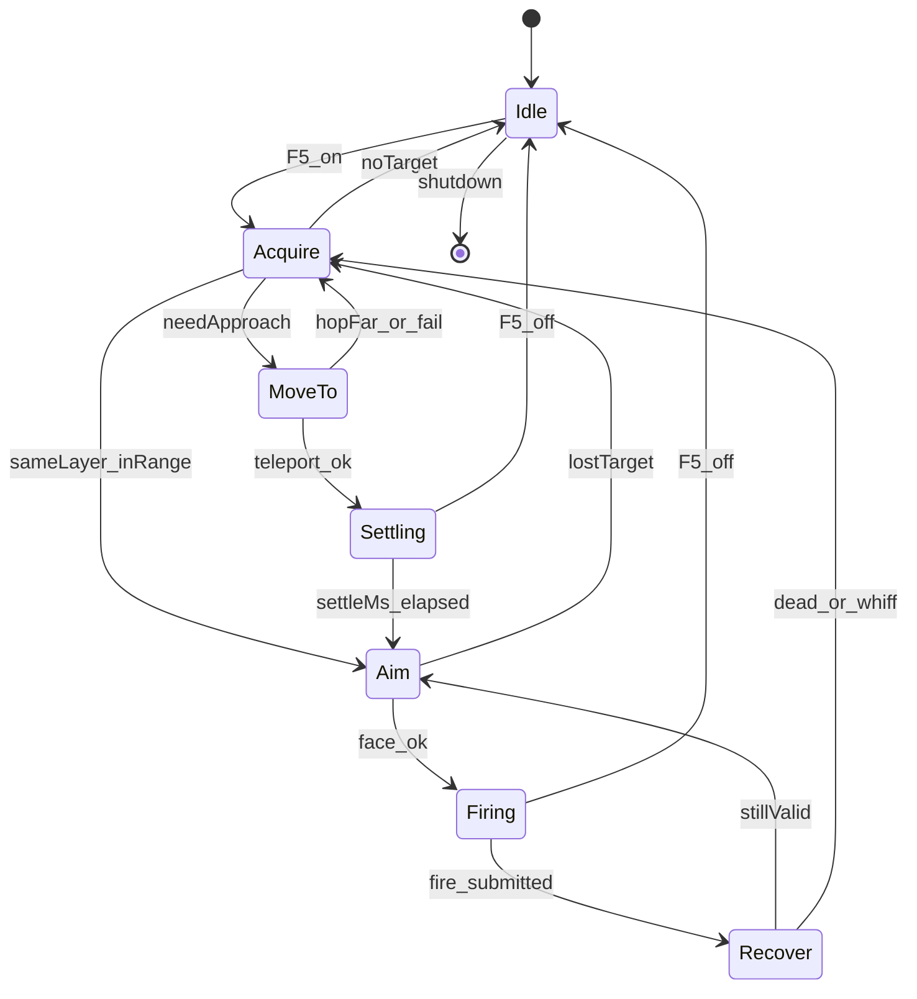

# simple_combat Feature 模块设计（Classic TWMS）

> **状态**：✅ 状态机重设计已落地（Phase0–3 代码）· BIN 站桩/贴怪验收待实机  
> **产品**：新枫之谷：经典版（TW · `Maplestory_Classic.exe`）· **不是**枫星  
> **对照来源**：`xcat_for_fengxing` 的状态机/IPC 模式（**不复用偏移/Lua**）  
> **源码**：`x/features/simple_combat/` · `ports/attack_input_port` · `ports/mob_pool_port` · `ports/teleport_port` · `ports/player_combat_port`  
> **瞬移锚点**：[`../teleport/模块设计.md`](../teleport/模块设计.md) · **唯一** `TeleportNativeSkillCall`（fill+Doing）  
> **契约**：`common/xcat_payload_control.*` · GUI：`xcat_app/workspace_tabs.cpp`  
> **安全**：禁止 `SendInput` / GA `.text` hook；禁止再引入 ImpactNext / Attr=4 旁路 / SyncRel settle

---

## 0. 一句话

自动打怪 = **显式状态机**：同层选怪 →（可选）互斥贴怪瞬移 → 朝向 → **出刀 `OnFuncKey(A 键绑定优先，空则 BasicActionAttack=5/52)`** → Recover。  
任一时刻只做一种动作；瞬移与出刀互斥；默认关贴怪瞬移、关智能间隔、关技能多发。

---

## 1. 设计原则（硬约束）

1. **单一职责分层**：选怪 / 出刀 / 瞬移 / 恢复走路不塞进同一分支森林。
2. **显式状态机**：状态切换带最短驻留；日志写 `state A→B why`。
3. **出刀真源唯一**：`UserLocal.OnFuncKey(Down/Up, FuncKey)`；**优先 A 键 keymap**（`GetDataByKeyCode(Key.A=15)`，可为 Skill/BasicAction）；A 空才回退 `5/52`。**不用** `KeyDownTouch`（CFF SEH）；硬编 `OnKey(Ctrl)` 易假成功。
4. **瞬移与出刀互斥**：`MoveTo`/`Settling` 禁止 Fire；`Firing`/`Recover` 禁止 Teleport。
5. **BIN 门禁**：声称「能打」须 `combat.log` 有序流转 + `SecAttack pktSum` 上升或 mob HP 下降。
6. **安全**：无 `SendInput`；无 GA `.text`；瞬移只走 `teleport_port` fill+Doing。

---

## 2. 状态机

| 状态 | 允许 | 禁止 |
|------|------|------|
| Idle | `RestoreWalkable`（关/换图） | 一切战斗副作用 |
| Acquire | 读 mob 快照、上锁、softBan | TP、Fire |
| MoveTo | 一次 `TeleportTo` 到 standOff 落点 | Fire、Rescue 连跳 |
| Settling | 等待满窗（700ms） | Fire、再次 TP |
| Aim | 朝向；校验同层且命中带 | TP（带内） |
| Firing | 一次出刀（普攻或可选多发） | TP、Rescue |
| Recover | 最短 ≥480ms + MotionBusy | TP、再次 Fire |

### 几何常量

| 项 | 值 | 说明 |
|----|-----|------|
| 同层 | 同 `zMass`（失败退 `|dy|≤45`） | 优先同连通域；无则跨 zMass |
| 命中带 | `12 ≤ \|dx\| ≤ standOff×1.35` | 带内禁止再 TP；默认 standOff=40 |
| 落点 | 怪台 ± standOff | FH 为 Prev/Next **线段链**；仅链条端点内缩 36，接合处不缩 |
| 最大 hop | 160px | 超距 softBan + Acquire |
| settle | 700ms | Settling 满窗 |
| 普攻 hold / recover | 220ms / 480ms | `attack_input_port` |
| 过滤 | `tpl=9999999` | 特殊怪 |

---

## 3. 出刀端口（唯一真源）

`ports/attack_input_port`：

- `FaceToward(dx)` 只记相对位移；**暂不**发左右键（L/R SEH）。
- `TryFirePrimary` → 间隔门控 + `OnFuncKey(Down)` → 异步 `Up`（hold≈180ms，不堵主线程）。
- FuncKey：优先 `GetDataByKeyCode(Key.A=15)`（技能/动作均可）；A 空再 `GetKeyByFunc(5,52)` / 合成 `5/52`。
- `MotionBusy`：距上次成功出刀 &lt; recover(480ms) 或 Up 未到。
- 智能间隔默认 **关**；开时随机 480–560ms（不低于 recover）。

**不做**：主线程 Sleep、改 face 位叠床架屋、SendInput、伪造攻包。

---

## 4. 瞬移策略（Phase2）

- 面板 `simpleCombatTeleport` 默认 **0**；关则 Acquire 够不着 → softBan 换靶（纯站桩）。
- 开：Acquire **优先同层**可落点；同层没有才跨层 → `MoveTo` → `TeleportNativeSkillCall` → `Settling` → `Aim`。
- **进 MoveTo 前查原生 CD**（`NativeCooldownRemainingMs`）；未好则留 Aim/Recover/Acquire，禁止 `teleport fail` 空转。
- settle / 互斥在 SM 内；**禁止** Settling 再调 SyncRel / ImpactNext（收态靠 fill+Doing 内 `Apl←Ap`）。
- Aim/Recover：**仅出带 / 怪心 / 跨层**才 `MoveTo`；**带内禁止 hug_follow**（防 Aim↔MoveTo 发呆）。

### 4.1 LiveStep 贴怪（实验 TAB · 默认关）

- 字段：`simpleCombatLiveStep`（依赖贴怪瞬移；贴怪关则无效）。
- **UI**：仅「实验」TAB；首页打怪设置不再展示。
- **关**：出带/跨层才用面板冷却瞬移（推荐日常）。
- **开**：出带后同层、且 **hop < 80** → `hug_follow` 微瞬移（Settling≈20ms、minHop≈4）；**hop≥80 同层仍走远距 `tp_ok`/50ms**。
- 选靶：无 hop 上限；优先同层可落点，同层没有才跨层（距离/hop 最短优先）。
- 日志：微贴 `hug=1`；远距同层 `hug=0`。

---

## 5. 多发（Phase3 · 可选）

仅当 `multiSkill` 开 **且** 有勾选技能：在 `Firing` 走 `multi_skill::TryCast`，与普攻互斥。  
默认关；失败不回退同 tick 普攻（下 tick 再判）。

---

## 6. IPC / 面板

| 字段 | 默认 | 说明 |
|------|------|------|
| `simpleCombat` | 0 | 总开关；F5 边沿切换 |
| `simpleCombatSmartInterval` | **0** | 智能间隔（本轮默认关） |
| `simpleCombatAttackIntervalMs` | 350 | 固定间隔（≥recover 才有效） |
| `simpleCombatTeleport` | **0** | 贴怪瞬移总开关 |
| `simpleCombatLiveStep` | **0** | **实验 TAB**：同层短 hop 跟位（需贴怪开） |
| `simpleCombatTeleportStandOff` | 40 | 落点偏移 20–200 |
| `simpleCombatTeleportCooldownMs` | 200 | 贴怪+LiveStep **共用**冷却（80–8000） |
| `simpleCombatTeleportMinDx` | 220 | 落盘保留；选靶以命中带为准 |
| `multiSkill` | 0 | 多发总开关（独立模块） |

（历史）飞天开时曾 pause 打怪；飞天模块已拆除，现无此互斥。

---

## 7. 分阶段验收（BIN）

### Phase1 — 站桩（贴怪关）

- `combat.log`：`state=Acquire→Aim→Firing→Recover` 有序，**无** `MoveTo`/`teleport` 行
- `SecAttack pktSum` 上升，或 `hp%` 下降 / `dead_or_gone`
- F5 关后可走

### Phase2 — 贴怪

- 日志：`MoveTo → Settling(wait) → Settling(done) → … → fire`
- Settling / Recover 期间零 fire / 零 teleport 交错
- 仍有 pktSum / 掉血

### Phase3 — 多发

- 多发开且有选：`multi fire` 行；与普攻不同 tick 并存

---

## 8. 明确非目标

- 风筝悬停 / IsOnGround 伪装
- foothold 爬绳自动下楼追跨层
- 伪造攻击包
- 与 fly 同时作战（fly 开则 pause）
- ClearAllTargetBans 刷屏（改用 per-id softBan + throttle 日志）

---

## 9. 文件职责

| 路径 | 职责 |
|------|------|
| `simple_combat.cpp` | 状态机 Tick / F5 / 选靶 / 互斥 |
| `attack_input_port.cpp` | OnFuncKey(A 槽优先) 出刀 + 异步 Up + recover |
| `teleport_port.cpp` | 仅 `TeleportNativeSkillCall` fill+Doing（无战斗业务） |
| `mob_pool_port` / `mob_scan` | 活怪快照（只读） |
| `player_combat_port` | 玩家坐标/上下文 |
| `multi_skill` | 可选 Firing 旁路 |

---

## 10. 风险

| 点 | 决策 |
|----|------|
| OnKey(Ctrl) vs OnFuncKey | **OnFuncKey(A 绑定优先，空则 5/52)**（BIN：OnKey 假成功） |
| 瞬移何时加 | Phase1 零瞬移默认；面板显式开才 MoveTo |
| 旧双路径 | 整文件替换，无 `#if OLD` |
| 攻速检测 | interval/recover ≥480ms；智能间隔不低于此（引擎真源见 [`../attack_speed/模块设计.md`](../attack_speed/模块设计.md)） |
| **GC unknown thread** | worker **禁止** `GetGoName` / `RuntimeClassInit` / FindAll 直调；玩家解析与 IM bind 走主线程泵；combat 只读 `mob::GetCached` |
