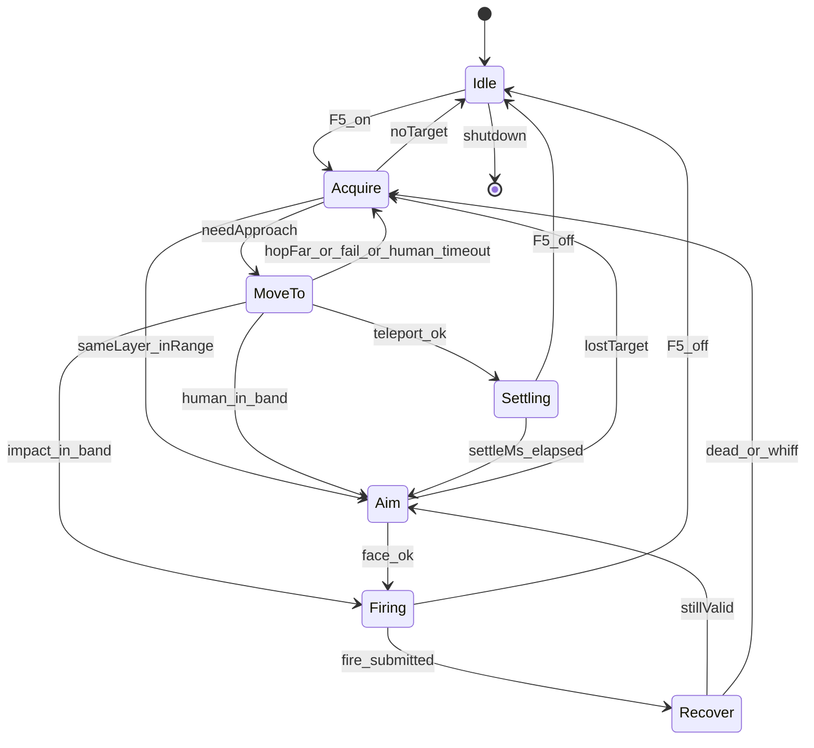

# simple_combat Feature 模块设计（Classic TWMS）

> **状态**：✅ 状态机重设计 · Impact 贴怪（默认）· 拟人 / fill+Doing 瞬移互斥回退  
> **产品**：新枫之谷：经典版（TW · `Maplestory_Classic.exe`）· **不是**枫星  
> **对照来源**：`xcat_for_fengxing` 的状态机/IPC 模式（**不复用偏移/Lua**）  
> **源码**：`x/features/simple_combat/`（含 `heli_rotor.*` 旋翼环）· `ports/attack_input_port` · `ports/mob_pool_port` · `ports/teleport_port` · `ports/player_combat_port`  
> **Impact 飞天（F6）**：[`../fly/模块设计.md`](../fly/模块设计.md)（同 Impact 端口；**F5 交战期同样开 fh-ban**，多源 OR）  
> **瞬移锚点**：[`../teleport/模块设计.md`](../teleport/模块设计.md) · fill+Doing 仅当 Impact/拟人都关  
> **掉图结案**：[`../teleport/P0d_fill_slim软重载结案.md`](../teleport/P0d_fill_slim软重载结案.md)（Doing 后勿抢收态）  
> **契约**：`common/xcat_payload_control.*` · GUI：`xcat_app/workspace_tabs.cpp`  
> **安全**：禁止 `SendInput` / GA `.text` hook；Settling 禁止 SyncRel / 手写 Attr=4 抢收态；Impact 贴怪只走 `teleport_port` 的 `ImpactSetVelocity`（旋翼）/ `ImpactImpulseToward`（F6 跟飞）

---

## 0. 一句话

自动打怪 = **显式状态机**：选怪 → **位移贴近** → 朝向 → **出刀 `OnFuncKey(A 键绑定优先，空则 BasicActionAttack=5/52)`** → Recover。  
位移优先级（互斥）：**Impact 贴怪（默认）** → 拟人走路 → fill+Doing 贴怪瞬移。  
Impact 贴怪 = **近战直升机**：旋翼环以 ~11Hz 持续托举悬停在怪旁，空中出刀；打死换下一只再飞过去。  
**旋翼与打怪状态机解耦**——出刀、丢锁、技能前置、池未热身期间照转；停一拍就掉一段（fh-ban 下没有地板托）。  
交战期开 `fly_fh_ban`（`CombatImpact` 源，与 F6 多源 OR）；无怪超 1500ms 则卸掉、正常落地站着。

---

## 1. 设计原则（硬约束）

1. **单一职责分层**：选怪 / 出刀 / Impact / 瞬移 / 拟人走路不塞进同一分支森林。
2. **显式状态机**：状态切换带最短驻留；日志写 `state A→B why`。
3. **出刀真源唯一**：`UserLocal.OnFuncKey(Down/Up, FuncKey)`；**优先 A 键 keymap**（`GetDataByKeyCode(Key.A=15)`，可为 Skill/BasicAction）；A 空才回退 `5/52`。**不用** `KeyDownTouch`（CFF SEH）；硬编 `OnKey(Ctrl)` 易假成功。
4. **位移策略互斥**：`impactOn` 时 `humanOn=tpOn=false`；仅 Impact 关且拟人开才 `HoldWalk`；两者都关才 `TeleportNativeSkillCall`。
5. **位移与出刀互斥（仅瞬移/拟人）**：`MoveTo`/`Settling` 禁止 Fire；`Firing`/`Recover` 禁止 Teleport / 走路。
   **Impact 不受此约束**：旋翼是飞行控制而非「贴怪位移」，出刀期间必须继续托举，停转即掉落。
6. **BIN 门禁**：声称「能打」须 `combat.log` 有序流转 + `SecAttack pktSum` 上升或 mob HP 下降。
7. **安全**：无 `SendInput`；无 GA `.text`；Impact 只走 `teleport_port::ImpactSetVelocity`；瞬移只走 fill+Doing；拟人走 KeyPad `SetFields`。

---

## 2. 状态机



| 状态 | 允许 | 禁止 |
|------|------|------|
| Idle | `RestoreWalkable`（关/换图） | 一切战斗副作用 |
| Acquire | 读 mob 快照（`EnsureFreshMobSnap` ≤16ms）、MobCtrl 软优先选怪、上锁、softBan | TP、Fire；禁止完整 Collect |
| MoveTo | **Impact**：只发布 setpoint 等进带（冲量在 A 层）；瞬移：一次 fill+Doing；拟人：`HoldWalk` | Fire、Rescue；Impact **不进 Settling** |
| Settling | 等待满窗（仅瞬移） | Fire、再次 TP |
| Aim | 朝向；校验命中带 | 带内再贴 |
| Firing | 一次出刀（普攻或可选多发） | TP / Rescue |
| Recover | 最短 ≥480ms + MotionBusy | TP、再次 Fire |

> **Impact 是例外**：旋翼层（`heli_rotor`）不在这张表的管辖范围内——它在**每个**状态下都可能发冲量，包括
> `Firing`。「位移与出刀互斥」只约束 fill+Doing 与拟人走路两条路径。

### 几何常量

| 项 | 值 | 说明 |
|----|-----|------|
| 同层 | 同 `zMass`（失败退 `|dy|≤45`） | 优先同连通域；无则跨 zMass（仅瞬移策略） |
| 命中带 | `12 ≤ \|dx\| ≤ standOff×1.35` | 带内禁止再 TP；默认 standOff=40 |
| 落点 | 怪台 ± standOff | FH 为 Prev/Next **线段链**；仅链条端点内缩 36，接合处不缩 |
| 最大 hop | 160px | 超距 softBan + Acquire（瞬移） |
| 拟人超时 | 8000ms | 同层走路追不到 → softBan 换怪 |
| settle | 700ms | Settling 满窗（仅瞬移） |
| 普攻 hold / recover | 220ms / 480ms | `attack_input_port` |
| 过滤 | `tpl=9999999` | 特殊怪 |

---

## 3. 出刀端口（唯一真源）

`ports/attack_input_port`：

- `FaceToward(dx)` 只记相对位移；**暂不**发左右键（L/R SEH）。
- `TryFirePrimary` → 间隔门控 + `OnFuncKey(Down)` → 异步 `Up`（hold≈180ms，不堵主线程）。
- FuncKey：优先 `GetDataByKeyCode(Key.A=15)`（技能/动作均可）；A 空再 `GetKeyByFunc(5,52)` / 合成 `5/52`。
- `MotionBusy`：距上次成功出刀 &lt; recover(480ms) 或 Up 未到。
- 智能间隔默认 **关**；开时随机 480–560ms（不低于 recover）。
- **拟人走路**：`HoldWalk(±1)` → 每帧 `KeyPad` A/B/C（右 A=0 / 左 A=64）+ AuxFrameTick；`StopWalk` / 出刀前 / 关 F5 清锁存。OnKey L/R **不**驱动物理（已 BIN）。

**不做**：主线程 Sleep、改 face 位叠床架屋、SendInput、伪造攻包。

---

## 4. 位移策略

优先级（SM 内互斥）：

| 优先级 | 字段 | 面板 | 行为 |
|--------|------|------|------|
| 1（默认） | `simpleCombatImpactApproach=1` | 「Impact贴怪」 | 旋翼环悬停在怪旁 → 进带 `Firing`（空中出刀） |
| 2 | Impact 关 ∧ `simpleCombatHumanWalk=1` | 「拟人模式」 | `HoldWalk` 同层 |
| 3 | 两者都关 ∧ `simpleCombatTeleport=1` | （强制开） | fill+Doing → Settling |

### 4.0 Impact 贴怪 = 近战直升机（默认 · 给后续 Agent）

**三层解耦。改这块之前先看懂为什么必须分层，否则一定会把「掉出地图」改回来。**

```
C 武器层  Firing/出刀        进命中带就砍。出刀期间旋翼照转 —— 不再停冲量
B 飞控层  simple_combat FSM  只发布 setpoint + 模式，不发冲量
A 旋翼层  heli_rotor         每 tick：读 Ap 位置+速度 → 横向 P 控 / 纵向 P 控+抗重力配平 → 小冲量
```

#### 竖直物理模型（实测 · 每一条都曾搞反并直接导致掉图 / 空刀）

**① `+Y` 是向上。** 别套 MapleStory「y 向下」的常识。

- 铁证：`foothold_path.cpp:37` 实机记录——Doing 挂不上台，「掉到**下层** `fh60@(786,-1463)`」，下层 y 更负。
- ⚠️ 同文件第 24 行注释「MS +Y 向下」是**错的**，曾被引用并导致整轮方向反掉，别再拿它当依据。
- 交叉验证：BIN 4ad1b2 `y` 从 `55` 掉到 `-1318` = 玩家实见「掉出地图」；BIN 79947e 角色 `y=-276`、怪 `y=-95` = 玩家实见「悬停在怪物底下空刀」。

**② 竖直冲量是叠加语义，写 `0` 无效。** BIN 4ad1b2：`cmdVy=0, pre=-670, post=-670`。
所以悬停不可能靠「写一次 0」实现。横向相反——X 是**设速度**：`cmd=-560 → vx=-560` 精确复现，叠加会是两倍。

**③ 合速被引擎钳在约 `[-670, +110]`，上下极不对称。**

| 方向 | 权限 | 含义 |
|---|---|---|
| 向上 | 合速上界 `+110`，实测净爬升 ~106px/s | 弱但可持续，**必须每拍给** |
| 向下 | 重力免费提供，终端 `-670` | 不需要发指令 |

⇒ **`kHoverVy` 这个常驻上偏就是悬停机制本身，不是缺陷。** 拆掉它 = 自由落体。

#### 历史病灶（两轮反向翻车，都记在这里）

**BIN 79947e「悬停在怪物底下空刀」**——方向搞反 + 配平被当成缺陷：

1. `ty = my - kHeliLiftPx` 在 `+Y 向上` 下把悬停点压到怪**下方**；
2. 那 `-90` 上偏其实是抗重力配平，却被当成「无条件偏置」；
3. 越过图边后 `Rtb` 目标取 FH AABB **图心** `y=355`，而怪在 `y=-95` → 把角色往怪下方拖了 450px；
4. 1247 条采样里 1186 条 `emg=1`，战斗意图长期被包线接管。

**BIN 4ad1b2「一直掉下地图 + 205」**——错误地信了「有自然下沉」：

1. 上一轮把 79947e 的 `+110` 误读成「引擎自带下沉封顶」，据此改成单边律「高于 setpoint 就不发指令」；
2. 但真相是②③：不发 = 叠加语义下什么都没发生 = 保持终端落速 `-670`；
3. 且把图底救援推力改成 `cmdVy=0`，**亲手拆掉唯一兜底** → `y` 一路掉到 `-1318`，连吃 205。

**教训**：这两轮都是「凭一份日志里的饱和值反推物理模型」翻的车。改竖直律前先用 `drift` 字段确认重力增量，
并拿 `foothold_path.cpp:37` 复核方向，别再从单份日志的数值猜语义。

#### 为什么要 A 层（历史病灶 · BIN 0bf954 / ac21f9）

旧实现把冲量写在 `State::MoveTo` 里点射，于是：

| 病灶 | 后果 |
|---|---|
| 冲量只在 MoveTo 发 | 一进 `Firing` 整个出刀窗口零冲量，fh-ban 下 = 自由落体 |
| 无锁期间完全不发 | `Acquire`/池未热身/`skill_prepare` 全是提前 `return` → 一路掉出图底 |
| 只按位置误差算 v，不读 `Ap.Vy` | 没有阻尼项，重力累积的落速无从抵消 |
| `ClampImpactSpeed` 每轴 80 地板 | 近距做不了小修正，只能大踹 → 限幅震荡越踹越偏 |
| 瞄点取 `EstimateLandPrefer` | 那是怪脚下的**地面台**，空中朝它推 = 往地板下钻 |

**硬约束**：旋翼 `heli::Tick()` 必须在 `TickImpl` **所有提前 `return` 之前**调用。往那之后挪一行，掉图立刻复现。

#### A 层控制律（`heli_rotor.cpp`）

- 端口：`teleport_port::QueryFlightState()` 读 `Ap` 位置 + 速度；`ImpactSetVelocity()` 直给速度（**不套 80 地板**）。
- 发射节奏 `kIssueMs=90`（~11Hz）；emergency 收紧到 45ms。
- 横向：`cmdVx = KpX·errX`（4.0），死区 12px。X 是**设速度**语义，每发抹掉旧速度，单 P 项在离散意义上自带阻尼。
- 纵向：`!onFh` 时先由 P 控算**期望均速** `desiredVy = (|errY|>12 ? KpY·errY : 0)`（`KpY=3.0`），
  再换算成本拍要发的**增量** `cmdVy = (desiredVy − vy) + trim/2 + 30`。
  - `+Y 向上` ⇒ `errY>0` = setpoint 在上方 = 正向指令。
  - **重力配平每拍都要付**（叠加语义下写 0 是空操作），但它是按**距上次发射的真实耗时**
    算出来的 `trim = 2·sinceMs`，**不是**写死常数——主线程一卡顿发射变稀，需要的配平同比变大。
    历史上写死 `kHoverVy=90` 正是净下沉的根源（90ms 周期只给了半油门，盈亏线是 180）。
  - 末项 `+kGravityPerStep/2 = +30` 是「冲量落地那一帧也吃一步重力」，漏掉它稳态稳定下沉
    30px/s，十秒 300px —— 正是过去「看着在悬停却越飘越低」的量级。
  - **死区 = 稳态位置残差的上界**（纵横都取 12px）。死区内不产生位移意图、只维持速度 0，
    所以角色停在**进入死区的那一点**；而进近总是从上方降下来，残差会一边倒地偏高。
    BIN 14a58c：死区 30 时中位残差 `+18px`，叠加当时 `kHeliLiftPx=14` = 稳定悬在怪上方 32px 砍空气。
    ⚠️ 曾经取 30 是怕「同台时把站定的角色踹飞」（BIN 79947e），该隐患现由 `onFh` 分支兜住
    （挂台强制 `cmdVy=0`），不必再靠宽死区代偿；fh-ban 悬空时更没有台可踹。
  - 挂台（`onFh`）时高度由引擎免费维持，**一发竖直冲量就变成连续小跳**，绝不能碰。
- 只读观测 `drift`（未发冲量的相邻两拍 `|Δvy|` 峰值 = 重力每拍增量）：它明显超过 `kHoverVy`
  说明配平不足、角色会稳定下沉——该抬配平，**不是**加大 `Kp`。
- 档位**意图**上限 `{vx, 上升, 下降}` —— **三轴同速**（2026-08-07 改）：
  `Cruise {560,560,560}` · `Rtb {480,480,480}` · `Station {340,340,340}` · `Hold {260,260,260}`；
  `kKpY` 也从 3.0 提到 4.0 与 `kKpX` 对齐。这是**意图**限幅、不是作动器限幅，
  作动器侧 `kMaxCmdVy=1200`（与 `kMaxCmdVx` 同级）。理由与安全论证见下方
  「竖直提速到与横向同级」。
- **判定框是「AABB 外扩成合法空域」，且两轴余量不同**：`kEnvSlackXPx=8` / `kEnvSlackYPx=48`
  （`heli_rotor.h`）。FH AABB 是**可站立面**的包围盒，不是合法空域——怪就站在最外沿那条台上。
  四处（A 层包线 / B 层 `NeedsHeliRtb` / 出刀硬闸 `PlayerOutOfPlayBounds` / 站位点
  `ClampAimInPlayBounds`）必须用同一口径，否则一层想下去、另一层判紧急往上拉，互相打架。
  详见下方「边界内缩事故」与「可站立面 ≠ 合法空域」。
- **安全包线**（注意 `Rect.top/bottom` 是**数值**含义，`top=min y`；`+Y 向上` ⇒ `top` 才是图底。
  下面的 `t / b / l / ri` 一律指**外扩后**的合法空域：`t=top−48`、`b=bottom+48`、`l=left−8`、`ri=right+8`）：
  - `vy < -kMaxFallVy`（高速下坠）→ 弃战全力上拉 `kRescueClimbVy=300`。
    该阈值现为 **780**，必须**高于**最大下降意图 560，否则每次正常快速下降都被误判成紧急
  - `y < t`（跌破合法空域下沿）→ 全力上拉。**这是唯一会掉出地图的方向，绝不可改成 `cmdVy=0`**
    （BIN 4ad1b2 就是这么改出来的）。上拉量必须**高于盈亏线 `2·sinceMs`**，否则越"救"越掉——
    bea1c3 给 `+120`（周期 90ms、盈亏线 180）从 `y=-270` 一路掉到 `-1188` 被服务端断线。
    再深 `kBailoutPx=420` 则判不可救，缴械让引擎接管
  - `y > b`（飞过合法空域上沿）→ 受控下沉 `-caps.descend`，不是放任自由落体
  - `x < l` / `x > ri` → 以 `kEnvPushVx=300` 向内推
  - **撞墙预刹（两轴都有）**：按 `kBrakeHorizonSec=200ms` 的前视把意图速度钳到
    「这一周期不会越界」的幅值。它是**预防**式的，位置包线是**事后**式的；竖直这一道是
    提速到 560 之后的必需品（见下方专节）
  - emergency 可越过拥堵闸与技能前置闸，**不可**越过无敌闸

#### B 层：setpoint 与档位（`simple_combat.cpp`）

| 模式 | 触发 | setpoint |
|---|---|---|
| `Station` | 有锁 ∧ 距站位点 ≤260px | `ty = my + kHeliLiftPx`，`kHeliLiftPx = 0` 即**与怪同高**（写成 `my - lift` 会压到怪下方，BIN 79947e）。历史上给 `+14` 是补重力锯齿，A 层改成重力前馈闭环后锯齿只剩约 4px，那 14px 就纯变成上偏 → 砍空气，**别再往这里加"保险余量"** |
| `Cruise` | 有锁 ∧ >260px | 同上，放宽水平速度 |
| `Hold` | 丢锁但在 1500ms 宽限内 | **进入 Hold 那一刻**的位置（不可每拍跟当前位置，等于放任下坠） |
| `Rtb` | 出 FH AABB 安全框任一侧 | **就近拉回安全线**：x/y 各自钳进安全区。**不可取图心**——怪都在图上部时那等于把角色往下拖几百 px（79947e） |
| `Off` | 宽限到点 / F5 关 / 硬暂停 | 同时卸 fh-ban → 正常落地 |

#### C 层：出刀带 —— 悬停带 ≠ 出刀带

「还要不要再飞」和「这一刀够不够得到」是两个问题，阈值差一倍多，**必须分开**：

| 带 | 常量 | dy 容差 | 用途 |
|---|---|---|---|
| 悬停带 `InHeliHoverBand` | `kHeliHoverMaxDy` | 80 | 只回答横向站位是否到位 |
| **出刀带 `InHeliFireBand`** | **`kHeliFireMaxDy`** | **35** | 出刀硬门；`NeedsHeliStationKeep` 也跟这个口径 |

BIN 14a58c + b8c7f6 合并 483 次出刀实测（`dy = 角色y − 怪y`，`+` = 角色在上方）：

| | dy 中位 | 四分位 | \|dy\|>40 |
|---|---|---|---|
| 命中（`whiff wounded`） | `+13` | `[0, +19]` | **1.6%** |
| 空刀（`whiff tick`） | `−3` | `[−57, +21]` | **47.2%** |

- **dy 是命中/空刀的唯一显著区分量。** 同一批数据里 `|dx|` 两组中位 `44` vs `43`，毫无区分力——
  别再往横向站距 / `standOff` 上找空刀的原因（我找过，是死路）。
- 阈值 35 取自权衡曲线拐点：保住 **98.4%** 命中、拦掉 **50.9%** 空刀。收到 30 只多拦 5 个点却
  白丢 6 个点命中；放到 40 命中一点不涨、反而少拦 4 个点。
**⚠️ 这个 dy 必须在全部五处门禁上同步生效，少一处就两头对推：**

| # | 位置 | 说明 |
|---|---|---|
| ① | `MoveTo` 的 `heli_in_band` | 到位判定 |
| ② | `Aim` 的 `heli_hover` | |
| ③ | `Aim` 的 `InHitBand / InMeleeHoldBand` 旁路 | 纵向容差 `SameLayer 45` / `同台 100` 是**地面站桩**口径 |
| ④ | `Recover` 的 `heli_hold` / `heli_near` | `heli_near` 原本无条件出刀 |
| ⑤ | `Firing` 的 P0 硬门 | `FireGateOk` 同为地面口径，会把 `dy=60` 判成可打，故 dy 超限**一票否决** |

外加 `NeedsHeliStationKeep`（「够不到就得继续飞」，口径同上）。

> **BIN 1394b0 事故**：首版只改了 ②③⑤，漏了 ①④。dy 落在 `(35, 80]` 时 `MoveTo` 说「到了」
> → `Firing`，`Firing` 说「够不到」→ `MoveTo`，70s 内对推 **4495 次（≈64/s）**，而收紧前同一
> 路径只有约 1.9 次/秒。更糟的是 `gStateEnterMs` 被每次迁移重置，`kHeliApproachTimeoutMs`
> **永远触发不了**，连换靶自救都做不到——现象就是「头顶台上的怪一直打不到、角色在下方死转」。
> 教训：**收紧任一出刀判据时，必须同时收紧所有『到位/续砍』判据**，否则 FSM 会在两个不
> 一致的阈值之间自激。

#### FSM 抖动为什么会冻死 IMGUI（放大器已断，但要知道它存在）

`EnterState` 在离开 `MoveTo` 时会调 `ports::attack::StopWalk()`，而它：

1. `InvokeAndWait` **阻塞抢占游戏主线程**（`JobPrio::High`）；
2. 给 `VK_LEFT` / `VK_RIGHT` 各注入一次抬起事件；
3. **没有「没在走路就早退」的短路**——不管走没走都跑完整流程；
4. 自身日志被 `sStop < 32` 限流，所以 `combat.log` 里**看不见**，只能从
   `key_macro_bin.log` 的 `osSend vk=* UP` 反推。

BIN 1394b0 实测：自激 64 次/秒 → `osSend` **4528 次**（69/s，峰值 112/s）+ 同量主线程抢占
→ IMGUI 覆盖层点不动。`vk=0x25 × 2264`、`vk=0x27 × 2264` 与 `MoveTo→Firing × 2261` 一一对应。

**现已在 `EnterState` 里加闸：`impactOn` 时跳过 `StopWalk`**——直升机全靠冲量位移、从不走路，
这一步本就是空转。切档时的锁存清理由 `SetImpactApproachEnabled` / `SetHumanWalkEnabled` 兜底。

> 排查同类「UI 卡死 / 游戏发飘」时的固定手法：先比 `key_macro_bin.log` 的体积与 `osSend`
> 条数，再回 `combat.log` 找对应频次的状态迁移。体积从 35KB 跳到 224KB 就是强信号。

#### 边界内缩事故：为什么「只有地图中段的怪能打中」

**症状**（BIN 4a79e4）：头顶和脚下的怪都打不中，只有中段飞行途中能命中；连续四个目标全部
2600ms 进近超时换靶，出刀率掉到 0.5 次/秒。

**根因**：A 层包线、B 层 `NeedsHeliRtb`、站位点 `ClampAimInPlayBounds` 三处都用
`kLandMarginPx(24) + 48 = 72` **向内缩**，等于把 FH AABB 最外一圈判成禁区。而站在最低/
最高台上的怪恰好全在那一圈里：

```
MoveTo heli id=756348 d=(40,-57)                        <- 怪在下方 57px
heli mode=station pos=(764,-550) sp=(788,-558)          <- setpoint 只在下方 8px，被钳住了
```

怪在 `y≈-607`，站位点被钳在 `-558`（AABB 下沿 + 72），永远差约 50px 进不了 ±35 的出刀带。
更糟的是三层口径一致地互相加强：飞控想往下、A 层包线判「跌破最低台」直接用
`kRescueClimbVy=+300` 覆盖掉下降意图（日志里满屏 `emg=1` 配 `des=-50`）。

**修法**：统一为「**AABB 之内一律合法，外扩 `kEnvSlackPx=48` 才算真出界**」。

| 位置 | 旧 | 新 |
|---|---|---|
| A 层包线（`heli_rotor.cpp`） | `AABB 内缩 72` | `AABB 外扩 kEnvSlackPx` |
| B 层 `NeedsHeliRtb` | `AABB 内缩 72`；拉回到内缩线 | `AABB 外扩 kEnvSlackPx`；拉回到内缩 `kEnvReturnInsetPx` |
| 站位点 `ClampAimInPlayBounds` | `AABB 内缩 72` | `AABB` 原始边界 |

> 那个 72 是从**瞬移落点**的安全内缩借来的，语义不通用：落点要避开边界，悬停点不用——
> **怪的坐标本身就是该处合法的证据**。夹取仍然保留（ac21f9 的 Y 过冲出图必须拦），
> 只是不再向内缩。真·坠落另有 `vy < -kMaxFallVy` 的**速度**闸兜底，不依赖位置阈值。
- 收紧不会卡死：`PublishHeliSetpoint` 在 pass 循环顶部**无条件每拍调用**，旋翼照常把 dy 压下去，
  角色只是「先不砍、边飞边等」。

#### 出界掉线：靠预刹，不靠放大缓冲（BIN c9b8dc）

上面那次放宽把命中救回来了（出刀 3.0 次/秒、进近超时归零），但暴露了另一个**一直存在、之前被
72px 内缩挡住**的缺陷：**横向进近根本不刹车**。

怪在最左台，角色带 `vx=-448` 扑过去，AABB 左沿 `-585`，实际冲到 `-658`（**出界 73px**），
在界外滞留约 130ms 且 `fired=1`——**界外还在出刀**。两段界外攻击的时间戳
（`05:12:46`、`05:13:05`）与用户报的两次掉线一一对应：服务端在校验坐标合法性。

事后靠 RTB 拉回是**追不上的**：`kEnvPushVx=300` 反不过 448 的入射速度，要好几拍才反向。

正解是从源头消灭过冲。**X 是设速度语义**——这一拍发多少，接下来整个发射周期就以多少速度平移，
所以只要让「本周期位移」落在 AABB 内，就不可能冲出去：

```
roomR = (rawR - x) / horizon      // 允许的最大 +vx
roomL = (rawL - x) / horizon      // 允许的最小 vx（界内为负）
cmdVx = clamp(cmdVx, roomL, roomR)
```

`horizon` 取 **150ms** 而非标称的 90ms：主线程一卡顿发射就变稀（实测 `since` 到过 106ms），
按标称算会刹不住。放在包线**之后**，这样紧急内推也按这条重算——已在界外时 `roomL/roomR` 同号，
两句钳位会把指令顶成内推且力度比 `kEnvPushVx` 更足，一个周期回到界内。

配套三条：

- 横向余量 **48 → 8**。它只留抖动余量，不当缓冲区用：界外没有台也没有怪，多待一拍都是在赌
  服务端校验。真正防过冲的是预刹，不是把这个数放大。
  （**竖直**后来另行放回 48，理由完全不同，见下方「可站立面 ≠ 合法空域」——别把两轴混为一谈。）
- 新增 `kEnvReturnInsetPx = 24`：RTB 拉回到 AABB **内缩 24px**，纯迟滞——拉到边沿上会立刻又落进
  出界判定，模式在 `rtb`/`station` 之间抖。24 远小于 ±35 的出刀带，不影响够边沿台上的怪。
- **界外一律不出手**：`PlayerOutOfPlayBounds()` 硬闸插在 Firing 的 P0 门**之前**。必须在前面，
  因为 `heliFireOk` 会绕过 `FireGateOk`，指望后者兜底兜不住。命中则回 `Aim`（日志 `oob_hold`），
  让旋翼按 RTB 把人拽回来再打。读不到边界时放行——不能因为拿不到图信息就哑火。

> 教训：`kEnvSlackPx` 这类「安全余量」不是越大越安全。放大它只是把**控制律缺陷**（不刹车）
> 藏起来，代价是边沿的怪够不到；缩小它缺陷就原形毕露。余量该做的是吸收抖动，防过冲得靠控制律本身。

**后续（c72cff）**：上面这套预刹只把过冲从 73px 压到 43px，没消灭——因为它建立在
**错误的横向作动器模型**上（详见下面的语义证据汇总）。`+300` 的紧急内推遇上 `v=-556`
只能把速度推到 `-256`，人还在往外飞。同一份日志里 `oob_hold=24`：界外禁刀的硬闸有效，
全程没有界外攻击，也没再掉线。模型订正后预刹才真正成立——`desiredVx` 是意图、`cmdVx` 是增量，
反向一发到位。

#### 可站立面 ≠ 合法空域：贴地面层打怪时 970 次「出界」全是误判（BIN b3d1bd · M0002）

第二台机器（`M0002`，跨 15 张图 16 分钟）跑出与本机完全不同的剖面：`oob_hold=970`、
`RTB=73`、`heli timeout=18`、`emg=90`——而同期本机全是 0。用户问的是「这张图为何一直掉线，
是否频繁出界」。**出界属实，但 95% 是我们自己判错了。**

**根因是概念错位。** `map_bounds_port.cpp` 取的是**全部 foothold 的包围盒**（`src="fh"`）：

> **AABB 是「可站立面」的范围，不是「合法空域」的范围。**
> 站在最低那块台上的角色，脚下坐标天然就**等于** `Rect.top`；怪也一样。

于是「越过 AABB = 出界」对**贴地打怪的飞行角色**是结构性误判——不是余量给少了，
是拿站立面当空域用了。近战要够到地面层的怪，就**必须**飞到 `Rect.top` 那一高度，
悬停死区 ±12px 的抖动必然反复压线。

**取证链**（每一步都可复算，脚本在 `Dumps/runtime/`）：

| 步骤 | 结果 |
|---|---|
| 反推各图边界 = `rtb` 拉回目标 − `kEnvReturnInsetPx(24)` | 与该图**怪的最小 Y** 差恒为 21~24px ⇒ AABB 下沿就压在最低那排台上 |
| 触发轴统计 | 竖直 **73** 次 vs 横向 **4** 次 |
| 越线深度（`_verify_slack.py`，1091 个旋翼采样） | **双峰**：中位 8px / p75 10px，然后直接跳到 p90 **311px** / 最大 392px |
| 怪的分布（`_mob_vs_floor.py`） | `110020000` 全图 40 只怪 **100%** 贴最低台；`110040000` 100%；`110030000` 60%；`107000000` 22% |

那个双峰是本节最硬的证据：**86% 聚在 3~10px（悬停抖动）、14% 在 300~392px（一次真坠落）**，
中间是空的。48px 落在两峰之间的空隙里——阈值不是拍脑袋定的，它把两个物理性质完全不同的
样本群分开了。

最后一行否掉了「跳过边界怪」这条路：那 40 只不是「极其边界的怪物」，就是普通地面层，
跳过等于整张图一只不打。

**修法：把合法空域按近战几何从 AABB 推出来，两轴分开给。**

```
合法空域 = FH AABB ⊕ reach
reach_y  = kHeliFireMaxDy(35) + kDeadY(12) ≈ 48     ← kEnvSlackYPx
reach_x  = 维持 8                                    ← kEnvSlackXPx
```

`reach` 全部来自本模块自己的战斗常量、**与地图数据无关**，这正是它能全类型地图适用的原因——
不需要任何逐图调参、也不需要地图白名单。

| 位置 | 旧 | 新 |
|---|---|---|
| A 层包线（`heli_rotor.cpp`） | 两轴同 8 | X 用 `kEnvSlackXPx`、Y 用 `kEnvSlackYPx` |
| B 层 `NeedsHeliRtb` | 两轴同 8 | 同上 |
| 出刀硬闸 `PlayerOutOfPlayBounds` | **零余量**原始 AABB | 同上 |
| 站位点 `ClampAimInPlayBounds` | 原始 AABB | 同上 |

**横向为什么不跟着放**：同一份日志横向只有 4 次，而横向过冲才是真正撞掉线的那条
（c9b8dc 冲出 73px 并在界外出刀）。竖直有「必须飞到怪那一高度」的几何刚需，横向没有。
防横向过冲仍然靠 A 层预刹，不靠放大余量——上一节那条教训依旧成立。

**「够不着的怪就放弃」不需要新机制**：进近看门狗的 `SoftBanFor(kBanUnreachable)` 就是它，
本轮已触发 18 次。空域定义修好后它只对真正够不着的目标生效，怪自己走回来后自然重新入选。

**安全边际未被削弱（已用实采样回放验证）**：把 1091 个旋翼采样按新旧判据各跑一遍——

| | 判为出界 |
|---|---|
| 旧（零余量 AABB） | 143 / 1091 = 13% |
| 新（`kEnvSlackYPx=48`） | **20** / 1091 = 2% |

消掉的 123 个全是 ≤48px 的抖动误判，**那次 392px 的真坠落 20 个采样一个不漏地仍被判出界**。
此外 `kBailoutPx` 的深度缴械与 `vy < -kMaxFallVy` 的速度闸是独立判据，真·掉出地图是几百 px 级
（4ad1b2 掉到 `y=-1318`），本来也不该由 48px 这道闸来拦。

**这次出界与掉线无关**：三次断线里两次发生在**根本没打怪**的时候（F5 已关 43s / 1s），
第三次才在战斗中。签名同为 `lean_local_or_soft`，与下一节记录的残留掉线同一类。

#### 残留掉线：飞行干净了仍会断，且它长得就像位移踢（BIN 683181 / 6dcc28 / c9ff6e）

预刹与作动器模型订正后，**进近超时**归零、出界与紧急大幅下降（`oob_hold`/`emg=1` 仍零星出现，
直到竖直余量修好的 BIN dbad81 才首次做到全零），但会话仍会在几分钟后被断开。
把当晚 25 个会话的 `kick.log` 全扫一遍，得到两条必须先记住的事实：

| 事实 | 证据 |
|---|---|
| 这个掉线**不是**某轮改动引入的 | 同一签名出现在 `02:38 / 02:52 / 04:23 / 05:12 / 05:19 / 05:25`（build 102，早于旋翼重构）与 `05:51 / 05:54 / 06:04`（build 103） |
| 飞行越稳，活得越久 | 掉线时长按时序 `24s → 38s → 47s → 76s → 73s → 161s → 366s → 450s`；出界/紧急归零后寿命涨了约 8 倍 |

**判读订正（重要）**：`verdict=lean_local_or_soft` 过去容易被读成「偏本地/网络波动」。
但本目录 §0 已写明 **位移踢 = 服端掐 TCP + 客户端本地拆线**，且 TW 的 `Session+0x40` 只写
哨兵 204/205、**从不**写 `HackingAutoBlock.Move/Position`。也就是说**位移踢本来就没有通知包**，
它在 `kick.log` 里的长相与网络波动**完全一致**。所以「没有 kick 提示包」只能排除*明示踢*，
**不能**用来推断「是网络问题」。

#### send.log 实包采证：候选逐一证伪（BIN 41c9f7 掉线 / e6b3dc 存活）

武装 `send_probe.on` 后拿到两场对照：`41c9f7` 飞行 289s 后断，`e6b3dc` 飞行 471s 仍在线。
**只截取飞行窗口**后两者剖面几乎完全一致——这一步很重要，41c9f7 前半场是拟人模式，
不剔除会把低速段算进来，得出「掉线场更温和」的反向错误结论。

| 指标（仅飞行窗口） | 掉线场 289s | 存活场 471s |
|---|---|---|
| UserMove 速率 | 1.96 包/s | 1.96 包/s |
| 速度突变（`el=0` 相对元素） | 2.88 次/s | 3.11 次/s |
| `\|vx\|` 中位 / p90 / 最大 | 136 / 559 / 560 | 121 / 559 / 560 |
| `\|vx\|>125` 时长加权 | 50.4% | 46.4% |
| `\|vx\|>560` | 0 | 0 |

**结论：飞行剖面不具判别力**，据此调速度或调频率都没有证据支撑。逐条证伪记录：

| 候选 | 结论 | 证据 |
|---|---|---|
| 上报横向速度过大 | **不判别** | 两场 p90 同为 559、时长占比 50.4% vs 46.4%，一死一活 |
| 速度突变频率 | **不判别** | 2.88/s（死）< 3.11/s（活） |
| 峰值超 560 | **误判** | 13 个 883/-707/vy=670 的尖峰全在 `06:31:04~06`，当时 Impact **未开启**、处于拟人模式且玩家在手动跳台；飞行窗口内 `>560` 为 0 |
| 包间位置瞬移 | **误判** | 曾算出「39/445 超容差」，是 `kDumpBodyBytes=64` 截断导致——只看得到每包前 3~4 个元素，拿中途落点比下一包起点。真实包间位移中位 62px / 最大 236px（510ms），与速度自洽 |
| 发包洪水 | 否 | 出站 20-28/s，其中 77% 是 `op=207`（引擎自发的 MobMove，非我方）；攻击 1.83/s、UserMove 1.96/s |
| 心跳超时 | 否 | `op=23 AliveAck` 间隔中位 10.1s、最大 11.2s、零异常；断线前 7.0s 刚发过 |
| **轨迹不自洽**（服端真正的契约面） | **否，且已量化** | 见下方「Δpos≈v·el 自洽性实证」 |
| 长途满速巡航 | **不判别** | 12 轮断线前 5s 的 `cruise` 占比 1/10~3/10（一次 6/140），峰值 `\|vx\|` 6 场 560 / 3 场 340，死活两侧同分布 |
| ccu / channel_hop 自伤 | 否 | 两场都只在登录时 latch 一次，全程未再触发 |
| 地图重载 | 否 | `foothold.log` 全程单一 map |
| **界外出刀** | **是（已修）** | 早期 24~76s 的短命场次伴随界外攻击；修掉后寿命进入 161/366/450/695/≥768s 区间 |

> `op=207` 在 `OpName` 里被标成 `MobDropPickUp`，但同文件 `InstallSendProbe` 注释记的是
> 「207 decoded 08-02: mobId, per-mob seq, start xy, 14-byte elements」= MobMove 的形状，
> 且 15.5/s 的速率只有「作为控制端上报多只怪移动」讲得通。**读 send.log 时别被那个名字带偏。**

#### Δpos≈v·el 自洽性实证：这条最该怀疑的，是干净的（BIN dbad81）

`MoveElem字段.md` §8 写明 `Vx,Vy` 与 `Δpos≈v·el/1000` 的契约面**在服端**（客户端 Flush 不拦）。
位移踢最合理的机制就是查这个式子，但一直没验过。用 1122 个绝对段实测残差
（`Dumps/runtime/_selfconsist.py`，逐段算 `x_i − (x_{i−1} + vx_i·el_i/1000)`）：

- **X 残差**：中位 0.3px、p99 1.0px、最大 1.4px —— 只有整数量化噪声。
- **Y 残差**：中位 3.1px、最大 22px，且**恒为负**（实际落点低于推算）。

Y 那点偏差不是异常，是**重力项**。元素报的是段末速度而非段内平均速度，缺的正好是 ½gt²：

| `el` | 实测 Y 残差中位 | ½·2000·t² 预测 | 样本 |
|---|---|---|---|
| 30ms | −1.1 | −0.9 | 501 |
| 60ms | −3.8 | −3.6 | 449 |
| 90ms | −8.3 | −8.1 | 143 |
| 120ms | −14.5 | −14.4 | 27 |

跨 4 倍时长的二次律精确吻合，g 与本文档上方实测的 2000 px/s² 一致。**这个签名是任何空中段
（含真人跳跃、正常坠落）都会有的**，服端若按此式判定必须容忍它，所以它不可能是踢人依据。

> 顺带：这也是「不要拿包间落点比下一包起点」那条误判的正解。`kDumpBodyBytes=64` 截断让跨包
> 比对必然失真，而**同包内相邻绝对段**不受截断影响，才是能真正检验契约的那把尺。

#### 累积式评分假设：证伪；存活时长呈无记忆分布（12 轮全样本）

「服端维护一个随可疑移动累加的分数、到阈值掐线」是当时剩下的头号候选。它有个硬预测：
**断线时刻的累计量应跨会话收敛**，而墙钟时长不必。12 轮存活时长跨 24s~979s（40 倍），
正好是检验它的好底子。取 `[Connected, Disconnected]` 窗口逐轮算
（`Dumps/runtime/_accum_threshold.py`，旋翼遥测节流实测 511ms 恒定，可当飞行时长代理）：

| 候选累计量 | CV | 均值 | 极差 |
|---|---|---|---|
| 出刀次数 | 0.79 | 776 | 22x |
| 飞行时长 | 0.81 | 240s | 15x |
| 目标切换 | 0.82 | 153 | 400x |
| 飞行位移 | 0.86 | 58 kpx | 57x |
| （对照）墙钟时长 | 0.96 | 312s | 26x |

**没有任何一个收敛**——全部与墙钟同量级。固定累积阈值假设不成立。

反过来，墙钟时长自身的形状很干净：`CV=1.12`，自助 90%CI `0.75~1.41` 涵盖 1.0，
排序样本贴合指数分位数（`_hazard.py`）。这是**无记忆过程**（恒定风险率）的签名，
λ ≈ 1 次 / 271s。

> **别把「无记忆」读成「不是我们的锅」。** 累加式评分会给出 CV≪1，老化会给出 CV<1，
> 而**周期性/概率性抽查**同样给出恒定风险率。所以这条证据只把机制从「累加到阈值」
> 收窄到「每单位时间独立判一次」，**不能**据此判定与飞行无关。真要切开，
> 只能靠「功能全关」的对照场：同样开 send.log 挂机 15 分钟，看 λ 是否不变。

（子集分析未能成立：12 轮里只有 `dbad81` 一轮是零异常，样本不足以单独拟合。）

#### 天然对照场：直升机相对地面打法**没有**额外掉线风险（176 份归档 · 生存分析）

不必等用户手跑对照——归档里已有 176 份 `kick.log`、51 台设备、8/02~8/07。
把每个 `Connected→Disconnected` 当一个会话（无后继 Disconnected 者按**右删失**计曝露），
按行为分 `fly`（旋翼飞行）/ `fight`（打怪未飞）/ `idle` 三组比风险率
（`Dumps/runtime/_natural_control.py` → `_landmark.py`）。

**这个分析踩了两个偏倚，都得修，否则结论完全相反：**

| 偏倚 | 机制 | 修法 |
|---|---|---|
| 截断反向因果 | 分组依据取自会话自身内容，而断线会截断会话——早死的会话攒不够出刀数，被系统性归进 `idle`，伪造出「闲置最危险」 | **地标分析**：只纳入活过 L=60s 的会话，用**前 60s**行为分组，只统计 L 之后的生存 |
| 日志覆盖缺失 | `combat.log` 会滚动而 `kick.log` 保留更久；落在已滚掉时段的会话「零战斗行」是日志没了、不是真闲置，于是伪造出一个巨大的低危 `idle` 组 | 要求 `combat.log` 覆盖地标窗口，否则整段剔除（实测剔掉 **106** 个会话） |

只修第一个会得到「打怪比闲置危险 7 倍，p≤0.001」——**那是假的**，两个都修完 7 倍就消失了。

| 口径 | `fly vs fight` λ 比 | p |
|---|---|---|
| 朴素（两个偏倚都在） | 0.71x | 0.640 |
| 地标（修截断） | 0.96x | 1.000 |
| 地标 + 覆盖（两个都修） | 0.85x | 1.000 |

**唯一穿过全部三种口径、始终不动的结论：直升机飞行与地面打法的掉线风险无法区分**
（点估计一直略偏低）。此前十几轮对飞控参数的怀疑，到此可以收工——
飞行不是掉线的判别变量。

至于「打怪 vs 闲置」（修完后 2.75x / p=0.132，边缘不显著）：归档样本量不够，
必须专门跑对照场。**功效可算**：若闲置风险与打怪相同（λ≈12/h，MTBF 300s），
则闲置 T 分钟不断线的概率是 `exp(-0.2T)`——**15 分钟无断线即 p<0.05，30 分钟 p<0.002**。
这就是那一场对照需要的最短时长。

剩余可能：服端周期性/概率性抽查（其触发面已从「移动」收窄，因为飞行不判别），
或与本功能无关的环境因素。
**下一步应做「功能关闭」的对照场**（挂机或手动游玩 15 分钟、同样开着 send.log）：
若照样掉线则与飞行无关，若稳定不掉才轮到二分飞行参数。
在拿到该对照前调速度或频率都是**无证据试错**。

> 已知未修：`Cruise/Station` 判档用的是**各向同性**的 `d>260`。怪在正下方 247px 时 `d<260`，
> 会判成「已到位」的 Station 档。b8c7f6 有 38% 的 station 样本 `|errY|>40`（上一版仅 3.7%）。
> 出刀带收紧后这只影响收敛快慢、不再直接产生空刀，**先观察再决定要不要给 dy 单独设闸**。

#### ★★ 掉线的两个真变量：连接新鲜度 4×、F5 开关 3×，可乘不交互（802 连接段 · BIN 70ea32）

起因是一次现场报告：「飞行中开了个不知道什么功能，立马掉线」。逐字段 diff `launcher.jsonl`
的 core 下发，掉线前**只有 `打怪 0→1`** 一项变化；用户以为按下的「加速」实际发生在
09:42:46.816，比掉线（46.598）**晚 218ms**，根本没生效。所以没有「未知功能」。

但 F5 开启（43.739）到掉线只隔 **2.86s**，按当时已知的 1/308s 风险率，偶然概率仅 0.93%。
这值得当假设检验，于是对全归档做人时（person-time）风险率分析。

**第一版结论是错的，错法值得记：** 按「距 F5 开启的时长」分箱，前 120s 风险 1/369、
之后 1/1086，2.9× 且 z=5.6。看起来铁证如山——但 F5 通常是**登录进图后**才开的，
「刚开 F5」与「连接刚建立」几乎共线。

拆开它的抓手是一条业务事实：**掉线不会关掉 F5**（`SetEnabled` 是边沿触发，一个开启区间
可以横跨多次掉线与重连）。于是存在大量「连接刚建立、但 F5 已开很久」的人时，两个变量可分。
补上「F5 全程关闭」的连接段作空白对照，得到干净的 2×2：

| 分组 | 事件 | 暴露 s | 风险率 |
|---|---|---|---|
| F5 关 · 连接 ≥120s | 99 | 675,524 | 1/6823 |
| F5 关 · 连接 <120s | 17 | 29,197 | 1/1717 |
| F5 开 · 连接 ≥120s | 154 | 346,665 | 1/2251 |
| **F5 开 · 连接 <120s** | **54** | **29,763** | **1/551** |

两个效应各自在两行/两列里**复现且量级一致**，说明没有交互、可直接相乘：

- **连接新鲜度**：3.97×（F5 关）/ 4.09×（F5 开），z=13.0
- **F5 开关**：3.12×（连接早）/ 3.03×（连接晚），z=11.1
- 最差格相对基线约 **12×**

而在「连接早」这一列里再按 F5 龄细分，刚开 F5 的是 2/2,582s（1/1291）、已开很久的是
52/27,310s（1/525）——**F5 龄本身不判别**，第一版的 2.9× 全部由连接新鲜度贡献。
BIN 70ea32 那次正落在最差格：进程 09:42:19 启动、09:42:32 进图、连接仅 14 秒，
其间已丢过两次 `SessionTcpLayer`；断线瞬间 ring 里只有正常的 MobMove/MobLeaveField，
3s 窗口内无任何 notice/warn/kick，verdict 仍是 `lean_local_or_soft`。

这同时**结掉上一节的悬案**：那里「打怪 vs 闲置 2.75× / p=0.132」边缘不显著、要求专门跑
15 分钟对照场；现在用全归档人时口径得到 3.0~3.1× 且 z=11，对照场不必再跑。

**这两个数各自的适用边界，别外推：**

| 结论 | 成立 | 不成立 |
|---|---|---|
| 连接 <120s 风险 4× | 与 F5 无关，F5 关时同样 4× | 不能推出「重连本身有害」——也可能是同一段网络劣化连着打了两次 |
| F5 开风险 3× | 「正在猎场打怪」这段人时风险更高 | **不能**推出「外挂被判别」：F5 关的人时大量落在城镇/选人/挂机，两组的**场景**本就不同 |
| 飞控参数不判别 | 见上一节与判决轮，620/780/地面三者无差 | — |

**可落地的一条**：最大单因子是连接新鲜度，且它与 F5 相乘。重连后**延迟 30~60s 再开打**
可把最差格的人时挪出高危窗口，按现有暴露估算约能消掉全部掉线的 11%，代价是等量的挂机时间。
要不要做、grace 取多长，取决于风险是否集中在重连后最初 15~30s——**这个还没测**，
先测细分再决定，别拍脑袋设常数。

> 采证脚手架的坑：PowerShell 里 `@(a,b,$arr,c)` 会把 `$arr` **展平**，字段整体错位且不报错，
> 只在后续下标运算时才炸。存结构化行一律用 `[pscustomobject]`。

#### 帧率假说：线上无痕（BIN 5e79a1 · `_fps_probe.py`）

现场报告「把引擎目标帧率锁到 480 后就不掉线了」，机制猜想是低帧时引擎实际位移与我们
按 11Hz 下发的速度对不上，被服端的 `Δpos≈v·el` 校验判掉。直接量 `send.log` 里
`UserMove` 每段的 `el` 与残差，按分钟切：

| 时段 | el 中位 | el p90 | \|ex\| 中位 | \|ey\| 中位 | 残差>10px |
|---|---|---|---|---|---|
| 09:58~10:01（掉线 3 次） | 60 | 90 | 0.3 | 3.1 | 2~8% |
| 10:01~10:07（干净 6.3min） | 60 | 90 | 0.3 | 3.1 | 2~4% |
| 对照 BIN 4238b6（未锁帧） | 60 | 90 | 0.2 | 3.6 | 2~4% |

**锁帧前后、以及与未锁帧的对照，三者完全重合。** `el` 只取 30/60/90ms，是 30ms 物理步的整数倍，
与渲染帧率解耦；`|ey|` 中位 3.1px 恰等于段内重力积分 `0.5·g·t²`（g=2000, t=60ms → 3.6px），
即客户端上报**本来就是自洽的**，没有可供服端判别的残差。

同一份日志里**仍掉线 3 次**（09:58:52 / 09:59:26 / 10:01:10，签名均为 `lean_local_or_soft`）。
前 209s 掉 3 次（≈1/70s）相对最差格基线 1/551 属异常簇（Poisson p≈0.7%），随后 367s 干净——
而按 1/2251 的常态率，随机活过 367s 的概率本就有 85%，**这段安静不构成证据**。

> 要把「锁帧有效」立住，需要 **连续约 112 分钟无掉线**（`exp(-T/2251)<0.05`）。
> 这不用专门跑，锁着帧正常挂机累计即可。但线上数据已经说明：**即便有效，也不是通过
> 改变我们发出去的包起效的**，故不必再为此调飞控。

#### ★★ 空刀真因：站位，不是速度（1331 刀实证 · BIN 5e79a1）

新埋点（`fire ... dy= v=(vx,vy)`）到位后第一份数据即判决。单刀结果按「同锁下一刀的 whiff
是否递增」判定，可判定 1331 刀、空 271 刀（20.4%）。

先看边际，两个变量都像元凶：

| \|dy\| | 0~5 | 5~10 | 10~15 | 15~20 | 25~30 | 30~35 |
|---|---|---|---|---|---|---|
| 空刀率 | 14% | 16% | 16% | 24% | **44%** | **53%** |

| \|v\| | 0~100 | 100~200 | 200~300 | 300~400 | 400~500 | 500~600 | 600+ |
|---|---|---|---|---|---|---|---|
| 空刀率 | 7% | 11% | 14% | 17% | **30%** | **35%** | **53%** |

**但三重控制一刀切开了共线**——只取 `|dy|<12 且 |dx|<40` 的「站位完美」刀：

| 合速 | 0~200 | 200~400 | 400~600 |
|---|---|---|---|
| 空刀率 | 5% (n=323) | 5% (n=77) | **2% (n=54)** |

**速度无罪。** 400~600px/s 站位对时空刀 2%，比慢速还低。边际上的「高速空刀」纯粹是
「飞得快时更常在攻击框外出刀」的伪装。这同时改写了判决轮对 780 的归因：780 输的不是速度，
是我们的出刀判据太松、把必空的刀放了出去。

真实攻击框比现行判据窄得多：

| 维度 | 现行判据 | 实测边界 | 越界后的空刀率 |
|---|---|---|---|
| 纵向 | `kHeliFireMaxDy = 35` | ~24 | \|dy\| 24~36 → 44~53%（且**与速度无关**） |
| 横向 | `InMeleeHoldBand` 放到 `kReapproachMinDx = 100` | ~60 | \|dx\| 60~80 → 33%，80~100 → **47%** |

**别把回溯扫描当收益预测。** 按 (dy<24, dx<60) 事后过滤，空刀率 20.4%→5.7%，但命中数
从 1060 掉到 790——因为过滤只会**删刀**，不模拟「不砍这刀、改为继续修正站位后再砍」。
直接的空刀时间损耗其实很小：271 空刀 ×123ms ≈ 33s，仅占约 570s 猎场时间的 5.8%，
**单靠收闸的上限就是 6%**。真正的杠杆是让旋翼把「处于良好包络内的时间占比」提上去。

架构上这两件事已经耦合：`NeedsHeliStationKeep` 走的就是 `InHeliFireBand`，所以收紧
`kHeliFireMaxDy` 会同时让旋翼「够不到就继续修正」。横向缺一道对称的 heli 专用 dx 闸
（现在靠地面口径的 `kReapproachMinDx=100` 兜底）。改动须同步那**五处**门禁，
否则复现 BIN 1394b0 的 `MoveTo↔Firing` 对推。

> 验收口径必须是 **kills/min**，不是空刀率——空刀率可以靠少砍刀刷好看。

#### 其它

- setpoint 在 pass 循环**顶部每拍刷新**：怪会动，出刀期间也要跟着悬停。
- **fh-ban 只在交战期挂**：`gHeliAirborneUntilMs` 由有锁时续期；无怪超 1500ms 就卸掉落地站着，不悬在空中赌旋翼。
- 进近看门狗：**按推进量判定**，不给行程掐秒表。距离连续 `kHeliApproachStallMs=1200` ms
  没有 ≥`kHeliApproachProgressPx=60` px 的改善才算卡住 → softBan 换靶；另有
  `kHeliApproachHardCapMs=8000` 兜底，防止追同速逃跑的怪。

> **事故：固定预算与地图尺寸冲突（BIN 8bd148）**。原实现是「MoveTo 超过 2600ms 就换靶」。
> 但换靶时目标常在 1200~1900px 外，而实际巡航均速只有约 400~470px/s（Cruise 上限 560，
> 还要扣加速段与近端 Station 收窄），2600ms 只够飞约 1100px——**超过这个距离在算术上
> 就不可能按时到达**。三次超时全是同一形态：距离 1872/1741/1223px 单调下降、全程没停，
> 都在差约 200px 时被砍掉，整趟 2.6 秒白飞，还把那只怪软禁 2.5 秒。
>
> 教训：超时的本意是「推不进去就换靶」，那就**直接量推进量**。拿耗时当代理指标，
> 等于隐式假设了一个行程上限，而这个假设会被地图宽度证伪。改判据后长途不再误判，
> 真卡住时 1.2s 就放弃，反而比原来的 2.6s 更果断。
>
> 日志新增 `stall=` 与 `best=` 两个字段：`stall` 是距上次实质推进的耗时（触发值 >1200），
> `best` 是本趟见过的最近距离。`age` 大而 `stall` 小 = 长途正常飞行，不是卡住。
- 硬依赖 `invuln::IsEnabled()`；关无敌旋翼停转（日志 `heli … guard=invuln_off`）。

#### 禁止

- 在 FSM 里直接调 `ImpactImpulseToward` 做贴怪（那是 F6 光标跟飞的 API，位置误差开环）。
- 给旋翼加瞬移冷却（`simpleCombatTeleportCooldownMs` 与 Impact 路径**无关**）。
- 朝 `EstimateLandPrefer` 的地面落点推冲量。
- 把 `heli::Tick` 挪到任何提前 `return` 之后。

#### 日志（combat.log）

`heli mode=… pos=… v=… sp=… cmd=… fired=… emg=… fh=… guard=…`（~2Hz，emergency/失败即时打）  
`MoveTo heli … (rotor inbound)` / `heli_in_band` / `MoveTo heli timeout` / `FlyFhBan BAN ON`

`guard` 取值：`off` / `no_state` / `invuln_off` / `congested` / `skill_prep` / `cadence` / `deadband` / `impact_fail` / `stale` / `bailout`。

排查出界掉线看两处：`mode=rtb` 行里 `pos.x` 与 `sp.x` 的差 = 实际出界深度（`sp` 就是拉回目标，
可反推 AABB 边沿）；状态迁移里的 `oob_hold` = 界外拦下了几次出刀。正常应为 0。

#### 语义证据汇总（曾用一次性 `heli_probe` 采证，结论已落地，探针已移除）

| 事实 | 证据 |
|---|---|
| X 轴 = **叠加 + 钳位**：`v_new = clamp(v_old + cmd, ±max(\|v_old\|, \|cmd\|))` | c72cff + 1ce9a0 共 11 组全中；对比设速度模型平均误差 228px |
| Y 轴 = **叠加**，写 0 无效 | BIN 4ad1b2：`cmdVy=0, pre=-670, post=-670` |
| **`+Y 向上`** | `foothold_path.cpp:37` 实机「掉到下层 `fh60@(786,-1463)`」；⚠️ 同文件 24 行注释「MS +Y 向下」是错的 |
| 重力 = 每物理步固定 `-60 px/s`、步长 30ms（g=2000 px/s²，与当前速度无关） | BIN bea1c3 逐帧采样 1128 个样本里 `dvy=-60` 出现 315 次，无第二众数 |
| **竖直在 ±900 指令内无封顶且线性** | 全归档 20363 条遥测（`Dumps/runtime/_vy_actuator.py`）：指令实发到过 **900**；实速上升达 **+840**、下降达 **−670**，两向都无平台；单发落地残差全是 60 的整数倍（= 步数估计差一帧）。900 以上仍未测 |

~~合速钳在约 `[-670, +110]`~~ —— **该结论已被 `keypad_walk_bin.log` 推翻，勿再引用**：那是把本模块
自己的 `caps.vy` 当成了引擎特性（`+110` 恰好 = 当时 `cmd 210` 减一帧重力）。

~~`X 轴 = 设速度`~~ —— **同样已被 c72cff 推翻，勿再引用**。那条取自**静止起步**的样本，
而 `0 + cmd` 与 `set(cmd)` 在静止态完全同形，**根本区分不了两个模型**。这是本模块踩过的
最贵的一次坑，教训单列一条：

> **只在静止态标定作动器，等于没标定。** 想区分「叠加」和「设速度」，样本必须取在
> `v_before ≠ 0` 且最好与 cmd 反向的时刻——那是两个模型预测差距最大的地方。
> c72cff 的六组样本里，反向的四组把 `before + cmd = after` 打得分毫不差（误差 ≤1px）。

式子里那个 `max` 是全部麻烦的根源：**引擎不允许一发冲量把你降到比原速更慢**。
于是「同向发个小值来减速」是彻底的空操作：

| 工况 | 发的值 | 实际落地 |
|---|---|---|
| `v=-557` 想减速到 `-208` | `-208` | `-765` 钳回 `max(557,208)=557` → **仍是 -557，指令被无视** |
| `v=-556` 想反向到 `+300` | `+300` | `-256`，**人继续往外飞** |

这两条合起来解释了历轮出界：**预刹从头到尾就没生效过**（刹车指令全被 `max` 吃掉），
唯一能救回来的只有紧急反向那一发——反向时钳位不咬，所以它偶尔管用，更加掩盖了问题。
c72cff 出界 43px、1ce9a0 出界 22px，都是这么来的。

正解见 `VxCommandFor()`：**除同向加速外一律发 `vt - v`**。
`vt=0` 时它自然退化成 `-v`，即一发刹停，不需要额外特例。

配套两处：`caps.vx` 从「命令上限」改成「**意图速度**上限」，命令上限另设 `kMaxCmdVx=1200`
（按 `caps.vx` 钳命令等于把反向所需的 `|vt|+|v|` 削掉）；`kIssueEmergencyMs` 45→20，
让紧急档按 tick 率发——1ce9a0 里已出界还在外飞时被节奏闸连拦两拍 40ms、多滑 22px，
那正是当轮剩余的**全部**出界深度。

日志新增 `desx` 字段（意图速度）。**校验横向作动器只需一条：下一拍的 `v.x` 应精确等于本拍的 `desx`。**
配对时不能只按时间就近取样——日志是 2Hz，两个样本之间夹着未记录的发射。要用 `since` 字段筛：
只有 `since_j == t_j - t_i` 的 `(i, j)` 才保证中间没有别的发射。

由「重力每步 -60」直接推出**唯一要记住的算术**：两次发射间隔 `T` ms，重力吃掉 `2T` px/s。
**单次发射量低于 `2T` 就是净下沉**，与 Kp、死区、模式全都无关。历史事故全部栽在这条上。

#### 竖直提速到与横向同级（2026-08-07）

现象：换层进近奇慢，效率被竖直卡死。三个限流叠在一起，且都不是物理必需：

| 限流 | 原值 | 现值 |
|---|---|---|
| P 增益 `kKpY` | 3.0（横向 4.0） | **4.0** |
| 档位下降上限 `Cruise/Station` | 240 / 200（横向 560 / 340） | **560 / 340** |
| 档位上升上限 `Cruise/Station` | 420 / 300 | **560 / 340** |
| 失控落速闸 `kMaxFallVy` | 460（**低于**新的下降上限，会把正常下降误判成紧急） | 780 → 后续再抬到 **1000** |
| 作动器上限 `kMaxCmdVy` | 900 | 1200 → 后续再抬到 **1700**（与 `kMaxCmdVx` 同级） |

> 本节的档位数字是**分轴口径**，已被下面「限幅口径：分轴 → 合速矢量」一节取代。
> 保留是因为「为什么当年的压制可以撤掉」那两条论证仍然有效。

**为什么原来的压制可以撤掉** —— 两条支撑它的理由都已被实证推翻：

1. ~~「下降速度必须低于一个发射周期能抵消的量，否则一进下降就再也拉不平」~~ ——
   这条在**设速度**模型下成立，在实测的**叠加**模型下不成立。叠加语义允许一发冲量把任意
   速度改写成任意速度（`cmd = vt − v`），从 `-560` 拉到 `+300` 只要一发 920，不存在
   「拉不平」。bea1c3 送出图的真凶是配平写死常数导致净下沉，已由 `GravityLoss()` 按真实
   耗时补偿修掉——**是配平的锅，不是下降速度的锅**，当年归错因了。
2. ~~「竖直只实测到 `cmd=300`」~~ —— 已结掉，见上方证据表：指令实发到过 900，实速上升
   达 +840。

**防坠不靠钝化速度，靠三道独立机制**（这是能安心提速的真正前提）：

```
竖直撞墙预刹（预防·新增） → 位置包线 y<t（事后） → kMaxFallVy 速度闸 → kBailoutPx 缴械
```

其中**竖直预刹是这次提速的必需品，不是对称美化**：560px/s 在一个 90ms 周期里走 50px，
而位置包线是「越过才报警」的事后判据，等它发现时人已在界外几十 px。横向早就有这道
（`kBrakeHorizonSec=200ms` 前视），竖直原先没有——原先也不需要，因为下降被压到 240。
横向冲出去是掉线，**竖直冲出去是掉出地图**，所以提速前必须先把这道补上。

预刹用**外扩后**的 `t/b` 而非 raw：贴地面层的怪站在 `rawTop` 上，站位点本身就在 `rawTop`
附近，距 `t = rawTop − 48` 还有整整一个 `kEnvSlackYPx` 的余量，正常作战根本碰不到这条线；
它只在锯齿或主线程卡顿导致的异常下沉时才咬合。

**顺带订正的两处陈旧文档**：本节上方的安全包线原先写 `y < top+72` / `y > bottom-72`
（向**内**缩 72px），那是「边界内缩事故」之前的口径，与现行的向外扩正好相反；
「飞太高 → `cmdVy=0` 放任重力带回」也与代码不符（实际是受控下沉 `-caps.descend`）。

#### 限幅口径：分轴 → 合速矢量（2026-08-07 · BIN adc7b2）

上一轮把两轴调成同速之后仍然慢。先量、后改，测出瓶颈根本不在「上限给多少」，
而在**限幅是按单轴做的**。

分轴钳有个隐蔽的各向异性：同一个「多快算快」，纯横向只能跑 `cap`，45° 斜向却能跑
`cap·√2`，相差 41%。而实测 770 次进近里 **74.4% 的横纵比 ≤ 0.1**（`d=(772,10)`、
`d=(222,-1)` 这种），也就是说绝大多数赶路是近乎纯单轴的，**全都在按最慢的那一档跑**。

| 口径 | 中位可达合速 | p90 | 峰值 |
|---|---|---|---|
| 分轴钳 560 | 560 | 634 | 784 |
| 合速钳 780 | **780（+39%）** | 780 | **780（略降）** |

所以这一改是「把斜向早就能跑的速度，允许所有方向都跑」：**提速 39%，而服务端所见的
峰值不升反降**。在掉线成因尚未定位、速度仍是未证伪嫌疑的前提下，这是唯一能大幅提速
而不增加峰值暴露的改法，因此优先做它，而不是直接抬上限。

各档 = 原分轴值 × √2 向下取整到十位，峰值逐档保持不变：

| 档位 | 旧（分轴） | 新（合速） | 旧口径斜向本就可达 |
|---|---|---|---|
| Cruise | 560 | ~~780~~ → **620** | 792 |
| Rtb | 480 | **660** | 679 |
| Station | 340 | **480** | 481 |
| Hold | 260 | **360** | 368 |

> Cruise 的 780 只活了一轮就被实机打回 620，原因见下一节——**峰值不变 ≠ 暴露不变**，
> 这是上面那套推理漏掉的一环。其余三档因为峰值与暴露都没实质变化，保持不变。

**实现上有一处必须留意**：合速钳仍要放在**撞墙预刹之后**，与分轴时代同序。界外时预刹的
`room` 与位移同号，那两句会把意图顶成「(出界深度)/0.2」的大幅内推——深出界 400px 就是
2000px/s。分轴时代靠末尾的 `Clamp(±caps.vx)` 兜住；改合速时若图省事把限幅前移到包线
之前，这个值就没人管了。

#### 增益按实测发射周期定档（同轮）

`kKpX/kKpY` 4.0 → **7.0**。进近末段是指数收敛段，占单次进近耗时的大头，这一项比抬速度
上限更省时间。

残差按 `(1 − Kp·T)` 逐拍收敛：`Kp·T < 2` 才收敛，`Kp·T ≤ 1` 则**单调无过冲**。
实测 482 次发射的 `sinceMs`：中位 94、p90 106、p99 117、**最大 126**ms。按最坏的 126ms
反解得 `Kp ≤ 7.9`，取 7.0：

| | 每拍残差降至 | 最坏 126ms |
|---|---|---|
| Kp=4.0 | 64% | 0.50 |
| Kp=7.0 | **34%** | 0.88（仍无过冲） |

配套：`kHeliCruiseRadius` 260 → **140**。Station 的职责是「已经到怪身边了，稳住站位」，
260 却把整段中距赶路也划了进去——实测 120~260px 的进近有 248 次、合计 92s，和 300px
的路没有性质区别，只是短一点。收窄不会带来过冲，因为末段速度由增益而非档位决定。

`kMaxFallVy` 780 → **1000**、`kMaxCmd` 1200 → **1700**：都是被上面两项倒逼的。落速闸必须
高于最大下降意图加锯齿（780 + 约 90），作动器权限必须覆盖最坏一次反向（−780 → +780
= 1560 + 配平 60）。**抬 `kMaxCmd` 是单调无害的**：若引擎在某处真有封顶，落地效果等同于
被钳在更低的值上，也就是回到抬之前的行为，不引入新失效模式；但 >900 仍属外推、未验，
下一轮日志可用遥测的 `cmd` / `v` 对照复核。

#### 这一轮实测到的时间去向（改前基线，用于下轮对照）

| 进近距离 | 次数 | 耗时中位 | 有效速度 | 该桶总耗时 |
|---|---|---|---|---|
| 0~120 | 67 | 141ms | 574px/s | 9s |
| 120~260 | 248 | 372ms | 530px/s | 92s |
| 260~450 | 202 | 760ms | **457px/s** | 154s |
| 450+ | 252 | 1330ms | 595px/s | **335s** |

**41% 的时间花在赶路上**（657s / 约 1600s）。260~450 桶最慢，因为它起步在 Cruise、
中途掉回 Station，正好卡在旧的 260 换档线上——这也是把换档半径收到 140 的直接依据。

#### ★★ 判决轮：620 净胜 +17%，780 被空刀吃光，掉线与飞行参数无关（BIN 4238b6 / a2d688）

四轮同图（1000001）、同战斗强度。**分母必须是「挂机时长」，不是「在线时长」**——
各轮的挂机占比差极大（`a2d688` 在线 923s 只挂了 141s），拿在线时长当分母会把结论算反
（我第一遍就是这么算出「提速零收益」的）。挂机时长 = 相邻 `state` 迁移间隔 `<20s` 的累加；
自检：相邻 `fire` 间隔累加 1315s / 137s ≈ 挂机 1322s / 141s，口径自洽。

| 轮次 | 挂机s | 挂机占比 | 出刀/s | **击杀/s** | **刀/杀** | **空刀/千刀** | MoveTo | Firing+Recover |
|---|---|---|---|---|---|---|---|---|
| 旧 560 | 1322 | 84% | 2.98 | **1.62** | 1.83 | 42.7 | 64.2% | 35.6% |
| 780 | 197 | 60% | 4.41 | 1.71 | **2.58** | **242.2** | 42.5% | 57.3% |
| 620 | 107 | 56% | 3.49 | **1.90** | 1.84 | 37.6 | 59.0% | 40.6% |
| 620 复现 | 141 | 13% | 3.48 | **1.92** | 1.82 | 53.0 | 58.7% | 41.0% |

**一、620 是净胜的：击杀率 +17~19%**（1.62 → 1.90/1.92）。两次独立跑分三项指标几乎重合
（3.49/3.48、1.90/1.92、1.84/1.82），可信。

**二、780 几乎白干（+5%），因为它把刀砍空了。** 出刀率明明涨了 48%，击杀率只涨 5%——
**刀/杀 1.83 → 2.58**。独立口径佐证：每千刀空刀数 **42.7 → 242.2**，是基线的 **5.7 倍**
（`whiff` 迁移计数，与刀/杀互不依赖）。飞太快时人还在高速漂移就挥刀。
**所以档位上限不能再往 620 以上抬——那不是「跑得快」，是「跑到打不中」。**

**三、下一个杠杆是攻击间隔，而且它是个面板值、不需要改代码。**
面板 `simpleCombatAttackIntervalMs` = **123ms**（默认值），实际相邻出刀中位 138ms，
`soft=0 fail=0` —— 节流器一次都没拒绝过，它就是老实按 123ms 执行。
客户机 `edb4fa` 同版本设的 **46ms**，实际跑到 **56ms**，同样 `soft=0 fail=0`，
**证明 123ms 不是硬下限，引擎接受**。

按时间预算拆（620 档）：每杀 526ms = 攻击环 **225ms** + travel/其他 301ms。
攻击环那 225ms = 1.83 刀 × 123ms —— 也就是**攻击环已被间隔完全占满、零余量**
（实测环内出刀率 8.6/s ≈ 123ms 的理论上限 8.1/s）。所以：

- 间隔 → 60ms ⇒ 攻击环 110ms ⇒ 每杀 411ms ⇒ **约 +28%**；
- 之后 travel 占比升到 73%，**那时再抬位移速度才有意义**——但受空刀率约束，
  620 已是上限，得先解决「高速漂移中挥刀」才能继续抬。

两个杠杆互补，但**顺序不能反**。

`type20` 风险：60ms 对应环内 16.7/s、总体约 5.7/s，远低于文档记录的 33.3/s 持续 60s 阈值；
客户机 56ms 实跑无事，可作旁证。

**四、掉线与飞行参数无关，撤回下一节的「剂量-反应证据」。**
620 的峰值 701（< 原版 865）、`|v|>700` 占 0.5%（< 原版 1.7%）、`|cmd|` 峰值 814
（< 原版 983）、`|cmd|>900` 占 0%（< 原版 0.2%）、方向反转率 35.2%（≈ 原版 37.8%）——
**每一项位移特征都比原版更温和。**

会话样本补齐后（620 共 45 / 90 / **788**s，那个 788s 是近期最长的一段），
按卡方法算泊松率的 95% CI：

| 配置 | 事件 | 暴露 | 点估计 | 95% CI |
|---|---|---|---|---|
| 旧 560 | 4 | 1432s | 1/358s | 1/140 ~ 1/1314 |
| 620 | 3 | 923s | **1/308s** | 1/105 ~ 1/1492 |

**点估计与区间几乎重合，结案：飞行参数不影响掉线率。**
下一节那个 p=0.042 是**先看数据再挑阈值**（110s 这条界是照着当时仅有的三个观测值选的）
算出来的，属于 p-hacking，作废——第四个会话 788s 一到就把它彻底打穿了。

掉线是变异极大的无记忆过程（全归档中位 213s、均值 457s、CV≈1），2~4 个样本分不开任何东西。
**以后比较掉线率必须用 CI 或至少 10 个事件，不要再用「几个会话都很短」下结论。**

#### 空刀的真因还没定，但已排除两个，并补了埋点（BIN 4238b6 / a2d688）

想解锁 620 以上的速度，就得先知道 780 的空刀是怎么来的。逐层拆到这里：

**① 不是「单刀更容易砍空」。** 逐刀口径（`whiff` 计数器递增）判空率只从 13.9% 涨到 17.3%，
只够解释 +4% 的刀/杀，而实测是 +41%。

**② 是「锁定被放弃」。** 放弃率 36.3% → **61.1%**，废刀占比 51.2% → **67.2%**；
而「真正砍死一只怪用了几刀」四轮恒为 1.69~1.89 —— **杀怪效率从没变过，变的是有多少刀
砍在了最终没死的怪身上**。增量几乎全在 `whiff_reapproach`（5.2% → **30.3%**）。

**③ 底层信号是客户端自己都没记到伤害。** `hit_probe`（`lastHitted` bump，出刀当帧客户端侧写）
占出刀数：**69% → 42%**。所以是真没打中，不是 hp% 上报延迟。

**④ ❌ 已排除：「刀没结算完人就飞出去了」。** 这是最直觉的解释，但被证伪了。
`fire` 行逐刀记 `dx`，相邻刀间隔约 123ms，`Δdx/Δt` 就是 8Hz 的相对速度估计。
用它扫描提前量 Δ，看 `|dx + v·Δ|` 对空刀的判别力（AUC，秩和法）：

| Δ(ms) | 0 | 50 | 75 | 100 | 150 | 200 |
|---|---|---|---|---|---|---|
| 旧 560（n=2771） | .598 | .613 | **.617** | .616 | .601 | .549 |
| 780（n=665） | **.640** | .628 | .617 | .585 | .480 | .436 |

**在空刀最严重的 780 上，AUC 在 Δ=0 最高、加提前量单调变差。** 若真是「飞出去才结算」，
应该恰好相反。所以不要去做速度前瞻火控门，那条路是死的。

**⑤ ❌ 已排除：残血怪不掉血的引擎怪癖。** 逐刀判空的怪 hp 中位 **100**、`hp≤20` 占比 **0.0%**，
空刀全发生在满血怪上。

**⑥ 剩下的最大嫌疑是 dy，但手上没有数据。** `kHeliFireMaxDy` 那段注释里 483 刀的实测早就
指出「dy 是命中/空刀的唯一显著区分量，|dx| 毫无区分力」，而 `fire` 行**只记了 dx**。
两次猜错都栽在这上面。故补埋点：`fire` / `multi fire` 行加 `dy`（角色 − 怪，与那 483 刀同向，
可直接并表）与 `v=(vx,vy)`（旋翼最近一拍遥测，与出刀同 tick）。下一轮日志即可判决：

- 若空刀集中在 `|dy|` 接近 35 的边缘 ⇒ 收紧出刀带，或让旋翼先把 dy 压到死区内再放刀；
- 若空刀与 `vy` 强相关而与 `vx` 无关 ⇒ 竖直穿越太快，需**竖直**限速而非整体降速；
- 若两者都不显著 ⇒ 回到怪自身移动/判定盒，与飞控无关，速度可以直接放开。

> ⚠️ **日志编码是 UTF-8，不是 GBK。** 按 GBK 解码时，`→` 的第三字节会与紧随的 ASCII 字母
> 凑成合法 GBK 双字节序列，**吃掉状态名首字母**（`state Idle→Acquire` 解出 `cquire`）；
> 而 GBK 控制台又把字节原样回显，看上去完全正常。纯 ASCII 区段（`v=(x,y)`、`fire id=`、
> 时间戳）不受影响，已逐项复核一致。分析脚本一律用 `UTF8Encoding` 读。

#### 峰值不变 ≠ 暴露不变（BIN 270783 · 结论已被上一节推翻，保留过程）

Cruise=780 上机一轮就被打回。**设计目标达成了，结论却是错的**：

| | `\|v\|>600` | `\|v\|>700` | `\|v\|>780` | 峰值 |
|---|---|---|---|---|
| 旧口径 `adc7b2` | 3.4% | 1.7% | 0.9% | 865 |
| 新口径 `270783` | 29.5% | **24.4%** | **19.4%** | 848 |

峰值确实没涨（848 < 865，如设计）。但漏算的是：780 在旧口径下**只有罕见的 45° 斜向摸得到**，
改合速后 74% 的纯单轴进近全程都在那儿——`>700` 的时间占比翻了 **14 倍**。

同图（1000001）、同战斗强度下，后果是：

| | 会话存活 | 在线占空比 | 墙钟效率 |
|---|---|---|---|
| `adc7b2` | 358s | 90.9% | **81.8 杀/分** |
| `270783` | **79s** | 70.8% | **60.1 杀/分（−27%）** |

重连空窗恒为约 48s，与版本无关。所以**空中省下的时间全被重连吃光，提速在净产出上是亏的**
——这也说明「效率」必须按墙钟算，只看飞行速度会得出完全相反的结论。

~~统计强度：全归档 158 次掉线会话里 `<110s` 占 34.8%，三次独立全落在该区间的概率 4.2%，
这是至今唯一一次让「速度」这个嫌疑出现剂量-反应关系。~~

> **❌ 上面这段作废。** 110s 这条阈值是**看过数据之后**才挑的（照着三个观测值选的），
> 属于 p-hacking。改用泊松率 CI 后两组重叠、不显著；下一轮 620 更是以**全面更低**的位移
> 特征拿到**最差**存活，直接证伪。详见上一节。

回调取 620 而非退回旧值，是为了让下一轮同时充当判决实验：

- 620 的峰值（约 680，含锯齿）**比改动前的 865 还低**，而 74% 的纯单轴进近仍比旧口径快 11%；
- 若存活恢复 → 自变量是**高速暴露时长**而非峰值，可据此二分找出可用上限；
- 若不恢复 → 速度整体排除，回头查 `invuln`（全程把 `hit298` 刷到 5000，12 分钟零受伤，
  比任何位移特征都更不像正常玩家）。

配套 `kMaxFallVy` 1000 → **850**：它必须**紧贴**最大下降意图上方，低了会把正常下降误判成
紧急，高了则让出一段异常下坠检测不到的窗口。620 档预期瞬时落速约 710，取 850。

### 4.1 拟人位移（Impact 关时）

- 字段：`simpleCombatHumanWalk`（默认 **1**）；首页「拟人模式」。
- 开：同层 `HoldWalk` 贴近 → Aim → A 出刀；跨层 softBan 换怪；日志 `human_approach` / `MoveTo human walk`。
- **非目标**：爬绳 / 下楼 / 跨台跳跃 / 寻路图。

### 4.2 fill+Doing 贴怪瞬移（Impact+拟人都关）

- 面板 `simpleCombatTeleport` 仍强制 **1**（能力保留）。
- Acquire **优先同层**可落点；同层没有才跨层 → `MoveTo` → `TeleportNativeSkillCall` → `Settling` → `Aim`。
- **进 MoveTo 前查原生 CD**（`NativeCooldownRemainingMs`）；未好则 defer。
- settle / 互斥在 SM 内；**禁止** Settling 再调 SyncRel / 手写 ImpactNext / HealVisual 抢收态（见 teleport P0d）。
- Aim/Recover：**仅出带 / 怪心 / 跨层**才 `MoveTo`；**带内禁止 hug_follow**。

### 4.3 LiveStep 贴怪（实验 TAB · 默认关）

- 字段：`simpleCombatLiveStep`（仅 fill+Doing 路径有效；Impact 开时走 Impact）。
- **UI**：仅「实验」TAB。
- **开**：出带后同层、且 **hop < 80** → `hug_follow` 微瞬移；**hop≥80** 仍远距 `tp_ok`。

---

## 5. 多发（Phase3 · 可选）

仅当 `multiSkill` 开 **且** 有勾选技能：在 `Firing` 走 `multi_skill::TryCast`，与普攻互斥。  
默认关；失败不回退同 tick 普攻（下 tick 再判）。

---

## 6. IPC / 面板

| 字段 | 默认 | 说明 |
|------|------|------|
| `simpleCombat` | 0 | 总开关；F5 边沿切换 |
| `simpleCombatSmartInterval` | **0** | 智能间隔（本轮默认关） |
| `simpleCombatAttackIntervalMs` | 350 | 固定间隔（≥recover 才有效） |
| `simpleCombatTeleport` | **1** | 贴怪瞬移能力（面板强制开；Impact/拟人都关时才用） |
| `simpleCombatImpactApproach` | **1** | **Impact 滑翔贴怪（默认）**；优先于拟人/瞬移 |
| `simpleCombatHumanWalk` | **1** | 拟人位移；仅 Impact 关时生效 |
| `simpleCombatLiveStep` | **0** | **实验 TAB**：同层短 hop 跟位（fill+Doing） |
| `simpleCombatTeleportStandOff` | 40 | 落点偏移 20–200 |
| `simpleCombatTeleportCooldownMs` | 200 | 瞬移 + LiveStep 内置节流；**与 Impact 无关**（旋翼用自己的 `kIssueMs=90`）；无面板入口 |
| `simpleCombatTeleportMinDx` | 220 | 落盘保留；选靶以命中带为准 |
| `multiSkill` | 0 | 多发总开关（独立模块） |

F6 飞行与 F5 打怪可并存：fh-ban 是**多源 OR**（`Fly` / `CombatImpact` 各自独立位），
F5 交战期武装 `CombatImpact`、无怪超宽限自动卸；关 F5 不会拆掉 F6 的 `Fly` 源。

---

## 7. 分阶段验收（BIN）

### Phase1 — 站桩（贴怪关）

- `combat.log`：`state=Acquire→Aim→Firing→Recover` 有序，**无** `MoveTo`/`teleport` 行
- `SecAttack pktSum` 上升，或 `hp%` 下降 / `dead_or_gone`
- F5 关后可走

### Phase Impact — 近战直升机（默认）

- **先看 `drift`**：这是重力每拍增量。若明显大于 `kHoverVy=90`，配平不足、角色会稳定下沉，
  其余观测都在错误前提上跑——先抬配平
- 无敌开 + Impact 开：`MoveTo heli … (rotor inbound)` → `heli_in_band` → fire
- `heli mode=…` 行连续出现且 `mode` 在 `cruise → station` 间收敛；**无** Settling 贴怪行
- **高度判据**（两轮翻车各有一条）：
  - `pos.y − sp.y` 应在 `[-30, 0]` 附近小幅锯齿。**持续为负且越来越负 = 在下沉**（配平不足或
    又被人改回「不发指令」）；持续为正 = 配平过头在爬升
  - `vy` 不应长期停在 `-670`（下坠饱和）或 `+110`（上升饱和）——任一饱和都说明控制律没在闭环
- **不掉图判据**（这是本阶段唯一硬指标）：
  - 出刀期间仍有 `heli mode=station fired=1` —— 证明旋翼没随 `Firing` 停转
  - 无 `bad_player_pos` / 205 软断；`kick.log` 无 `pendingError=205` 连发
  - `emg=1` 应罕见。若持续 `emg=1`，先看是哪一侧：`y<top+72` 说明真在往下掉（查配平），
    `x` 越界说明横向 P 控没收敛
- 丢锁：`mode=hold` 钉住原地 ≤1500ms → 无怪则 `FlyFhBan` OFF、人落地站着（不该继续悬空）
- 关无敌：`heli … guard=invuln_off` + `MoveTo heli defer`，不硬崩
- 仍有 pktSum / 掉血

### Phase2 — fill+Doing 贴怪（Impact+拟人都关）

- 日志：`MoveTo → Settling(wait) → Settling(done) → … → fire`
- Settling / Recover 期间零 fire / 零 teleport 交错

### Phase Human — 拟人（Impact 关）

- `human_approach` / `MoveTo human walk`；**无** `TeleportNative` / Settling
- 同层走路贴近后 A 出刀；异层 softBan 换怪
- 关 F5 后 InputX 清零

### Phase3 — 多发

- 多发开且有选：`multi fire` 行；与普攻不同 tick 并存

---

## 8. 明确非目标

- 风筝悬停 / IsOnGround 伪装
- foothold 爬绳自动下楼追跨层（拟人 MVP 亦禁）
- 伪造攻击包
- ClearAllTargetBans 刷屏（改用 per-id softBan + throttle 日志）
- F5 自动武装 F6 鼠标跟飞（仅共用 fh-ban，不抢光标飞）

---

## 9. 文件职责

| 路径 | 职责 |
|------|------|
| `simple_combat.cpp` | 状态机 Tick / F5 / 选靶 / 拟人·瞬移互斥 / **发布旋翼 setpoint（B 层）** |
| `heli_rotor.{h,cpp}` | **旋翼环（A 层）**：横向 P 控 + 纵向意图速度与重力前馈 + 安全包线 + 缴械判定；不含选怪与出刀 |
| `attack_input_port.cpp` | OnFuncKey(A 槽优先) 出刀 + HoldWalk/StopWalk + 异步 Up + recover |
| `teleport_port.cpp` | `QueryFlightState` / `ImpactSetVelocity` / `ImpactImpulseToward` / `TeleportNativeSkillCall`（无战斗业务） |
| `mob_pool_port` / `mob_scan` | 活怪快照（只读）；节奏/唤醒/Lite 刷新见 [`../mob_scan/模块设计.md`](../mob_scan/模块设计.md) |
| `player_combat_port` | 玩家坐标/上下文 |
| `multi_skill` | 可选 Firing 旁路 |

---

## 10. 读怪与选怪（与 mob_scan 协作）

详情以 [`../mob_scan/模块设计.md`](../mob_scan/模块设计.md) 为准；战斗侧要点：

| 项 | 行为 |
|----|------|
| 缓存新鲜度 | `EnsureFreshMobSnap`：龄 >16ms → `RequestImmediateScan` + Lite（龄门可跳过） |
| 换怪 | `ClearLockRetarget`：死怪/早切/whiff 强制 Lite；落点/跨层 softBan 走龄门；写回 `thread_local` tick snap |
| 选怪 | `CtrlPreferRank`：我方控 > 中性 > 他人；再比距离；全员 Neutral ≡ 旧行为 |
| 面板 | `[core] mobScanIntervalMs`（首页「怪物读取速度」，默认 20ms） |
| 启停 | F5 `SetEnabled` → `RequestImmediateScan`（避免卡 idle 360ms） |

详表与相对旧实现优势见 [`../mob_scan/模块设计.md`](../mob_scan/模块设计.md) §1。

---

## 11. 风险

| 点 | 决策 |
|----|------|
| OnKey(Ctrl) vs OnFuncKey | **OnFuncKey(A 绑定优先，空则 5/52)**（BIN：OnKey 假成功） |
| 位移优先级 | Impact（默认）→ 拟人 → fill+Doing；三者 SM 互斥 |
| 拟人 InputX 粘住 | 出刀前 / 离 MoveTo / 关 F5 / 切策略 → `StopWalk` |
| Impact vs F6 | 同底层 Impact 写入；F5 走 `ImpactSetVelocity` 闭环旋翼 + `BanSource::CombatImpact`，F6 走 `ImpactImpulseToward` 光标开环 |
| **掉出地图** | 根因是「旋翼停转 + 无速度反馈 + 每轴 80 地板」，不是瞄点没夹。修法见 §4.0；`heli::Tick` 必须在所有提前 `return` 之前 |
| 攻速检测 | interval/recover ≥480ms；智能间隔不低于此（引擎真源见 [`../attack_speed/模块设计.md`](../attack_speed/模块设计.md)） |
| **GC unknown thread** | worker **禁止** `GetGoName` / `RuntimeClassInit` / FindAll 直调；玩家解析与 IM bind 走主线程泵；combat 只读 `GetCached` / `TryRefreshCacheLite`（禁完整 Collect） |
