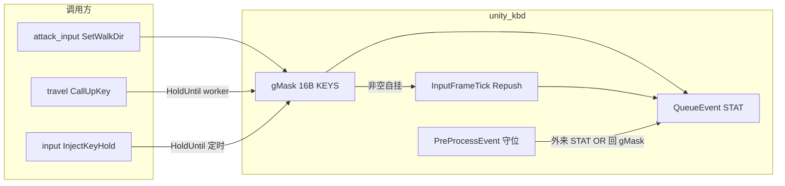

# unity_kbd Feature 模块设计（Classic TWMS）

> **状态**：✅ 已挂入；Hold + 自管 `InputFrameTick` Repush（2026-08-09）  
> **产品**：新枫之谷：经典版（TW · `Maplestory_Classic.exe`）· **不是**枫星  
> **源码**：`x/features/ports/unity_kbd_port.{h,cpp}`  
> **消费方**：`attack_input_port`（拟人走路）· `travel_port`（StickUp ↑）· `input_port`（`InjectKeyHold`）· `timed_keys` / `autopot`  
> **深挖采证**：[`../protocol/MoveElem字段.md`](../protocol/MoveElem字段.md)（§InputSystem 结论更正）  
> **安全**：遵守 [`../security/GRAP与枫星对齐.md`](../security/GRAP与枫星对齐.md) — **禁止 E9 / 改 GA `.text` 作发键主路径**；禁止 `SendInput` / `keybd_event` 作产品默认

---

## 0. 一句话

往 Unity `InputSystem.Keyboard` 灌整块 `StateEvent('STAT'+'KEYS')`，用 **变化边沿** 驱动游戏输入门闩；`gMask` 非空时自挂每帧 Repush，并提供 worker 安全的 `HoldUntil` 租约（Travel 进门 / 定时键脉冲同路）。

---

## 1. 为何不是 RawInput / OnKey / 直写缓冲

| 路径 | 结论 |
|------|------|
| Win32 `SendInput` / PostMessage | 经典版有 RawInput+宏分析，产品忌假键鼠；且要焦点 |
| `InputManager.KeyDownTouch/Up`（旧） | worker→泵→再嵌泵会死锁（Travel BIN：`KEY_FAIL` + 卡游戏） |
| 直写 Keyboard 前台状态缓冲（`XCAT_KBD_DIRECT=1`） | 实测移动率 71.4%→10.2%：门闩吃**变化**，直写打断事件边沿；**默认关** |
| **QueueEvent StateEvent**（现行） | 不依赖窗口焦点；与 change monitor / InputAction 回调同路 |

游戏侧对 `Keyboard.get_current` / `InputAction.IsPressed` 等在业务段**零调用**；走位/进门键采样来自设备状态**变化**，不是轮询当前位图。细节与 RVA 见 MoveElem 文档结论更正。

---

## 2. 架构



| 组件 | 职责 |
|------|------|
| `gMask` | 本模块正持有的键位图（绝对状态事件载荷） |
| `PushState` / `RepushOnMain` | 构造 `KeyboardStateEvent` 入队；时间戳严格递增 |
| `SyncInputFrameTick` | `gMask` 非空 → `SetInputFrameTick(Repush)`；变空摘掉 |
| `PreProcessEvent` 钩 | 外来整块键盘 STAT 把我们的位写成 0 时 OR 回去（防前台一顿一顿） |
| `HoldUntil` | worker：Down → 轮询 until/max → 必 Up；失败也松 |

**走路不再独占 `InputFrameTick`**：Travel / 脉冲在走路关时也能稳定每帧补写（BIN：仅走路 armed 时才有 tick → StickUp 空窗 → 半截进门黑屏）。

---

## 3. 对外 API（`ports::unity_kbd`）

头文件：[`x/features/ports/unity_kbd_port.h`](../../x/features/ports/unity_kbd_port.h)。

### 3.1 铁律

| | |
|---|---|
| `*OnMain` | **仅** Unity 主线程（泵 / FrameTick） |
| Worker | 用 `HoldUntil`，或自备 `InvokeAndWait` 包 `BeginHold`/`EndHold` |
| 禁止 | 已在泵线程的 job 里再 `InvokeAndWait`（嵌套死锁） |
| 补写 | 掩码非空时模块自管 tick；一般勿再抢 `SetInputFrameTick` |
| 启动 | 先 `(void)EnsureBound()` |

### 3.2 键码（InputSystem.Key == 位号）

| 常量 | 值 | 用途 |
|------|-----|------|
| `kKeyLeftArrow` | 61 | 拟人左 |
| `kKeyRightArrow` | 62 | 拟人右 |
| `kKeyUpArrow` | 63 | Travel StickUp / 调试 ↑ |
| `kKeyDownArrow` | 64 | 预留 |
| 其它 | 枚举值 | 经 `input::VkToUnityKey`（PageDown=66 等） |

### 3.3 主线程

```cpp
unity_kbd::SetWalkDirOnMain(+1);           // 右；0=双松左右（不碰 ↑/脉冲）
unity_kbd::ReleaseAllOnMain();             // 只清左右
unity_kbd::BeginHoldOnMain(kKeyUpArrow);   // 租约 Down
unity_kbd::EndHoldOnMain(kKeyUpArrow);     // 租约 Up
unity_kbd::SetKeyHeldOnMain(key, down);    // 与 Begin/End 等价底层
unity_kbd::AnyHeld();                      // 掩码是否非空
unity_kbd::HeldMaskHash();                 // 诊断
```

### 3.4 Worker：`HoldUntil`

```cpp
using HoldUntilFn = bool (*)(void* user);  // true = 可以结束 hold

bool HoldUntil(
    int32_t unityKey,
    DWORD minHoldMs,              // 至少按住（until 早到也撑满 = drain）
    DWORD maxHoldMs,              // 上限
    HoldUntilFn until,            // nullptr = 纯定时（min==max 即可）
    void* user,
    char* detail, size_t detailCap,
    DWORD afterUntilDrainMs = 0); // until 命中后再多按一会（Travel 进门）
```

**时机**：Down →（至少 `minHoldMs`）→ `until==true` 或到 `maxHoldMs` → Up（失败重试松键）。  
**主线程误调**：不做整段 Sleep，最短脉冲后松（防卡游戏）。

结束日志（tag `UnityKbd`）：`key` / `heldMs` / `reason` / `dPush` / `dGuard` / `tick` / `host`。

### 3.5 诊断 / 生命周期

```cpp
uint32_t push, clob, dw, guard, hc;
unity_kbd::Stats(&push, &clob, &dw, &guard, &hc);
unity_kbd::GuardActive();   // PreProcess 钩是否装上
unity_kbd::LastFail();      // "ok" 或失败串
unity_kbd::Shutdown();      // probe DETACH：摘钩 + 清 tick + 清掩码
```

| 计数 | 含义 |
|------|------|
| pushes | 入队状态事件数 |
| clobbers | 外来事件覆盖次数（前台应明显高于失焦） |
| directs | 直写次数（默认应为 0） |
| guards | 守位改写外来 STAT 次数 |
| hookCalls | 钩被调到次数（与 guards 区分「没进钩」） |

---

## 4. 外部怎么用（按场景）

### 4.1 固定时长脉冲（timed_keys / autopot）

优先：`input::InjectKeyHold(vk, holdMs)`（内部 `HoldUntil(key, ms, ms, nullptr, …)`）。

```cpp
char detail[96]{};
unity_kbd::HoldUntil(unityKey, 80, 80, nullptr, nullptr, detail, sizeof(detail));
```

### 4.2 按住直到条件（Travel StickUp）

见 `travel_port::CallUpKey`：

```cpp
struct Ctx { int map0; bool mapChanged; bool transit; };
bool Until(void* p) {
    auto* c = (Ctx*)p;
    if (!world::IsInMapScene() || !world::IsPlayReady()) {
        c->transit = true; return true;
    }
    if (MapIdChangedFrom(c->map0)) {
        c->mapChanged = true; return true;
    }
    return false;
}
// HoldUntil(↑, 160, 700, Until, &ctx, detail, …, postChangeDrainMs≈220)
```

产品定案细节（贴门、禁 CheckMovePortal、post-sleep MapId 复查）见 [`../travel/模块设计.md`](../travel/模块设计.md)。

### 4.3 拟人走路

`attack_input_port::HoldWalk` → 泵上 `SetWalkDirOnMain`；**不要**再 `SetInputFrameTick`。  
Disarm 只 `ReleaseAllOnMain`（清左右）；若仍有 ↑ 等脉冲位，tick 由 kbd 保留。

---

## 5. 实现要点（代码地图）

| 主题 | 位置 / 说明 |
|------|-------------|
| 事件布局 | `KeyboardStateEvent`：`type@0` `'STAT'` · `stateFormat@0x14` `'KEYS'` · `keys@0x18` 16B |
| 关键 RVA | `QueueEvent 0x46F9C30` · `Keyboard.get_current 0x4755120` · `PreProcess 0x4757020` 等（以 `unity_kbd_port.cpp` 顶注释为准） |
| 时间戳 | `device.m_LastUpdateTimeInternal + ε`，禁乱序丢事件 |
| 背景行为 | 默认 `backgroundBehavior=IgnoreFocus`（`XCAT_KBD_BG=0` 可关） |
| 守位钩 | 用**设备实例 klass** 解 `IEventPreProcessor` 槽（勿用 FindClass 碰运气）；`HasEventPreProcessor` 实读置位 |
| 环境开关 | `XCAT_KBD_DIRECT` / `XCAT_KBD_GUARD=0` / `XCAT_KBD_BG=0` |

---

## 6. BIN 教训（Hold 完善动机）

| 现象 | 根因 | 对策 |
|------|------|------|
| Travel hop2：`kbd Up pulse` 后 MapId 才变 → InterStage 卡死 | ↑ 固定 160ms 松键过早；走路关时无帧 Repush | `HoldUntil` 最长 700ms + MapId until + post-change drain；kbd 自管 tick |
| `Sleep(80)` 后仍标 `FIRED_STICK_UP` | MapId 已变未再查 | `stick-up1 post-sleep` 复查（travel_port） |
| 前台走路一顿一顿 | 外来 STAT 冲掉注入位 | PreProcess 守位 + 每帧 Repush |
| 直写缓冲 | 打断变化边沿 | 默认禁 `XCAT_KBD_DIRECT` |

---

## 7. 非目标

- 鼠标 / 手柄 InputSystem 设备  
- 默认恢复 StickUp → `CheckMovePortal` / Up2 第二枪  
- OnKey / RawInput 主路径  
- 改 GA `.text` 伪造输入  

---

## 8. 相关文档

| 文档 | 关系 |
|------|------|
| [`../protocol/MoveElem字段.md`](../protocol/MoveElem字段.md) | InputSystem 真源采证、RVA、守位钩派发公式 |
| [`../travel/模块设计.md`](../travel/模块设计.md) | StickUp 产品路径 |
| [`../timed_keys/模块设计.md`](../timed_keys/模块设计.md) | 定时键 → `InjectKeyHold` |
| [`../autopot/模块设计.md`](../autopot/模块设计.md) | 危急 PAGE 脉冲 |
| [`../ops/il2cpp托管调用线程规约.md`](../ops/il2cpp托管调用线程规约.md) | 主线程泵规约 |
